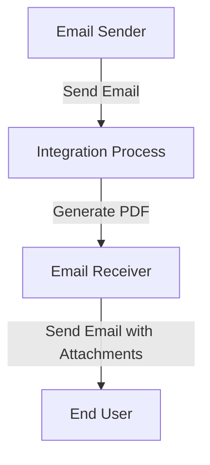

<h1 style="color: #1f4e79; font-size: 3em; text-align: center; margin-top: 5px; margin-bottom: 5px;">Task1</h1><h2 style="color: #1f4e79; font-size: 1.5em; text-align: center; margin-top: 5px; margin-bottom: 0px;">SAP CPI Technical Specification Document</h2>

<table border="1" style="width: 400px; border-collapse: collapse; border-color: black; margin: 0 auto; text-align: left;">
  <tr><td style="width: 30%; padding: 5px;">**Author:**</td><td style="padding: 5px;">Rohancherian783</td></tr>
  <tr><td style="padding: 5px;">**Date:**</td><td style="padding: 5px;">2025-12-11</td></tr>
  <tr><td style="padding: 5px;">**Version (Commit):**</td><td style="padding: 5px;">52b77e0</td></tr>
</table>

<h1 style="color: #1f4e79; font-size: 2.5em;">Table of Contents</h1>

1. Introduction
   1.1 Purpose
   1.2 Scope
2. Integration Overview
   2.1 Integration Architecture
   2.2 Integration Components
3. Integration Scenarios
   3.1 Scenario Description
   3.2 Data Flows
   3.3 Security Requirements
4. Error Handling and Logging
5. Testing Validation
6. Reference Documents

# 1. Introduction

## 1.1 Purpose
The purpose of this iFlow, named 'Task1', is to automate the process of converting email content into PDF documents. The iFlow retrieves emails, extracts their content, generates PDF files from this content, and sends these PDFs as email attachments.

## 1.2 Scope
This iFlow interacts with email systems to receive messages and utilizes the SAP Cloud Platform Integration (CPI) capabilities to process and send emails. The systems affected include the email server for both sending and receiving emails, as well as the CPI environment where the iFlow is deployed.

# 2. Integration Overview

## 2.1 Integration Architecture
The integration architecture consists of a sender and receiver email system, with an integration process in between that handles the conversion of email content to PDF format. The architecture is designed to facilitate the seamless flow of data between these components.

## 2.2 Integration Components
- **Sender System**: The email sender that initiates the process by sending emails.
- **Receiver System**: The email receiver that receives the processed emails with PDF attachments.
- **Adapters Used**: 
  - Mail Adapter for receiving emails (IMAP).
  - Mail Adapter for sending emails (SMTP).

# 3. Integration Scenarios

## 3.1 Scenario Description
1. An email is received by the iFlow.
2. The email content is extracted using JavaMail API.
3. The content is processed to generate two PDF documents.
4. The PDFs are attached to a new email and sent to the specified recipient.

## 3.2 Data Flows
The data flow involves:
- Extracting the email body from the incoming email.
- Generating PDFs using the iText library.
- Merging or attaching the PDFs to the outgoing email.

### Groovy Script Explanations
- **script1.groovy**: Extracts email content using JavaMail API.
- **script3.groovy**: Converts the email body into a string format.
- **script5.groovy**: Generates a PDF from the email body.
- **script30.groovy**: Cleans the email body and generates PDFs with dynamic filenames.

## 3.3 Security Requirements
- **Authentication**: Basic authentication is disabled for the sender.
- **Email Security**: The email content is processed securely, ensuring that sensitive information is handled appropriately.

# 4. Error Handling and Logging
Error handling is implemented within the Groovy scripts to catch exceptions during PDF generation. Logs are maintained to track the processing of emails and any errors encountered, ensuring that issues can be diagnosed and resolved efficiently.

# 5. Testing Validation
Key testing scenarios include:
- Sending emails with various content types (plain text, HTML).
- Validating the generated PDFs for content accuracy.
- Ensuring that the emails are sent with the correct attachments.

# 6. Reference Documents
- iFlow Content: `Task1.iflw`
- Groovy Scripts: 
  - `script1.groovy`
  - `script3.groovy`
  - `script5.groovy`
  - `script30.groovy`
- Additional scripts related to PDF generation and email handling.
