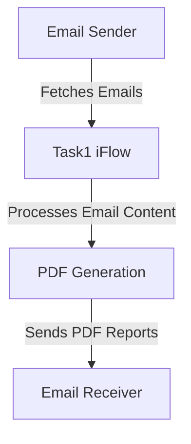

<div style="float: left; text-align: left;"></div><div style="float: right; text-align: right;"></div><div style="clear: both;"></div>
<div style="height: 80px;"></div><h1 style="color: #1f4e79; font-size: 3em; text-align: center; margin-top: 5px; margin-bottom: 5px;">Task1</h1><h2 style="color: #1f4e79; font-size: 1.5em; text-align: center; margin-top: 5px; margin-bottom: 0px;">SAP CPI Technical Specification Document</h2><div style="height: 100px;"></div><div style="width: 100%; text-align: center;">
<table border="1" style="width: 400px; border-collapse: collapse; border-color: black; margin: 0 auto; text-align: left;">
  <tr><td style="width: 30%; padding: 5px;">**Author:**</td><td style="padding: 5px;">Rohancherian783</td></tr>
  <tr><td style="padding: 5px;">**Date:**</td><td style="padding: 5px;">2025-12-11</td></tr>
  <tr><td style="padding: 5px;">**Version (Commit):**</td><td style="padding: 5px;">49340a1</td></tr>
</table>
</div>
<div style="page-break-after: always;"></div>

<div style="float: left; text-align: left;"></div><div style="float: right; text-align: right;"></div><div style="clear: both;"></div>
```markdown

<h1 style="color: #1f4e79; font-size: 2.5em;">Table of Contents</h1>

1. Introduction
    1.1 Purpose
    1.2 Scope
2. Integration Overview
    2.1 Integration Architecture
    2.2 Integration Components
3. Integration Scenarios
    3.1 Scenario Description
    3.2 Data Flows
    3.3 Security Requirements
4. Error Handling and Logging
5. Testing Validation
6. Reference Documents


<div style="page-break-before: always;"></div>
<div style="float: left; text-align: left;"></div><div style="float: right; text-align: right;"></div><div style="clear: both;"></div>


<h1 style="color: #1f4e79;">1. Introduction</h1>

<h2 style="color: #1f4e79;">1.1 Purpose</h2>
The purpose of this iFlow, named 'Task1', is to process incoming emails, extract their content, and generate PDF reports based on the email body. The generated PDFs are then attached to an outgoing email.

<h2 style="color: #1f4e79;">1.2 Scope</h2>
This iFlow integrates with email systems to receive emails and send processed reports. It primarily interacts with the email sender and receiver systems, utilizing SMTP and IMAP protocols for sending and receiving emails, respectively.

<h1 style="color: #1f4e79;">2. Integration Overview</h1>

<h2 style="color: #1f4e79;">2.1 Integration Architecture</h2>
The integration architecture consists of a sender system that retrieves emails and a receiver system that sends processed emails with attached PDF reports. The iFlow orchestrates the flow of data between these systems.



<h2 style="color: #1f4e79;">2.2 Integration Components</h2>
- **Sender System**: Uses IMAP to fetch emails.
- **Receiver System**: Uses SMTP to send emails.
- **Adapters**: IMAP adapter for receiving emails and SMTP adapter for sending emails.

<h1 style="color: #1f4e79;">3. Integration Scenarios</h1>

<h2 style="color: #1f4e79;">3.1 Scenario Description</h2>
The iFlow operates as follows:
1. An email is received via the IMAP adapter.
2. The email content is extracted and processed.
3. Two PDF documents are generated from the email content.
4. The PDFs are attached to a new email and sent out via the SMTP adapter.

<h2 style="color: #1f4e79;">3.2 Data Flows</h2>
The data flow involves:
- **Email Extraction**: Using JavaMail API to parse the email and extract the body.
- **PDF Generation**: Utilizing iText library to create PDF documents from the extracted content.
- **Attachment Handling**: PDFs are attached to the outgoing email using CamelAttachments.

<h2 style="color: #1f4e79;">3.3 Security Requirements</h2>
- **Authentication**: Basic authentication is disabled for the sender.
- **Email Security**: The iFlow does not implement specific security measures for email content but relies on the email service provider's security protocols.

<h1 style="color: #1f4e79;">4. Error Handling and Logging</h1>
Error handling is implemented through exception handling in Groovy scripts. Any errors during PDF generation or email processing are logged, and appropriate messages are set in the email body to inform the user of the failure.

<h1 style="color: #1f4e79;">5. Testing Validation</h1>
Key testing scenarios include:
- Sending emails with various content types (plain text, HTML).
- Validating the generation of PDFs from different email contents.
- Ensuring that the outgoing email contains the correct attachments.

<h1 style="color: #1f4e79;">6. Reference Documents</h1>
- iFlow Content: `Task1.iflw`
- Groovy Scripts: `script23.groovy`, `script17.groovy`, `script24.groovy`, `script11.groovy`, `script26.groovy`, `script25.groovy`, `script10.groovy`, `script29.groovy`, `script18.groovy`, `script30.groovy`, `script15.groovy`, `script19.groovy`, `script3.groovy`, `script5.groovy`, `script14.groovy`, `script13.groovy`, `script28.groovy`, `script7.groovy`, `script20.groovy`, `script2.groovy`.
```
