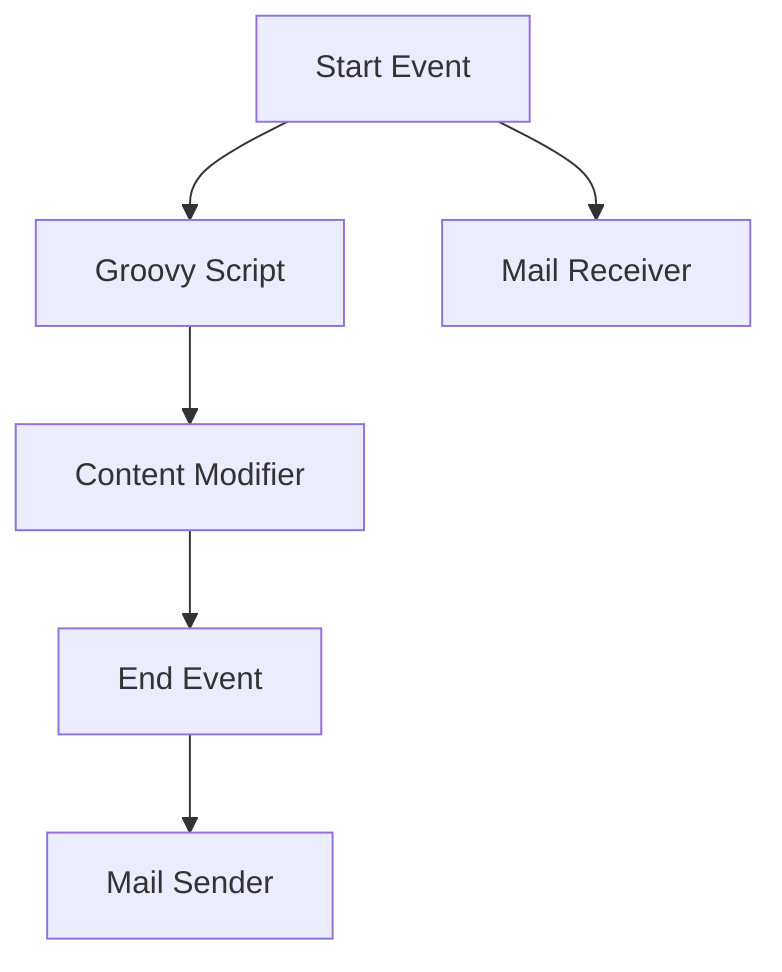

<h1 style="color: #1f4e79; text-align: center; font-size: 3.5em; margin-bottom: 10px;">Task1</h1><h2 style="text-align: center; font-size: 1.8em; font-weight: normal; margin-top: 0;">Technical Specification Document</h2>

<table style="width: 60%; margin: 0 auto;"><tr><th>Author</th><td>Rohancherian783</td></tr><tr><th>Date</th><td>2026-01-05</td></tr><tr><th>Version</th><td>1.0.0</td></tr></table>

<h1 style="color: #1f4e79; font-size: 2.5em;">Table of Contents</h1>

1. Introduction  
&nbsp;&nbsp;&nbsp; 1.1 Purpose  
&nbsp;&nbsp;&nbsp; 1.2 Scope  

2. Integration Overview  
&nbsp;&nbsp;&nbsp; 2.1 Integration Architecture  
&nbsp;&nbsp;&nbsp; 2.2 Integration Components  

3. Integration Scenarios  
&nbsp;&nbsp;&nbsp; 3.1 Scenario Description  
&nbsp;&nbsp;&nbsp; 3.2 Data Flows  
&nbsp;&nbsp;&nbsp; 3.3 Security Requirements  

4. Error Handling and Logging  

5. Testing Validation  

6. Reference Documents  

<h1 style="color: #1f4e79;">1. Introduction</h1>

<b style="color: #1f4e79;">1.1 Purpose:</b>

The purpose of this report is to provide a comprehensive analysis of the iFlow 'Task1', detailing its integration architecture, components, scenarios, and testing validation.

<b style="color: #1f4e79;">1.2 Scope:</b>

This report covers the integration flow defined in the provided BPMN XML, focusing on the components involved, the data flows, and the error handling mechanisms.

<h1 style="color: #1f4e79;">2. Integration Overview</h1>

<b style="color: #1f4e79;">2.1 Integration Architecture:</b> 

<b style="color: #1f4e79;">2.2 Integration Components:</b>

| Component Type | Name/Details | Description |
| :--- | :--- | :--- |
| EndpointSender | Sender | Initiates the integration flow by sending messages. |
| EndpointReceiver | Receiver | Receives messages from the mail server. |
| Integration Process | Process_1 | Main process that orchestrates the flow. |
| Groovy Script | Groovy Script 3 | Executes custom logic within the flow. |
| Content Modifier | Content Modifier 1 | Modifies message content before sending. |

<h1 style="color: #1f4e79;">3. Integration Scenarios</h1>

<b style="color: #1f4e79;">3.1 Scenario Description:</b>

The integration scenario involves receiving emails from a specified mailbox, processing the content, and sending a modified email to a designated recipient.

<b style="color: #1f4e79;">3.2 Data Flows:</b>

1. **Email Reception**: The flow starts with the mail receiver fetching unread emails from the inbox.
2. **Processing**: The Groovy script processes the email content.
3. **Modification**: The content modifier updates the email subject.
4. **Email Sending**: The modified email is sent to the specified recipient.

<b style="color: #1f4e79;">3.3 Security Requirements:</b>

- Basic authentication is disabled for the sender.
- Secure connections are established using SSL/TLS for both sending and receiving emails.

<h1 style="color: #1f4e79;">4. Error Handling and Logging</h1>

The integration flow is configured to log all events, and error handling is managed by returning exceptions to the sender when necessary. The transaction timeout is set to 30 seconds to ensure timely processing.

<h1 style="color: #1f4e79;">5. Testing Validation</h1>

**Testing Details – Sheet: Testing**

| Test Case ID | Scenario | Expected Outcome |
| :--- | :--- | :--- |
| TC001 | Receive Email | Email is successfully received from the inbox. |
| TC002 | Process Email | Email content is processed without errors. |
| TC003 | Modify Email | Email subject is updated correctly. |
| TC004 | Send Email | Modified email is sent to the recipient successfully. |

<h1 style="color: #1f4e79;">6. Reference Documents</h1>

- SAP CPI Documentation
- BPMN 2.0 Specification
- Email Protocol Standards (SMTP, IMAP)
