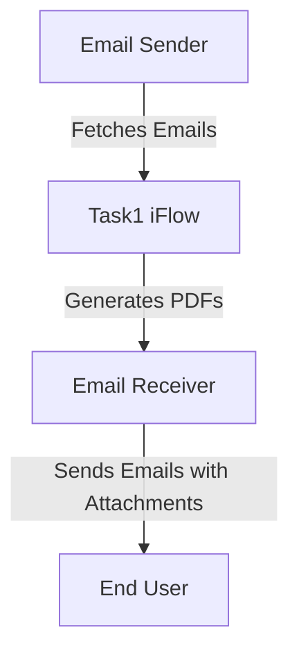

<div style="float: left; text-align: left;"></div><div style="float: right; text-align: right;"></div><div style="clear: both;"></div>
<div style="height: 80px;"></div><h1 style="color: #1f4e79; font-size: 3em; text-align: center; margin-top: 5px; margin-bottom: 5px;">Task1</h1><h2 style="color: #1f4e79; font-size: 1.5em; text-align: center; margin-top: 5px; margin-bottom: 0px;">SAP CPI Technical Specification Document</h2><div style="height: 100px;"></div><div style="width: 100%; text-align: center;">
<table border="1" style="width: 400px; border-collapse: collapse; border-color: black; margin: 0 auto; text-align: left;">
  <tr><td style="width: 30%; padding: 5px;">**Author:**</td><td style="padding: 5px;">Rohancherian783</td></tr>
  <tr><td style="padding: 5px;">**Date:**</td><td style="padding: 5px;">2025-12-15</td></tr>
  <tr><td style="padding: 5px;">**Version (Commit):**</td><td style="padding: 5px;">1031bab</td></tr>
</table>
</div>
<div style="page-break-after: always;"></div>

<div style="float: left; text-align: left;"></div><div style="float: right; text-align: right;"></div><div style="clear: both;"></div>
```markdown
<h1 style="color: #1f4e79; font-size: 2.5em;">Table of Contents</h1>
1. Introduction<br>
1.1 Purpose<br>
1.2 Scope<br>
2. Integration Overview<br>
2.1 Integration Architecture<br>
2.2 Integration Components<br>
3. Integration Scenarios<br>
3.1 Scenario Description<br>
3.2 Data Flows<br>
3.3 Security Requirements<br>
4. Error Handling and Logging<br>
5. Testing Validation<br>
6. Reference Documents<br>


<div style="page-break-before: always;"></div>
<div style="float: left; text-align: left;"></div><div style="float: right; text-align: right;"></div><div style="clear: both;"></div>


<h1 style="color: #1f4e79;">1. Introduction</h1>

<h2 style="color: #1f4e79;">1.1 Purpose</h2>
The purpose of this iFlow, named 'Task1', is to process incoming emails, extract their content, and generate PDF reports based on the email body. The generated PDFs are then attached to an outgoing email.

<h2 style="color: #1f4e79;">1.2 Scope</h2>
This iFlow interacts with email systems to receive and send emails. It processes email content, generates PDF documents, and handles attachments. The systems affected include the email server for both sending and receiving emails, as well as the SAP Cloud Platform Integration (CPI) environment where this iFlow is deployed.

<h1 style="color: #1f4e79;">2. Integration Overview</h1>

<h2 style="color: #1f4e79;">2.1 Integration Architecture</h2>
The integration architecture consists of a sender system that retrieves emails and a receiver system that sends emails with attached PDF reports. The iFlow orchestrates the flow of data between these systems.



<h2 style="color: #1f4e79;">2.2 Integration Components</h2>
The integration components include:
- **Sender System**: Email server (IMAP) to receive emails.
- **Receiver System**: Email server (SMTP) to send emails.
- **Adapters**: IMAP adapter for receiving emails and SMTP adapter for sending emails.

<h1 style="color: #1f4e79;">3. Integration Scenarios</h1>

<h2 style="color: #1f4e79;">3.1 Scenario Description</h2>
The iFlow operates as follows:
1. An email is received from the sender system.
2. The email content is extracted and processed.
3. Two PDF documents are generated from the email content.
4. The PDFs are attached to a new email.
5. The email is sent to the specified recipient.

<h2 style="color: #1f4e79;">3.2 Data Flows</h2>
The mapping logic involves extracting the email body and generating PDFs using Groovy scripts. The key Groovy scripts used are:
- **script23.groovy**: Extracts email body and generates two PDFs, merging them into one attachment.
- **script24.groovy**: Generates two separate PDFs and creates a MIME multipart message for email attachment.
- **script30.groovy**: Cleans the email body and generates PDFs with dynamic filenames based on the email subject.

<h2 style="color: #1f4e79;">3.3 Security Requirements</h2>
The iFlow does not require basic authentication for the sender system. However, it is essential to ensure that the email servers are configured securely, using SSL/TLS for communication. The iFlow should also handle sensitive data appropriately, ensuring that any personal information in emails is managed according to data protection regulations.

<h1 style="color: #1f4e79;">4. Error Handling and Logging</h1>
Error handling is implemented through logging mechanisms within the Groovy scripts. Any exceptions during PDF generation or email processing are logged, and appropriate error messages are set in the message body to inform the sender of any issues.

<h1 style="color: #1f4e79;">5. Testing Validation</h1>
Key testing scenarios include:
- Sending emails with various content types (plain text, HTML).
- Validating the generation of PDFs from different email bodies.
- Ensuring that the attachments are correctly formatted and sent to the recipient.

<h1 style="color: #1f4e79;">6. Reference Documents</h1>
The following artifacts were analyzed:
- iFlow Content: `Task1.iflw`
- Groovy Scripts: `script23.groovy`, `script24.groovy`, `script30.groovy`, and others.
- XSLT files (if applicable).
```
