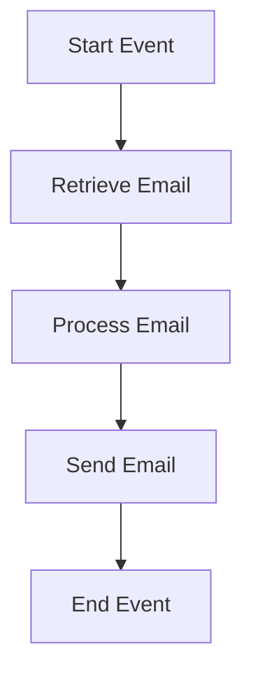

<h1 style="color: #1f4e79; text-align: center; font-size: 3.5em;">Task1</h1><h2 style="text-align: center; font-size: 2em;">Technical Specification Document</h2>

<table><tr><th>Author</th><td>Rohancherian783</td></tr><tr><th>Date</th><td>2026-01-02</td></tr><tr><th>Version</th><td>1.0.0</td></tr></table>

<h1 style="color: #1f4e79; font-size: 2.5em;">Table of Contents</h1>

1. Introduction  
&nbsp;&nbsp;&nbsp; 1.1 Purpose  
&nbsp;&nbsp;&nbsp; 1.2 Scope  

2. Integration Overview  
&nbsp;&nbsp;&nbsp; 2.1 Integration Architecture  
&nbsp;&nbsp;&nbsp; 2.2 Integration Components  

3. Integration Scenarios  
&nbsp;&nbsp;&nbsp; 3.1 Scenario Description  
&nbsp;&nbsp;&nbsp; 3.2 Data Flows  
&nbsp;&nbsp;&nbsp; 3.3 Security Requirements  

4. Error Handling and Logging  

5. Testing Validation  

6. Reference Documents  

<h1 style="color: #1f4e79;">1. Introduction</h1>

<b style="color: #1f4e79;">1.1 Purpose:</b>

The purpose of the iFlow 'Task1' is to facilitate the automated processing of email communications between two endpoints: a sender and a receiver. This integration flow is designed to read emails from a specified inbox, process the content, and subsequently send an email with the processed information. The business logic behind this iFlow is to streamline communication processes, reduce manual intervention, and ensure timely responses to incoming emails. The integration leverages the capabilities of SAP Cloud Platform Integration (CPI) to connect with external email services, specifically using SMTP and IMAP protocols for sending and receiving emails, respectively.

The iFlow is structured to handle various email attributes such as subject, body, and attachments, ensuring that the information is accurately captured and transmitted. The technical objective is to create a seamless flow of information that enhances operational efficiency and improves response times in business communications.

<b style="color: #1f4e79;">1.2 Scope:</b>

The scope of the iFlow 'Task1' encompasses the integration of email services within the SAP CPI environment. It includes the following key components:

- **Email Retrieval**: The iFlow retrieves unread emails from a specified Gmail inbox using the IMAP protocol. This process is scheduled to run at regular intervals, ensuring that no important communications are missed.

- **Email Processing**: Upon retrieval, the email content is processed through a Groovy script that can manipulate the data as required. This may include extracting specific information, modifying the content, or preparing it for further actions.

- **Email Sending**: After processing, the iFlow sends an email to a designated recipient using the SMTP protocol. The email includes the processed content and is configured with appropriate headers such as subject and body.

- **Error Handling**: The iFlow incorporates mechanisms for error handling and logging to ensure that any issues encountered during the email processing are captured and can be addressed promptly.

The integration is designed to be flexible and can be adapted to accommodate different email providers or additional processing requirements as needed by the business.

<h1 style="color: #1f4e79;">2. Integration Overview</h1>

<b style="color: #1f4e79;">2.1 Integration Architecture:</b>

<b style="color: #1f4e79;">2.2 Integration Components:</b>

| Component Type       | Name/Details                     | Description                                                                 |
|----------------------|----------------------------------|-----------------------------------------------------------------------------|
| Sender               | Gmail IMAP                      | Retrieves unread emails from the specified Gmail inbox.                    |
| Receiver             | Gmail SMTP                     | Sends processed emails to the designated recipient using SMTP protocol.     |
| Processing Component  | Groovy Script                   | Executes custom logic to manipulate email content as per business needs.   |
| Logging              | CPI Logging                     | Captures all events and errors for monitoring and troubleshooting purposes. |

<h1 style="color: #1f4e79;">3. Integration Scenarios</h1>

<b style="color: #1f4e79;">3.1 Scenario Description:</b>

1. **Email Retrieval**: The iFlow initiates by connecting to the Gmail inbox to fetch unread emails.
2. **Content Processing**: The retrieved email content is processed using a Groovy script to extract necessary information.
3. **Email Sending**: After processing, the iFlow sends an email to the specified recipient with the updated content.
4. **Error Handling**: Any errors encountered during the process are logged for review.

<b style="color: #1f4e79;">3.2 Data Flows:</b>

- Incoming emails are fetched from the Gmail inbox.
- The email body and subject are extracted and processed.
- Processed content is sent as a new email to the recipient.

<b style="color: #1f4e79;">3.3 Security Requirements:</b>

| Security Aspect          | Description                                      |
|--------------------------|--------------------------------------------------|
| Authentication           | Basic authentication is disabled for the sender.|
| Data Encryption          | Emails are sent using STARTTLS for encryption.   |
| Access Control           | CORS is disabled, and no credentials are shared. |

<h1 style="color: #1f4e79;">4. Error Handling and Logging</h1>

The iFlow includes comprehensive error handling mechanisms that log all events and errors encountered during the execution. This ensures that any issues can be quickly identified and resolved, maintaining the integrity of the email processing workflow.

<h1 style="color: #1f4e79;">5. Testing Validation</h1>

Testing of the iFlow will involve validating the email retrieval process, ensuring that emails are correctly processed, and verifying that the emails are sent with the appropriate content and headers. Additionally, error scenarios will be tested to confirm that the logging and error handling mechanisms function as intended.

<h1 style="color: #1f4e79;">6. Reference Documents</h1>

- SAP Cloud Platform Integration Documentation
- Email Protocol Specifications (SMTP, IMAP)
- Groovy Scripting Guide for SAP CPI
