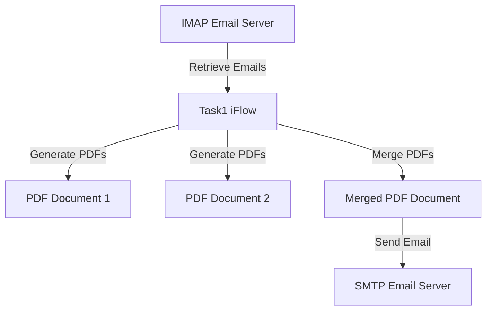

<h1 style="color: #1f4e79; font-size: 2.5em;">Table of Contents</h1>

1. Introduction  
    1.1. Purpose  
    1.2. Scope  

2. Integration Overview  
    2.1. Integration Architecture  
    2.2. Integration Components  

3. Integration Scenarios  
    3.1. Scenario Description  
    3.2. Data Flows  
    3.3. Security Requirements  

4. Error Handling and Logging  

5. Testing Validation  

6. Reference Documents  

          

# 1. Introduction

## 1.1 Purpose
The purpose of this iFlow, named 'Task1', is to automate the process of converting email content into PDF documents. It retrieves emails, extracts their body content, generates two separate PDF files from this content, and then merges these PDFs into a single document for attachment in an outgoing email.

## 1.2 Scope
This iFlow interacts with email systems to receive and send messages. It is designed to work with SMTP and IMAP protocols, specifically targeting Gmail servers. The iFlow processes incoming emails, generates PDF reports, and sends them as attachments to specified recipients.

# 2. Integration Overview

## 2.1 Integration Architecture
The integration architecture consists of a sender (IMAP email server) that retrieves emails and a receiver (SMTP email server) that sends the generated PDF reports. The iFlow processes the email content, generates PDFs, and manages the attachment of these PDFs to outgoing emails.

## 2.2 Integration Components
- **Sender System**: IMAP Email Server (e.g., Gmail)
- **Receiver System**: SMTP Email Server (e.g., Gmail)
- **Adapters Used**: 
  - IMAP Adapter for receiving emails
  - SMTP Adapter for sending emails

# 3. Integration Scenarios

## 3.1 Scenario Description
1. The iFlow is triggered by incoming emails from the IMAP server.
2. The email body is extracted and processed.
3. Two separate PDFs are generated from the email content.
4. The PDFs are merged into a single document.
5. The merged PDF is sent as an attachment to a specified recipient via the SMTP server.

## 3.2 Data Flows
The data flow involves the following steps:
- **Email Retrieval**: The iFlow uses the IMAP adapter to fetch emails.
- **PDF Generation**: Multiple Groovy scripts are utilized to create PDFs from the email body.
- **Merging PDFs**: The generated PDFs are merged into one document using the PdfCopy class from the iText library.
- **Email Sending**: The merged PDF is attached to an email and sent using the SMTP adapter.

### Groovy Script Explanations
- **script1.groovy**: Extracts email body from the incoming message.
- **script3.groovy**: Parses the email content using JavaMail API.
- **script17.groovy**: Generates a single PDF from the email body.
- **script26.groovy**: Merges two PDFs into one and sets it as the message body for sending.
- **script30.groovy**: Cleans up the email body before PDF generation.

## 3.3 Security Requirements
- **Authentication**: Basic authentication is used for both IMAP and SMTP connections.
- **Credentials**: Email credentials must be securely stored and managed within the iFlow configuration.
- **Transport Security**: TLS/SSL is enabled for secure communication with email servers.

# 4. Error Handling and Logging
Error handling is implemented through exception handling in Groovy scripts. If an error occurs during PDF generation or email sending, the iFlow logs the error message and sets a plain text response indicating the failure. This ensures that any issues are captured for troubleshooting.

# 5. Testing Validation
Key testing scenarios include:
- Validating the retrieval of emails from the IMAP server.
- Ensuring that the PDF generation works correctly with various email formats.
- Testing the merging of PDFs and verifying the final output.
- Confirming that the email with the PDF attachment is sent successfully.

# 6. Reference Documents
- iFlow Content: `Task1.iflw`
- Groovy Scripts: 
  - `script1.groovy`
  - `script3.groovy`
  - `script17.groovy`
  - `script26.groovy`
  - `script30.groovy`
- Additional scripts for PDF handling and email processing.
