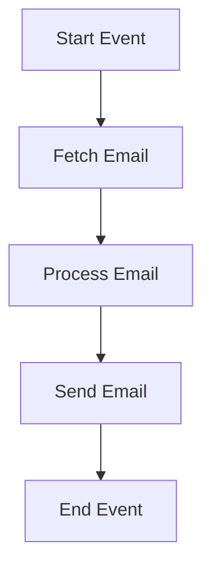

<h1 style="color: #1f4e79; text-align: center; font-size: 3.5em; margin-bottom: 10px;">Task1</h1><h2 style="text-align: center; font-size: 1.8em; font-weight: normal; margin-top: 0;">Technical Specification Document</h2>

<table style="width: 60%; margin: 0 auto;"><tr><th>Author</th><td>Rohancherian783</td></tr><tr><th>Date</th><td>2026-01-05</td></tr><tr><th>Version</th><td>1.0.0</td></tr></table>

<h1 style="color: #1f4e79; font-size: 2.5em;">Table of Contents</h1>
1. Introduction  
&nbsp;&nbsp;&nbsp; 1.1 Purpose  
&nbsp;&nbsp;&nbsp; 1.2 Scope  
2. Integration Overview  
&nbsp;&nbsp;&nbsp; 2.1 Integration Architecture  
&nbsp;&nbsp;&nbsp; 2.2 Integration Components  
3. Integration Scenarios  
&nbsp;&nbsp;&nbsp; 3.1 Scenario Description  
&nbsp;&nbsp;&nbsp; 3.2 Data Flows  
&nbsp;&nbsp;&nbsp; 3.3 Security Requirements  
4. Error Handling and Logging  
5. Testing Validation  
6. Reference Documents  

<h1 style="color: #1f4e79;">1. Introduction</h1>
<b style="color: #1f4e79;">1.1 Purpose:</b>
The iFlow 'Task1' addresses the need for automated email processing within an organization. It triggers when new emails arrive in the specified inbox, processes the email content, and sends a formatted email to a designated recipient. The technical outcome includes the transformation of incoming email data into a structured format suitable for further processing or notification.

<b style="color: #1f4e79;">1.2 Scope:</b>
The iFlow integrates with the following endpoints:
- **Sender Endpoint:** IMAP server (imap.gmail.com:993) to fetch unread emails from the inbox.
- **Receiver Endpoint:** SMTP server (smtp.gmail.com:587) to send processed emails.

The data transformation logic involves extracting the subject and body from the incoming email, modifying the content as necessary, and sending it to the recipient. The target system for the outgoing email is the SMTP server configured for sending notifications.

<h1 style="color: #1f4e79;">2. Integration Overview</h1>
<b style="color: #1f4e79;">2.1 Integration Architecture:</b>

<b style="color: #1f4e79;">2.2 Integration Components:</b>
| Component                | Role                       | Details                                                                 |
|--------------------------|----------------------------|-------------------------------------------------------------------------|
| IMAP Adapter             | Email Fetching             | Connects to the IMAP server to retrieve unread emails from the inbox.   |
| SMTP Adapter             | Email Sending              | Sends processed emails to the specified recipient via SMTP.             |
| Groovy Script            | Data Transformation        | Processes the email content and prepares it for sending.                |
| Content Modifier         | Header Modification        | Modifies email headers, such as setting the subject line.               |

<h1 style="color: #1f4e79;">3. Integration Scenarios</h1>
<b style="color: #1f4e79;">3.1 Scenario Description:</b>
1. The iFlow starts with a trigger from the Start Event.
2. The IMAP adapter fetches unread emails from the configured inbox.
3. The Groovy Script processes the email content, extracting necessary information such as the subject and body.
4. The Content Modifier updates the email headers, particularly the subject line.
5. The SMTP adapter sends the modified email to the designated recipient.
6. The process concludes with the End Event.

<b style="color: #1f4e79;">3.2 Data Flows:</b>
- **Incoming Data Flow:** 
  - Email is fetched from the inbox using IMAP.
- **Processing Data Flow:**
  - Email content is transformed using Groovy Script.
- **Outgoing Data Flow:**
  - Processed email is sent via SMTP to the recipient.

<b style="color: #1f4e79;">3.3 Security Requirements:</b>
- Basic authentication is disabled for the IMAP and SMTP connections.
- Ensure that sensitive data in emails is handled according to organizational security policies.

<h1 style="color: #1f4e79;">4. Error Handling and Logging</h1>
Error handling mechanisms will be implemented to capture any failures during email fetching, processing, or sending. Logs will be maintained for all events to facilitate troubleshooting.

<h1 style="color: #1f4e79;">5. Testing Validation</h1>
**Testing Details – Sheet: Testing**
| Test Case ID | Scenario                          | Expected Outcome                                      |
| :---         | :---                              | :---                                                |
| TC001        | Fetch unread emails               | Emails are successfully retrieved from the inbox.   |
| TC002        | Process email content             | Email content is correctly transformed.             |
| TC003        | Send processed email              | Email is sent to the recipient without errors.      |

<h1 style="color: #1f4e79;">6. Reference Documents</h1>
- SAP CPI Documentation
- Email Adapter Configuration Guide
- Groovy Scripting Best Practices
