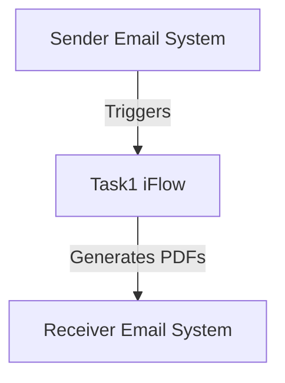

<div style="float: left; text-align: left;"></div><div style="float: right; text-align: right;"></div><div style="clear: both;"></div>
<div style="height: 80px;"></div><h1 style="color: #1f4e79; font-size: 3em; text-align: center; margin-top: 5px; margin-bottom: 5px;">Task1</h1><h2 style="color: #1f4e79; font-size: 1.5em; text-align: center; margin-top: 5px; margin-bottom: 0px;">SAP CPI Technical Specification Document</h2><div style="height: 100px;"></div><div style="width: 100%; text-align: center;">
<table border="1" style="width: 400px; border-collapse: collapse; border-color: black; margin: 0 auto; text-align: left;">
  <tr><td style="width: 30%; padding: 5px;">**Author:**</td><td style="padding: 5px;">Rohancherian783</td></tr>
  <tr><td style="padding: 5px;">**Date:**</td><td style="padding: 5px;">2025-12-12</td></tr>
  <tr><td style="padding: 5px;">**Version (Commit):**</td><td style="padding: 5px;">2a3dd01</td></tr>
</table>
</div>
<div style="page-break-after: always;"></div>

<div style="float: left; text-align: left;"></div><div style="float: right; text-align: right;"></div><div style="clear: both;"></div>
```markdown
<h1 style="color: #1f4e79; font-size: 2.5em;">Table of Contents</h1>
1. Introduction<br>
1.1 Purpose<br>
1.2 Scope<br>
2. Integration Overview<br>
2.1 Integration Architecture<br>
2.2 Integration Components<br>
3. Integration Scenarios<br>
3.1 Scenario Description<br>
3.2 Data Flows<br>
3.3 Security Requirements<br>
4. Error Handling and Logging<br>
5. Testing Validation<br>
6. Reference Documents<br>


<div style="page-break-before: always;"></div>
<div style="float: left; text-align: left;"></div><div style="float: right; text-align: right;"></div><div style="clear: both;"></div>


<h1 style="color: #1f4e79;">1. Introduction</h1>

<h2 style="color: #1f4e79;">1.1 Purpose</h2>
The purpose of this iFlow, named 'Task1', is to process incoming emails, extract their content, generate PDF reports from the email body, and send these reports as attachments in an outgoing email.

<h2 style="color: #1f4e79;">1.2 Scope</h2>
This iFlow integrates with email systems to receive emails, processes the content to generate PDF documents, and sends these documents to specified recipients. The systems affected include the email sender and receiver, as well as the SAP CPI platform.

<h1 style="color: #1f4e79;">2. Integration Overview</h1>

<h2 style="color: #1f4e79;">2.1 Integration Architecture</h2>
The integration architecture consists of a sender email system that triggers the iFlow upon receiving an email. The iFlow processes the email content, generates PDFs, and sends them to a receiver email system.



<h2 style="color: #1f4e79;">2.2 Integration Components</h2>
- **Sender System**: Email system that sends emails to the iFlow.
- **Receiver System**: Email system that receives the generated PDF reports.
- **Adapters Used**: 
  - Mail Sender Adapter for receiving emails.
  - Mail Receiver Adapter for sending emails.

<h1 style="color: #1f4e79;">3. Integration Scenarios</h1>

<h2 style="color: #1f4e79;">3.1 Scenario Description</h2>
The iFlow operates as follows:
1. An email is received by the iFlow.
2. The email content is extracted.
3. Two PDF documents are generated from the email content.
4. The PDFs are attached to a new email and sent to the specified recipient.

<h2 style="color: #1f4e79;">3.2 Data Flows</h2>
The data flow involves:
- Extracting the email body using JavaMail API.
- Generating PDFs using iText library in Groovy scripts.
- Attaching the PDFs to the outgoing email.

**Groovy Script Explanations**:
- **script1.groovy**: Extracts email content.
- **script3.groovy**: Parses the email and sets the body.
- **script20.groovy**: Generates two PDFs and prepares them for attachment.

<h2 style="color: #1f4e79;">3.3 Security Requirements</h2>
The iFlow does not require basic authentication for the sender. However, it is essential to ensure that the email systems involved are secured and that sensitive information is handled appropriately.

<h1 style="color: #1f4e79;">4. Error Handling and Logging</h1>
Error handling is implemented through try-catch blocks in Groovy scripts. Any exceptions during PDF generation are logged, and a user-friendly error message is set in the message body.

<h1 style="color: #1f4e79;">5. Testing Validation</h1>
Key testing scenarios include:
- Sending emails with various content types (plain text, HTML).
- Validating the generated PDFs for content accuracy.
- Ensuring that the emails are sent with the correct attachments.

<h1 style="color: #1f4e79;">6. Reference Documents</h1>
- iFlow Content: `Task1.iflw`
- Groovy Scripts: `script1.groovy`, `script3.groovy`, `script20.groovy`, etc.
- PDF Generation Library: iText
```
