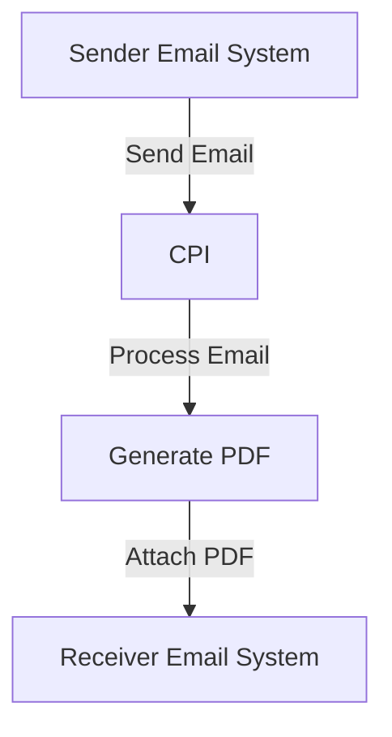

<div style="float: left; text-align: left;"></div><div style="float: right; text-align: right;"></div><div style="clear: both;"></div>
<div style="height: 80px;"></div><h1 style="color: #1f4e79; font-size: 3em; text-align: center; margin-top: 5px; margin-bottom: 5px;">Task1</h1><h2 style="color: #1f4e79; font-size: 1.5em; text-align: center; margin-top: 5px; margin-bottom: 0px;">SAP CPI Technical Specification Document</h2><div style="height: 100px;"></div><div style="width: 100%; text-align: center;">
<table border="1" style="width: 400px; border-collapse: collapse; border-color: black; margin: 0 auto; text-align: left;">
  <tr><td style="width: 30%; padding: 5px;">**Author:**</td><td style="padding: 5px;">Rohancherian783</td></tr>
  <tr><td style="padding: 5px;">**Date:**</td><td style="padding: 5px;">2025-12-11</td></tr>
  <tr><td style="padding: 5px;">**Version (Commit):**</td><td style="padding: 5px;">4df6f79</td></tr>
</table>
</div>
<div style="page-break-after: always;"></div>

<div style="float: left; text-align: left;"></div><div style="float: right; text-align: right;"></div><div style="clear: both;"></div>
```markdown

<h1 style="color: #1f4e79; font-size: 2.5em;">Table of Contents</h1>

1. Introduction
   1.1 Purpose
   1.2 Scope
2. Integration Overview
   2.1 Integration Architecture
   2.2 Integration Components
3. Integration Scenarios
   3.1 Scenario Description
   3.2 Data Flows
   3.3 Security Requirements
4. Error Handling and Logging
5. Testing Validation
6. Reference Documents


<div style="page-break-before: always;"></div>
<div style="float: left; text-align: left;"></div><div style="float: right; text-align: right;"></div><div style="clear: both;"></div>


<h1 style="color: #1f4e79;">1. Introduction</h1>

<h2 style="color: #1f4e79;">1.1 Purpose</h2>
The purpose of this iFlow, named 'Task1', is to process incoming emails, extract their content, and generate PDF reports based on the email body. The generated PDFs are then attached to an outgoing email.

<h2 style="color: #1f4e79;">1.2 Scope</h2>
This iFlow integrates with email systems to receive messages and utilizes the iText library to create PDF documents. It is designed to work with email content, specifically handling both plain text and HTML formats. The systems affected include the email sender and receiver, as well as the SAP Cloud Platform Integration (CPI) environment.


<div style="float: left; text-align: left;"></div><div style="float: right; text-align: right;"></div><div style="clear: both;"></div>
<h1 style="color: #1f4e79;">2. Integration Overview</h1>

<h2 style="color: #1f4e79;">2.1 Integration Architecture</h2>
The integration architecture consists of a sender email system that sends emails to the CPI, which processes the emails and generates PDF reports. The architecture is designed to handle both incoming and outgoing email communications.



<h2 style="color: #1f4e79;">2.2 Integration Components</h2>
The integration components include:
- **Sender System**: The email system that sends the initial email.
- **Receiver System**: The email system that receives the processed email with attachments.
- **Adapters**: The iFlow uses Mail adapters for both sending and receiving emails.


<div style="float: left; text-align: left;"></div><div style="float: right; text-align: right;"></div><div style="clear: both;"></div>
<h1 style="color: #1f4e79;">3. Integration Scenarios</h1>

<h2 style="color: #1f4e79;">3.1 Scenario Description</h2>
The iFlow operates as follows:
1. An email is received by the CPI.
2. The email content is extracted using JavaMail API.
3. Two PDFs are generated from the email content.
4. The PDFs are attached to a new email.
5. The email is sent to the designated recipient.

<h2 style="color: #1f4e79;">3.2 Data Flows</h2>
The data flow involves:
- Extracting the email body from the incoming message.
- Generating PDFs using the iText library.
- Attaching the generated PDFs to the outgoing email.

The mapping logic is handled within the Groovy scripts, which utilize the iText library to create and manipulate PDF documents.

<h2 style="color: #1f4e79;">3.3 Security Requirements</h2>
The iFlow does not require basic authentication for the sender. However, it ensures that the email content is processed securely, and the generated PDFs are attached with appropriate headers to prevent unauthorized access.


<div style="float: left; text-align: left;"></div><div style="float: right; text-align: right;"></div><div style="clear: both;"></div>
<h1 style="color: #1f4e79;">4. Error Handling and Logging</h1>
Error handling is implemented within the Groovy scripts to catch exceptions during PDF generation. If an error occurs, the message body is set to indicate the error, and the content type is adjusted accordingly.


<div style="float: left; text-align: left;"></div><div style="float: right; text-align: right;"></div><div style="clear: both;"></div>
<h1 style="color: #1f4e79;">5. Testing Validation</h1>
Key testing scenarios include:
- Sending emails with plain text and HTML content to ensure proper extraction and PDF generation.
- Validating that the generated PDFs are correctly attached to the outgoing email.
- Testing the iFlow with various email formats to ensure robustness.


<div style="float: left; text-align: left;"></div><div style="float: right; text-align: right;"></div><div style="clear: both;"></div>
<h1 style="color: #1f4e79;">6. Reference Documents</h1>
The following artifacts were analyzed for this iFlow:
- iFlowContent.xml
- Groovy scripts (script1.groovy, script2.groovy, script3.groovy, script4.groovy, script5.groovy, script6.groovy, script7.groovy, script8.groovy, script9.groovy, script10.groovy, script11.groovy, script12.groovy, script13.groovy, script14.groovy, script15.groovy, script16.groovy, script17.groovy, script18.groovy, script19.groovy, script20.groovy, script21.groovy, script22.groovy, script23.groovy, script24.groovy, script25.groovy, script26.groovy, script27.groovy, script28.groovy, script29.groovy, script30.groovy)
- XSLT files (if applicable)
```
