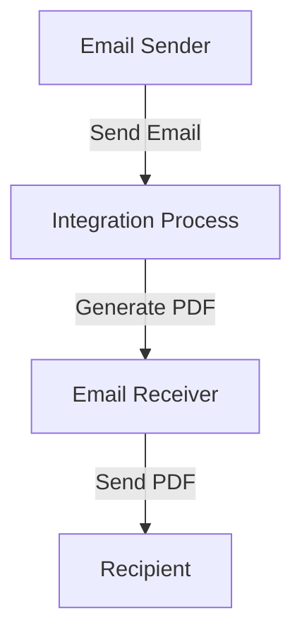

```html
<div align="center">

&nbsp;&nbsp;&nbsp;&nbsp;&nbsp;&nbsp;&nbsp;&nbsp;&nbsp;&nbsp;&nbsp;&nbsp;&nbsp;

</div>

<br><br><br>
<h1 align="center" style="color: #1f4e79; font-size: 3em;">Task1 Integration Technical Specification</h1>
<br><br><br>

| Field | Value |
| :--- | :--- |
| **Author** | CPI Automation Bot |
| **Date** | 2025-12-10 |
| **Version** | 1.0 (Draft) |

<br><br><br><br><br><br><br><br><br><br><br><br><br><br><br><br><br><br><br><br>
```

<h1 style="color: #1f4e79; font-size: 2.5em;">Table of Contents</h1>

1. Introduction  
   1.1 Purpose  
   1.2 Scope  
2. Integration Overview  
   2.1 Integration Architecture  
   2.2 Integration Components  
3. Integration Scenarios  
   3.1 Scenario Description  
   3.2 Data Flows  
   3.3 Security Requirements  
4. Error Handling and Logging  
5. Testing Validation  
6. Reference Documents  

<br><br><br><br><br><br><br><br><br><br><br><br><br><br><br><br><br><br><br><br>

# 1. Introduction
## 1.1 Purpose
The purpose of the Task1 iFlow is to automate the process of extracting email content, generating PDF reports from the email body, and sending these reports as attachments via email.

## 1.2 Scope
This iFlow integrates with email systems to retrieve messages, processes the content to generate PDF documents, and sends the generated PDFs to specified recipients. The systems affected include the email server for both sending and receiving emails.

# 2. Integration Overview
## 2.1 Integration Architecture
The integration architecture consists of a sender and receiver email system, with an integration process that handles the transformation of email content into PDF format.



## 2.2 Integration Components
- **Sender System:** Email Sender (IMAP/SMTP)
- **Receiver System:** Email Receiver (IMAP/SMTP)
- **Adapter Types Used:** Mail Adapter for both sending and receiving emails.

# 3. Integration Scenarios
## 3.1 Scenario Description
1. An email is received by the iFlow.
2. The email content is extracted.
3. Two PDFs are generated from the email content.
4. The PDFs are attached to a new email.
5. The email is sent to the specified recipient.

## 3.2 Data Flows
The data flow involves:
- Extracting the email body using JavaMail API.
- Generating PDFs using iText library.
- Attaching the PDFs to an outgoing email.

## 3.3 Security Requirements
- Basic authentication is disabled for the email sender.
- Secure connections (SSL/TLS) are used for email transmission.

# 4. Error Handling and Logging
Error handling is implemented to catch exceptions during PDF generation and email sending. Logs are maintained for debugging purposes, capturing the email content and any errors encountered.

# 5. Testing Validation
Key testing scenarios include:
- Validating email retrieval and content extraction.
- Ensuring PDFs are generated correctly from various email formats.
- Testing the sending of emails with attachments to ensure they are received correctly.

# 6. Reference Documents
- iFlow Content: `Task1.iflw`
- Groovy Scripts: 
  - `script1.groovy`
  - `script2.groovy`
  - `script3.groovy`
  - `script4.groovy`
  - `script5.groovy`
  - `script6.groovy`
  - `script7.groovy`
  - `script8.groovy`
  - `script9.groovy`
  - `script10.groovy`
  - `script11.groovy`
  - `script12.groovy`
  - `script13.groovy`
  - `script14.groovy`
  - `script15.groovy`
  - `script16.groovy`
  - `script17.groovy`
  - `script18.groovy`
  - `script19.groovy`
  - `script20.groovy`
  - `script21.groovy`
  - `script22.groovy`
  - `script23.groovy`
  - `script24.groovy`
  - `script25.groovy`
  - `script26.groovy`
  - `script27.groovy`
  - `script28.groovy`
  - `script29.groovy`
  - `script30.groovy`
```
