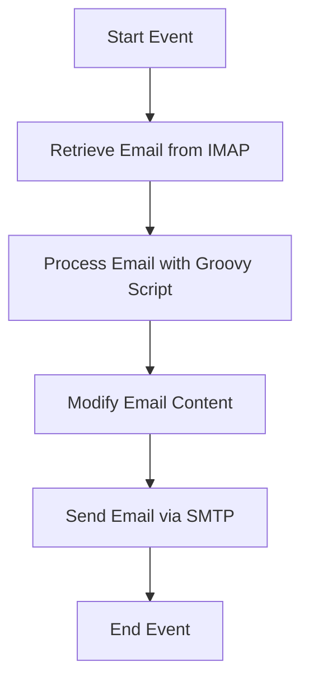

<h1 style="color: #1f4e79; text-align: center; font-size: 3.5em;">Task1</h1><h2 style="text-align: center; font-size: 2em;">Technical Specification Document</h2>

<table style="margin: 0 auto; border-collapse: collapse; min-width: 500px; border: 1px solid #000;"><tr><th style="padding: 12px; border: 1px solid #000; background-color: #f2f2f2; text-align: left;">Author</th><td style="padding: 12px; border: 1px solid #000; text-align: left;">Rohancherian783</td></tr><tr><th style="padding: 12px; border: 1px solid #000; background-color: #f2f2f2; text-align: left;">Date</th><td style="padding: 12px; border: 1px solid #000; text-align: left;">2026-01-05</td></tr><tr><th style="padding: 12px; border: 1px solid #000; background-color: #f2f2f2; text-align: left;">Version</th><td style="padding: 12px; border: 1px solid #000; text-align: left;">1.0.0</td></tr></table>

<h1 style="color: #1f4e79; font-size: 2.5em;">Table of Contents</h1>

1. Introduction  
&nbsp;&nbsp;&nbsp; 1.1 Purpose  
&nbsp;&nbsp;&nbsp; 1.2 Scope  

2. Integration Overview  
&nbsp;&nbsp;&nbsp; 2.1 Integration Architecture  
&nbsp;&nbsp;&nbsp; 2.2 Integration Components  

3. Integration Scenarios  
&nbsp;&nbsp;&nbsp; 3.1 Scenario Description  
&nbsp;&nbsp;&nbsp; 3.2 Data Flows  
&nbsp;&nbsp;&nbsp; 3.3 Security Requirements  

4. Error Handling and Logging  

5. Testing Validation  

6. Reference Documents  

<h1 style="color: #1f4e79;">1. Introduction</h1>

<b style="color: #1f4e79;">1.1 Purpose:</b>

The purpose of the iFlow 'Task1' is to facilitate the automated processing of emails within an SAP Cloud Platform Integration (CPI) environment. This integration flow is designed to read incoming emails from a specified mailbox, process the content, and subsequently send an email notification based on the processed data. The business logic revolves around enhancing communication efficiency by automating the handling of email messages, which can include notifications, alerts, or other relevant information. The iFlow leverages SMTP and IMAP protocols for sending and receiving emails, ensuring secure and reliable communication between the sender and receiver systems.

The technical objective of this iFlow is to streamline the email processing workflow by utilizing Groovy scripts for data manipulation and content modification. This allows for dynamic email subject lines and body content based on the incoming email's properties. The integration also ensures that all events are logged for monitoring and troubleshooting purposes, thereby enhancing the overall reliability of the email processing system.

<b style="color: #1f4e79;">1.2 Scope:</b>

The scope of the iFlow 'Task1' encompasses the integration of email services within the SAP CPI framework. It includes the following key components:

- **Email Retrieval**: The iFlow is configured to connect to an IMAP server (in this case, Gmail) to retrieve unread emails from the inbox. This is crucial for ensuring that no important communication is missed.

- **Email Processing**: Upon retrieval, the iFlow processes the email content using Groovy scripts. This processing can involve parsing the email body, extracting relevant information, and preparing it for further actions.

- **Email Notification**: After processing, the iFlow sends an email notification to a specified recipient using SMTP. The email's subject and body can be dynamically generated based on the content of the incoming email, allowing for personalized communication.

- **Logging and Monitoring**: The iFlow is designed to log all events, which aids in monitoring the performance and reliability of the email processing workflow. This logging is essential for identifying issues and ensuring that the integration operates smoothly.

The iFlow is intended for use in environments where automated email processing is required, such as customer support systems, notification services, or any scenario where timely communication is critical.

<h1 style="color: #1f4e79;">2. Integration Overview</h1>

<b style="color: #1f4e79;">2.1 Integration Architecture:</b>

<b style="color: #1f4e79;">2.2 Integration Components:</b>

| Component Type      | Name/Details                | Description                                                                 |
|---------------------|-----------------------------|-----------------------------------------------------------------------------|
| Sender              | IMAP Email Receiver         | Connects to the IMAP server to retrieve unread emails from the inbox.      |
| Receiver            | SMTP Email Sender           | Sends processed email notifications to specified recipients.               |
| Process             | Integration Process         | Contains the main logic for processing emails and modifying content.       |
| Groovy Script       | script30.groovy            | Custom script for processing email content and generating dynamic responses.|
| Content Modifier     | Content Modifier 1          | Modifies the email content before sending it out.                         |

<h1 style="color: #1f4e79;">3. Integration Scenarios</h1>

<b style="color: #1f4e79;">3.1 Scenario Description:</b>

1. **Email Retrieval**: The iFlow initiates by connecting to the IMAP server to fetch unread emails from the inbox.
2. **Email Processing**: Each retrieved email is processed using a Groovy script that extracts necessary information and prepares it for modification.
3. **Content Modification**: The email subject and body are modified based on the extracted data, ensuring that the response is relevant and personalized.
4. **Email Sending**: The modified email is sent to the designated recipient using SMTP, completing the workflow.

<b style="color: #1f4e79;">3.2 Data Flows:</b>

- Incoming emails are fetched from the IMAP server.
- Email content is processed and modified using Groovy scripts.
- Processed emails are sent out via SMTP to specified recipients.

<b style="color: #1f4e79;">3.3 Security Requirements:</b>

| Security Aspect          | Description                                         |
|--------------------------|-----------------------------------------------------|
| Authentication           | Basic authentication is used for IMAP and SMTP connections. |
| Data Encryption          | Emails are sent using secure protocols (TLS/SSL) to ensure data integrity and confidentiality. |
| Logging                  | All events are logged for monitoring and troubleshooting purposes. |

<h1 style="color: #1f4e79;">4. Error Handling and Logging</h1>

The iFlow incorporates comprehensive error handling mechanisms to manage exceptions that may arise during email retrieval, processing, or sending. Errors are logged with detailed information to facilitate troubleshooting. Additionally, notifications can be configured to alert administrators in case of critical failures.

<h1 style="color: #1f4e79;">5. Testing Validation</h1>

Testing of the iFlow will involve validating the email retrieval process, ensuring that emails are processed correctly, and confirming that notifications are sent as expected. Various test cases will be executed to cover different scenarios, including successful email processing and handling of erroneous inputs.

<h1 style="color: #1f4e79;">6. Reference Documents</h1>

- SAP Cloud Platform Integration Documentation
- Email Protocol Specifications (IMAP, SMTP)
- Groovy Scripting Guide for SAP CPI
