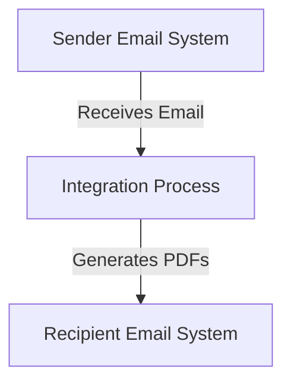

```markdown
<h2 style="color: #1f4e79;">Table of Contents</h2>

1. Introduction  
&nbsp;&nbsp;1.1 Purpose  
&nbsp;&nbsp;1.2 Scope  
2. Integration Overview  
&nbsp;&nbsp;2.1 Integration Architecture  
&nbsp;&nbsp;2.2 Integration Components  
3. Integration Scenarios  
&nbsp;&nbsp;3.1 Scenario Description  
&nbsp;&nbsp;3.2 Data Flows  
&nbsp;&nbsp;3.3 Security Requirements  
4. Error Handling and Logging  
5. Testing Validation  
6. Reference Documents  

---

# 1. Introduction

## 1.1 Purpose
The purpose of this iFlow, named 'Task1', is to automate the process of converting email content into PDF documents and sending them as email attachments. This integration facilitates the generation of reports from incoming emails, enhancing the efficiency of document handling and distribution.

## 1.2 Scope
This iFlow interacts with email systems to receive messages, processes the content to generate PDF files, and sends these files as attachments to specified recipients. The systems affected by this iFlow include the email server for both sending and receiving emails, as well as the SAP Cloud Platform Integration (CPI) environment where the iFlow is deployed.

# 2. Integration Overview

## 2.1 Integration Architecture
The integration architecture consists of a sender email system that retrieves incoming emails, processes their content, and generates PDF documents. The generated PDFs are then sent to a recipient email system.



## 2.2 Integration Components
- **Sender System**: Email server (IMAP) that retrieves incoming emails.
- **Receiver System**: Email server (SMTP) that sends generated PDF attachments.
- **Adapters Used**:
  - IMAP Adapter for receiving emails.
  - SMTP Adapter for sending emails.

# 3. Integration Scenarios

## 3.1 Scenario Description
1. The iFlow is triggered by an incoming email.
2. The email content is extracted and processed.
3. Two PDF documents are generated from the email content.
4. The PDFs are attached to a new email and sent to the specified recipient.

## 3.2 Data Flows
The data flow involves the following steps:
- **Email Retrieval**: The iFlow uses the IMAP adapter to fetch emails.
- **Content Processing**: The email body is extracted and cleaned using Groovy scripts.
- **PDF Generation**: Multiple Groovy scripts are utilized to create PDF documents from the email content.
- **Email Sending**: The SMTP adapter sends the generated PDFs as attachments.

### Groovy Script Explanations
- **script1.groovy**: Extracts email content using JavaMail API.
- **script3.groovy**: Parses the email body and sets it as the message payload.
- **script21.groovy**: Generates two PDFs from the email body and prepares them for attachment.

## 3.3 Security Requirements
The iFlow does not require basic authentication for the sender email system. However, it is essential to ensure secure connections (SSL/TLS) for both IMAP and SMTP communications to protect sensitive data during transmission.

# 4. Error Handling and Logging
Error handling is implemented within the Groovy scripts to catch exceptions during PDF generation. If an error occurs, a message indicating the failure is set as the body of the message, and the content type is adjusted to "text/plain" for clarity.

# 5. Testing Validation
Key testing scenarios include:
- Validating the retrieval of emails and the correct extraction of content.
- Ensuring that the generated PDFs are correctly formatted and contain the expected content.
- Testing the email sending functionality to confirm that attachments are received by the intended recipients.

# 6. Reference Documents
- **iFlow Content**: `Task1.iflw`
- **Groovy Scripts**: 
  - `script1.groovy`
  - `script3.groovy`
  - `script21.groovy`
  - Additional scripts for PDF generation and email handling.
```
