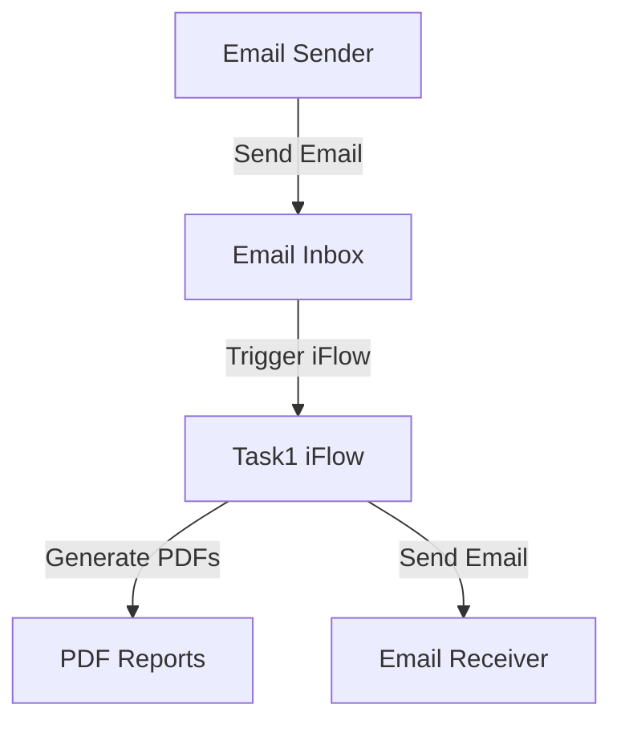

# 1. Introduction

## 1.1 Purpose
The purpose of this iFlow, named 'Task1', is to process incoming emails, extract their content, generate PDF documents from the email body, and send these PDFs as attachments in a new email. This iFlow automates the conversion of email content into a structured PDF format, facilitating easier sharing and archiving of email information.

## 1.2 Scope
This iFlow interacts with email systems, specifically using SMTP and IMAP protocols for sending and receiving emails. It processes emails from a specified inbox, generates PDF reports based on the email content, and sends these reports to designated recipients. The systems affected by this iFlow include the email server (Gmail in this case) and the SAP Cloud Platform Integration (CPI) environment.

# 2. Integration Overview

## 2.1 Integration Architecture
The integration architecture consists of a sender system (email inbox) that triggers the iFlow upon receiving an email. The iFlow processes the email content, generates PDFs, and sends them to a specified recipient.

## 2.2 Integration Components
- **Sender System**: Email inbox (IMAP)
- **Receiver System**: Email recipient (SMTP)
- **Adapter Types Used**: 
  - IMAP Adapter for receiving emails
  - SMTP Adapter for sending emails

# 3. Integration Scenarios

## 3.1 Scenario Description
1. An email is received in the designated inbox.
2. The iFlow is triggered by the arrival of the email.
3. The email content is extracted and processed.
4. Two PDF documents are generated from the email content.
5. The PDFs are attached to a new email.
6. The new email is sent to the specified recipient.

## 3.2 Data Flows
The iFlow utilizes Groovy scripts to handle the extraction of email content and the generation of PDFs. The key scripts include:
- **script1.groovy**: Extracts the email body from the incoming email.
- **script21.groovy**: Generates two PDFs from the extracted email body and prepares them for attachment.
- **script30.groovy**: Cleans the email body and sets the subject for the outgoing email.

### Mapping Logic Summary
- The email body is extracted using JavaMail API.
- PDFs are generated using the iText library, with the content formatted appropriately.
- The generated PDFs are encoded and attached to the outgoing email.

## 3.3 Security Requirements
- **Authentication**: Basic authentication is disabled for the sender and receiver.
- **Email Security**: The iFlow uses secure connections (SSL/TLS) for both IMAP and SMTP protocols to ensure the confidentiality of email content.
- **Credentials**: Email credentials are managed securely within the CPI environment.

# 4. Error Handling and Logging
Error handling is implemented within the Groovy scripts to catch exceptions during PDF generation. If an error occurs, the message body is set to indicate the error, and the content type is changed to plain text for clarity. Additionally, logging is performed to capture the state of the message and any attachments for debugging purposes.

# 5. Testing Validation
Key testing scenarios include:
- Sending emails with various content types (plain text, HTML) to ensure proper extraction and PDF generation.
- Validating the attachment of PDFs in the outgoing email.
- Testing the iFlow with different email subjects to ensure dynamic subject handling.
- Ensuring that error handling works correctly by simulating failures in PDF generation.

# 6. Reference Documents
- **iFlow Content**: `Task1.iflw`
- **Groovy Scripts**: 
  - `script1.groovy`
  - `script21.groovy`
  - `script30.groovy`
  - Additional scripts for PDF generation and email handling.
- **Integration Artifacts**: Configuration files and logs related to the iFlow execution.
