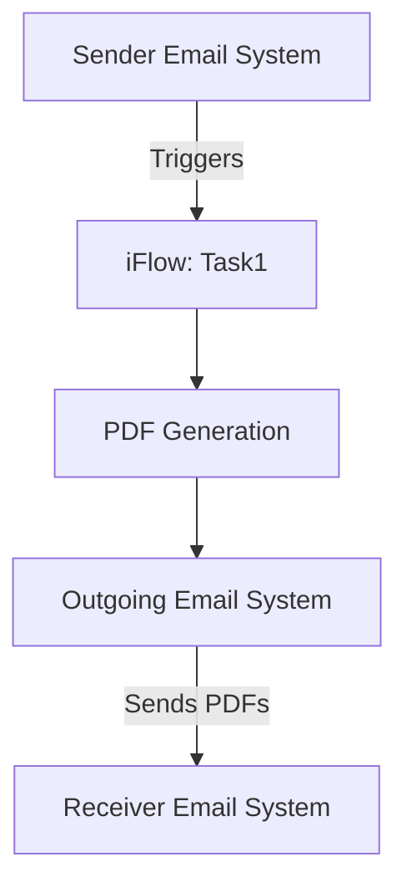

<div style="float: left; text-align: left;"></div><div style="float: right; text-align: right;"></div><div style="clear: both;"></div>
<div style="height: 80px;"></div><h1 style="color: #1f4e79; font-size: 3em; text-align: center; margin-top: 5px; margin-bottom: 5px;">Task1</h1><h2 style="color: #1f4e79; font-size: 1.5em; text-align: center; margin-top: 5px; margin-bottom: 0px;">SAP CPI Technical Specification Document</h2><div style="height: 100px;"></div><div style="width: 100%; text-align: center;">
<table border="1" style="width: 400px; border-collapse: collapse; border-color: black; margin: 0 auto; text-align: left;">
  <tr><td style="width: 30%; padding: 5px;">**Author:**</td><td style="padding: 5px;">Rohancherian783</td></tr>
  <tr><td style="padding: 5px;">**Date:**</td><td style="padding: 5px;">2025-12-11</td></tr>
  <tr><td style="padding: 5px;">**Version (Commit):**</td><td style="padding: 5px;">5f1bb99</td></tr>
</table>
</div>
<div style="page-break-after: always;"></div>

<div style="float: left; text-align: left;"></div><div style="float: right; text-align: right;"></div><div style="clear: both;"></div>
```markdown

<h1 style="color: #1f4e79; font-size: 2.5em;">Table of Contents</h1>

1. Introduction
    1.1 Purpose
    1.2 Scope
2. Integration Overview
    2.1 Integration Architecture
    2.2 Integration Components
3. Integration Scenarios
    3.1 Scenario Description
    3.2 Data Flows
    3.3 Security Requirements
4. Error Handling and Logging
5. Testing Validation
6. Reference Documents


<div style="page-break-before: always;"></div>
<div style="float: left; text-align: left;"></div><div style="float: right; text-align: right;"></div><div style="clear: both;"></div>


<h1 style="color: #1f4e79;">1. Introduction</h1>

<h2 style="color: #1f4e79;">1.1 Purpose</h2>
The purpose of this iFlow, named 'Task1', is to process incoming emails, extract their content, and generate PDF reports based on the email body. The generated PDFs are then attached to an outgoing email.

<h2 style="color: #1f4e79;">1.2 Scope</h2>
This iFlow integrates with email systems to receive messages, processes the content to create PDF documents, and sends these documents as attachments. The systems affected include the email sender and receiver, as well as the SAP Cloud Platform Integration (CPI) environment.


<div style="float: left; text-align: left;"></div><div style="float: right; text-align: right;"></div><div style="clear: both;"></div>
<h1 style="color: #1f4e79;">2. Integration Overview</h1>

<h2 style="color: #1f4e79;">2.1 Integration Architecture</h2>
The integration architecture consists of a sender email system that triggers the iFlow upon receiving an email. The iFlow processes the email content, generates PDFs, and sends them to a specified receiver email system.



<h2 style="color: #1f4e79;">2.2 Integration Components</h2>
- **Sender System**: Email system that sends incoming emails to the iFlow.
- **Receiver System**: Email system that receives the generated PDF attachments.
- **Adapters Used**: 
    - Mail Adapter for receiving emails.
    - Mail Adapter for sending emails.


<div style="float: left; text-align: left;"></div><div style="float: right; text-align: right;"></div><div style="clear: both;"></div>
<h1 style="color: #1f4e79;">3. Integration Scenarios</h1>

<h2 style="color: #1f4e79;">3.1 Scenario Description</h2>
The iFlow operates as follows:
1. An email is received by the iFlow.
2. The email content is extracted and processed.
3. Two PDF documents are generated from the email content.
4. The PDFs are attached to an outgoing email and sent to the specified recipient.

<h2 style="color: #1f4e79;">3.2 Data Flows</h2>
The data flow involves:
- Extracting the email body using JavaMail API.
- Generating PDFs using iText library.
- Attaching the PDFs to the outgoing email.

**Groovy Script Explanations**:
- **script1.groovy**: Extracts the email body from the incoming message.
- **script3.groovy**: Parses the email content and sets it as the message body.
- **script17.groovy**: Generates a PDF from the email body and attaches it.
- **script24.groovy**: Merges two PDFs into one and sets it as the email body.

<h2 style="color: #1f4e79;">3.3 Security Requirements</h2>
- Basic authentication is not enabled for the sender.
- The iFlow does not expose sensitive headers or allow CORS.
- All email communications are secured using standard email protocols.


<div style="float: left; text-align: left;"></div><div style="float: right; text-align: right;"></div><div style="clear: both;"></div>
<h1 style="color: #1f4e79;">4. Error Handling and Logging</h1>
Error handling is implemented through logging mechanisms that capture exceptions during PDF generation and email processing. If an error occurs, a plain text message indicating the error is sent back as the response.


<div style="float: left; text-align: left;"></div><div style="float: right; text-align: right;"></div><div style="clear: both;"></div>
<h1 style="color: #1f4e79;">5. Testing Validation</h1>
Key testing scenarios include:
- Sending emails with various content types (plain text, HTML).
- Validating the generated PDFs for correct content.
- Ensuring that the outgoing email is received with the correct attachments.


<div style="float: left; text-align: left;"></div><div style="float: right; text-align: right;"></div><div style="clear: both;"></div>
<h1 style="color: #1f4e79;">6. Reference Documents</h1>
- iFlow Content: `Task1.iflw`
- Groovy Scripts: `script1.groovy`, `script3.groovy`, `script17.groovy`, `script24.groovy`, etc.
- Integration Architecture Diagrams and Documentation.
```
