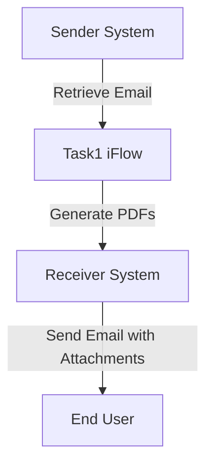

```markdown
<h2 style="color: #1f4e79;">Table of Contents</h2>

1. Introduction  
&nbsp;&nbsp;1.1 Purpose  
&nbsp;&nbsp;1.2 Scope  
2. Integration Overview  
&nbsp;&nbsp;2.1 Integration Architecture  
&nbsp;&nbsp;2.2 Integration Components  
3. Integration Scenarios  
&nbsp;&nbsp;3.1 Scenario Description  
&nbsp;&nbsp;3.2 Data Flows  
&nbsp;&nbsp;3.3 Security Requirements  
4. Error Handling and Logging  
5. Testing Validation  
6. Reference Documents  

---

# 1. Introduction

## 1.1 Purpose
The purpose of this iFlow, named 'Task1', is to automate the process of converting email content into PDF documents. The iFlow retrieves emails, extracts their content, generates two separate PDF files from the content, and sends these PDFs as attachments in a new email.

## 1.2 Scope
This iFlow interacts with email systems to receive and send emails. It is designed to work with SMTP and IMAP protocols for sending and receiving emails, respectively. The iFlow is limited to processing plain text content from emails and generating PDF documents based on that content.

# 2. Integration Overview

## 2.1 Integration Architecture
The integration architecture consists of a sender system that retrieves emails and a receiver system that sends emails with PDF attachments. The iFlow processes the email content and generates the required PDFs.



## 2.2 Integration Components
- **Sender System**: Email server using IMAP to fetch emails.
- **Receiver System**: Email server using SMTP to send emails.
- **Adapters Used**: IMAP adapter for receiving emails and SMTP adapter for sending emails.

# 3. Integration Scenarios

## 3.1 Scenario Description
1. The iFlow is triggered by a scheduled event or an incoming email.
2. It retrieves the email content using the IMAP adapter.
3. The content is processed to generate two PDF documents.
4. The PDFs are attached to a new email and sent to the specified recipient using the SMTP adapter.

## 3.2 Data Flows
The iFlow utilizes various Groovy scripts to handle the email content and PDF generation. Key scripts include:
- **script1.groovy**: Extracts the email body from the incoming email.
- **script21.groovy**: Generates two PDFs from the email content and prepares them for attachment.
- **script30.groovy**: Cleans the email body and sets the subject for the outgoing email.

### Groovy Script Explanations
- **script1.groovy**: Uses JavaMail API to parse the email and extract the body content.
- **script21.groovy**: Creates two PDF documents using iText and attaches them to the message.
- **script30.groovy**: Cleans the email body by removing disclaimers and unnecessary formatting before generating PDFs.

## 3.3 Security Requirements
The iFlow does not require basic authentication for the sender system. However, it is essential to ensure that the email servers are configured securely to prevent unauthorized access. The iFlow should also handle sensitive information appropriately when processing email content.

# 4. Error Handling and Logging
Error handling is implemented within the Groovy scripts to catch exceptions during PDF generation. If an error occurs, the iFlow logs the error message and sets the response body to indicate the failure. This ensures that any issues can be traced and resolved efficiently.

# 5. Testing Validation
Key testing scenarios include:
- Validating the retrieval of emails and ensuring the correct content is extracted.
- Testing the PDF generation process to confirm that the content is accurately represented in the PDFs.
- Ensuring that the emails with attachments are sent successfully to the intended recipients.

# 6. Reference Documents
- **iFlow Content**: `Task1.iflw`
- **Groovy Scripts**: 
  - `script1.groovy`
  - `script21.groovy`
  - `script30.groovy`
- **XSLT Files**: Not applicable for this iFlow.
```
