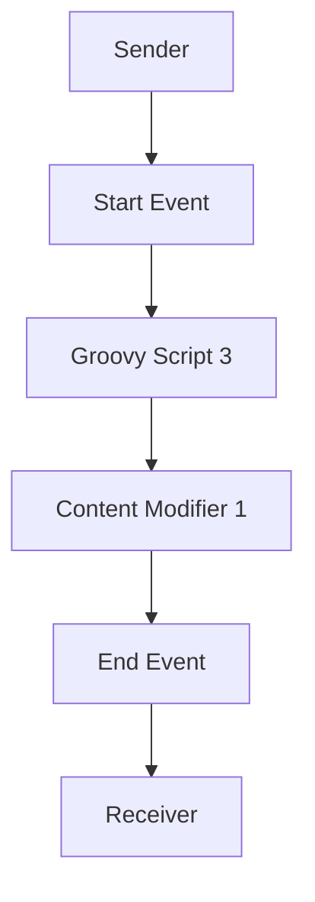

<h1 style="color: #1f4e79; text-align: center; font-size: 3.5em;">Task1</h1><h2 style="text-align: center; font-size: 2em;">Technical Specification Document</h2>

<table><tr><th>Author</th><td>Rohancherian783</td></tr><tr><th>Date</th><td>2026-01-02</td></tr><tr><th>Version</th><td>1.0.0</td></tr></table>

<h1 style="color: #1f4e79; font-size: 2.5em;">Table of Contents</h1>
1. Introduction  
&nbsp;&nbsp;&nbsp; 1.1 Purpose  
&nbsp;&nbsp;&nbsp; 1.2 Scope  
2. Integration Overview  
&nbsp;&nbsp;&nbsp; 2.1 Integration Architecture  
&nbsp;&nbsp;&nbsp; 2.2 Integration Components  
3. Integration Scenarios  
&nbsp;&nbsp;&nbsp; 3.1 Scenario Description  
&nbsp;&nbsp;&nbsp; 3.2 Data Flows  
&nbsp;&nbsp;&nbsp; 3.3 Security Requirements  
4. Error Handling and Logging  
5. Testing Validation  
6. Reference Documents  

<h1 style="color: #1f4e79;">1. Introduction</h1>
<b style="color: #1f4e79;">1.1 Purpose:</b>  
The purpose of this report is to provide a comprehensive analysis of the integration flow 'Task1' within the SAP Cloud Platform Integration (CPI) environment. This includes an overview of its architecture, components, scenarios, and testing validation.

<b style="color: #1f4e79;">1.2 Scope:</b>  
This report covers the integration flow 'Task1', detailing its design, implementation, and testing strategies. It is intended for technical architects, developers, and stakeholders involved in the integration process.

<h1 style="color: #1f4e79;">2. Integration Overview</h1>
<b style="color: #1f4e79;">2.1 Integration Architecture:</b>  

<b style="color: #1f4e79;">2.2 Integration Components:</b>  
| Component Type         | Name/Details                       | Description                                      |
|------------------------|------------------------------------|--------------------------------------------------|
| Integration Process     | Process_1                          | Main process handling the integration logic.     |
| Call Activity           | Groovy Script 3                    | Executes a Groovy script for processing data.    |
| Call Activity           | Content Modifier 1                 | Modifies the message content before sending.     |
| Start Event             | StartEvent_2                       | Initiates the integration flow.                   |
| End Event               | EndEvent_25936                    | Marks the completion of the integration flow.     |
| Message Flow            | Mail                               | Handles email communication between sender and receiver. |

<h1 style="color: #1f4e79;">3. Integration Scenarios</h1>
<b style="color: #1f4e79;">3.1 Scenario Description:</b>  
The integration flow 'Task1' is designed to retrieve emails from a specified inbox and process them using a Groovy script. The processed data is then modified and sent to a designated recipient via email.

<b style="color: #1f4e79;">3.2 Data Flows:</b>  
1. **Email Retrieval:** The flow starts by retrieving unread emails from the specified inbox.
2. **Processing:** The retrieved email data is processed using a Groovy script.
3. **Modification:** The content of the email is modified as per the requirements.
4. **Email Sending:** The modified content is sent to the specified recipient.

<b style="color: #1f4e79;">3.3 Security Requirements:</b>  
- Basic authentication is disabled for the sender and receiver.
- The integration flow does not expose sensitive headers or allow CORS.
- All events are logged for monitoring and auditing purposes.

<h1 style="color: #1f4e79;">4. Error Handling and Logging</h1>  
Error handling is implemented to capture any exceptions during the integration process. All events are logged, allowing for easy tracking of issues and performance monitoring.

<h1 style="color: #1f4e79;">5. Testing Validation</h1>  
**Testing Details – Sheet: Testing**  
| Test Case ID | Scenario                                      | Expected Outcome                                      |
|--------------|-----------------------------------------------|------------------------------------------------------|
| TC01         | Retrieve unread emails from inbox             | Successfully retrieves unread emails.                |
| TC02         | Process email data using Groovy script        | Data is processed without errors.                    |
| TC03         | Modify email content                           | Email content is modified as per defined rules.     |
| TC04         | Send modified email to recipient              | Email is sent successfully to the specified recipient.|
| TC05         | Handle errors during email retrieval           | Logs error and does not crash the integration flow.  |
| TC06         | Validate logging of events                     | All events are logged correctly for monitoring.      |

<h1 style="color: #1f4e79;">6. Reference Documents</h1>  
- SAP Cloud Platform Integration Documentation  
- BPMN 2.0 Specification  
- Groovy Language Documentation  
