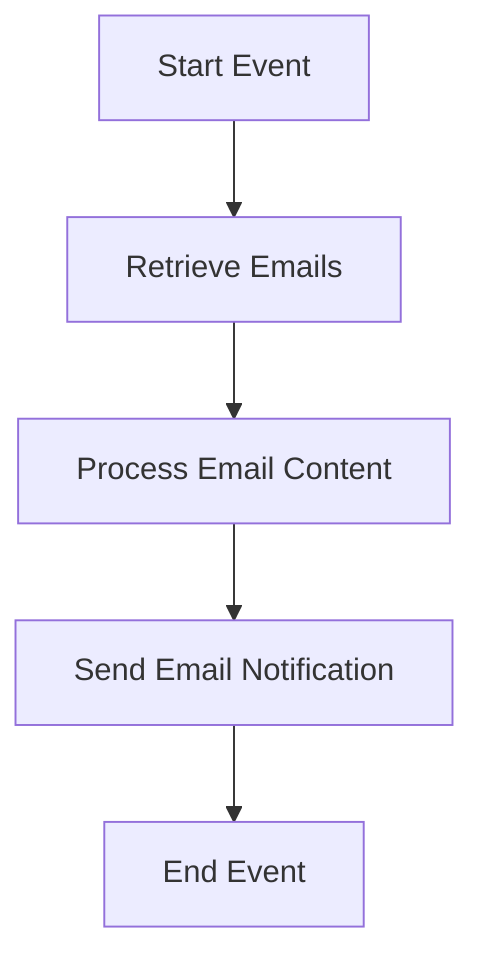

<h1 style="color: #1f4e79; text-align: center; font-size: 3.5em;">Task1</h1><h2 style="text-align: center; font-size: 2em;">Technical Specification Document</h2>

<table style="margin: 0 auto; border-collapse: collapse; min-width: 500px; border: 1px solid #000;"><tr><th style="padding: 12px; border: 1px solid #000; background-color: #f2f2f2; text-align: left;">Author</th><td style="padding: 12px; border: 1px solid #000; text-align: left;">Rohancherian783</td></tr><tr><th style="padding: 12px; border: 1px solid #000; background-color: #f2f2f2; text-align: left;">Date</th><td style="padding: 12px; border: 1px solid #000; text-align: left;">2026-01-02</td></tr><tr><th style="padding: 12px; border: 1px solid #000; background-color: #f2f2f2; text-align: left;">Version</th><td style="padding: 12px; border: 1px solid #000; text-align: left;">1.0.0</td></tr></table>

<h1 style="color: #1f4e79; font-size: 2.5em;">Table of Contents</h1>

1. Introduction  
&nbsp;&nbsp;&nbsp; 1.1 Purpose  
&nbsp;&nbsp;&nbsp; 1.2 Scope  
2. Integration Overview  
&nbsp;&nbsp;&nbsp; 2.1 Integration Architecture  
&nbsp;&nbsp;&nbsp; 2.2 Integration Components  
3. Integration Scenarios  
&nbsp;&nbsp;&nbsp; 3.1 Scenario Description  
&nbsp;&nbsp;&nbsp; 3.2 Data Flows  
&nbsp;&nbsp;&nbsp; 3.3 Security Requirements  
4. Error Handling and Logging  
5. Testing Validation  
6. Reference Documents  

<h1 style="color: #1f4e79;">1. Introduction</h1>

<b style="color: #1f4e79;">1.1 Purpose:</b>

The purpose of the iFlow 'Task1' is to facilitate the automated processing of email messages between a sender and a receiver. This integration flow is designed to retrieve unread emails from a specified inbox, process the content of these emails, and subsequently send notifications or responses based on the email content. The business logic behind this iFlow is to streamline communication processes, reduce manual intervention, and ensure timely responses to incoming queries or requests. The integration involves the use of SMTP and IMAP protocols for sending and receiving emails, respectively, and utilizes Groovy scripts for processing the email content dynamically.

<b style="color: #1f4e79;">1.2 Scope:</b>

The scope of the iFlow 'Task1' encompasses the following key areas:

- **Email Retrieval:** The iFlow is configured to connect to an IMAP server (imap.gmail.com) to fetch unread emails from the inbox. It is set to poll the inbox at regular intervals, ensuring that no incoming messages are missed.
  
- **Email Processing:** Upon retrieval, the content of the emails is processed using Groovy scripts. This allows for dynamic manipulation of the email content, such as extracting specific information or modifying the message body before sending a response.

- **Email Sending:** After processing, the iFlow sends out notifications or responses via SMTP (smtp.gmail.com). The email is sent to a predefined recipient with a subject and body that can be customized based on the processed content.

- **Logging and Error Handling:** The iFlow includes comprehensive logging of events and error handling mechanisms to ensure that any issues encountered during the email processing are captured and can be addressed promptly.

This iFlow is particularly beneficial for organizations looking to automate their email communication processes, thereby enhancing efficiency and responsiveness.

<h1 style="color: #1f4e79;">2. Integration Overview</h1>

<b style="color: #1f4e79;">2.1 Integration Architecture:</b>

<b style="color: #1f4e79;">2.2 Integration Components:</b>

| Component Type      | Name/Details                          | Description                                                                 |
|---------------------|---------------------------------------|-----------------------------------------------------------------------------|
| Sender              | SMTP Server (smtp.gmail.com:587)     | Responsible for sending email notifications to the recipient.              |
| Receiver            | IMAP Server (imap.gmail.com:993)     | Responsible for retrieving unread emails from the inbox.                   |
| Integration Process  | Groovy Script                         | Contains the logic for processing the email content dynamically.           |
| Logging             | Event Logging                         | Logs all events and errors for monitoring and troubleshooting purposes.    |

<h1 style="color: #1f4e79;">3. Integration Scenarios</h1>

<b style="color: #1f4e79;">3.1 Scenario Description:</b>

1. **Email Retrieval:** The iFlow initiates by connecting to the IMAP server to fetch unread emails from the specified inbox.
  
2. **Content Processing:** Each retrieved email is processed using a Groovy script that extracts relevant information and prepares the content for response.

3. **Email Sending:** After processing, the iFlow sends an email notification to the designated recipient with the processed content.

4. **Completion:** The iFlow concludes the process by logging the event and marking the email as read.

<b style="color: #1f4e79;">3.2 Data Flows:</b>

- Incoming emails are fetched from the IMAP server.
  
- The email content is processed and modified as needed.

- Notifications are sent out via the SMTP server.

- Logs are generated for each step of the process.

<b style="color: #1f4e79;">3.3 Security Requirements:</b>

| Security Aspect          | Description                                           |
|--------------------------|-------------------------------------------------------|
| Authentication           | Basic authentication is used for both SMTP and IMAP connections. |
| Data Encryption          | Emails are sent using STARTTLS for secure transmission. |
| Access Control           | Ensure that only authorized users can access the email accounts. |

<h1 style="color: #1f4e79;">4. Error Handling and Logging</h1>

The iFlow incorporates robust error handling mechanisms to capture and log any issues that arise during the email retrieval or sending processes. This includes:

- Logging error messages with detailed descriptions to facilitate troubleshooting.
  
- Implementing retry logic for transient errors, such as temporary network issues.

- Sending alerts to administrators in case of critical failures.

<h1 style="color: #1f4e79;">5. Testing Validation</h1>

Testing of the iFlow will include:

- Unit testing of the Groovy scripts to ensure correct processing of email content.
  
- Integration testing to validate the end-to-end flow from email retrieval to sending notifications.

- Performance testing to assess the iFlow's ability to handle a high volume of emails.

<h1 style="color: #1f4e79;">6. Reference Documents</h1>

- SAP CPI Documentation
- Email Protocol Specifications (SMTP, IMAP)
- Groovy Scripting Guide for SAP CPI
