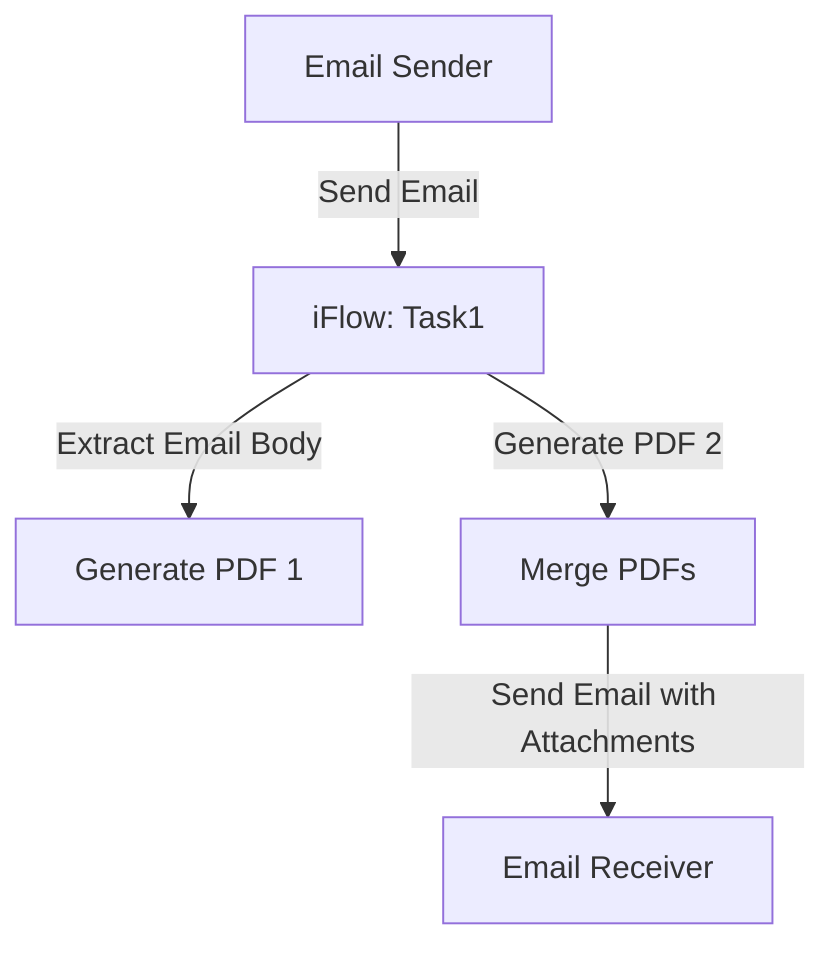

<h1 style="color: #1f4e79; font-size: 2.5em;">Table of Contents</h1>

1. Introduction  
    1.1 Purpose  
    1.2 Scope  
2. Integration Overview  
    2.1 Integration Architecture  
    2.2 Integration Components  
3. Integration Scenarios  
    3.1 Scenario Description  
    3.2 Data Flows  
    3.3 Security Requirements  
4. Error Handling and Logging  
5. Testing Validation  
6. Reference Documents  

          

# 1. Introduction

## 1.1 Purpose
The purpose of this iFlow, named 'Task1', is to automate the process of converting email content into PDF documents. The iFlow extracts the body of incoming emails, generates two separate PDF files from the content, and then merges these PDFs into a single document for attachment in an outgoing email.

## 1.2 Scope
This iFlow interacts with email systems to receive messages and send processed content back as attachments. It utilizes the iText library for PDF generation and is designed to handle MIME multipart email formats. The systems affected by this iFlow include the email server for receiving and sending emails, as well as the SAP Cloud Platform Integration (CPI) environment where the iFlow is deployed.

# 2. Integration Overview

## 2.1 Integration Architecture
The integration architecture consists of a sender email system that triggers the iFlow upon receiving an email. The iFlow processes the email content, generates PDFs, and sends the final document to a specified recipient.

## 2.2 Integration Components
- **Sender System**: Email server (IMAP) that receives emails.
- **Receiver System**: Email server (SMTP) that sends emails.
- **Adapters Used**: 
  - IMAP Adapter for receiving emails.
  - SMTP Adapter for sending emails.

# 3. Integration Scenarios

## 3.1 Scenario Description
1. An email is received by the iFlow from the sender's email server.
2. The iFlow extracts the email body using the JavaMail API.
3. Two PDFs are generated from the email content.
4. The PDFs are merged into a single document.
5. The merged PDF is sent as an attachment in a new email to the specified recipient.

## 3.2 Data Flows
The iFlow utilizes several Groovy scripts to handle the data transformation and PDF generation:
- **Email Extraction**: Scripts (e.g., `script1.groovy`, `script2.groovy`) extract the email body from the MIME format.
- **PDF Generation**: Scripts (e.g., `script17.groovy`, `script19.groovy`, `script21.groovy`) create PDFs from the extracted content.
- **Merging PDFs**: Scripts (e.g., `script26.groovy`, `script30.groovy`) merge the generated PDFs into a single document.

## 3.3 Security Requirements
The iFlow does not require basic authentication for the sender email system. However, it is essential to ensure that the email server configurations (IMAP and SMTP) are secured and that sensitive information is handled appropriately. The iFlow logs all events for monitoring purposes.

# 4. Error Handling and Logging
Error handling is implemented within the Groovy scripts to catch exceptions during PDF generation and email processing. If an error occurs, the iFlow sets the message body to indicate the error and changes the content type to plain text for better readability.

# 5. Testing Validation
Key testing scenarios include:
- Sending emails with various content types (plain text, HTML).
- Validating the generated PDFs for correct content and formatting.
- Ensuring that the merged PDF is correctly attached to the outgoing email.

# 6. Reference Documents
- `Task1.iflw`: Main iFlow configuration file.
- `script1.groovy`, `script2.groovy`, `script3.groovy`, etc.: Groovy scripts for processing email and generating PDFs.
- iText library documentation for PDF generation.
