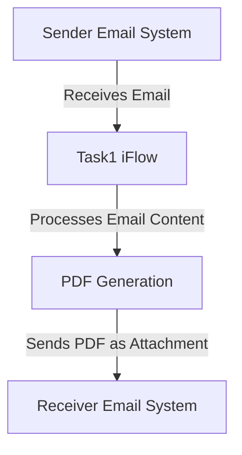

<div style="float: left; text-align: left;"></div><div style="float: right; text-align: right;"></div><div style="clear: both;"></div>

<div style="height: 80px;"></div><h1 style="color: #1f4e79; font-size: 3em; text-align: center; margin-top: 5px; margin-bottom: 5px;">Task1</h1><h2 style="color: #1f4e79; font-size: 1.5em; text-align: center; margin-top: 5px; margin-bottom: 0px;">SAP CPI Technical Specification Document</h2><div style="height: 100px;"></div><div style="width: 100%; text-align: center;">
<table border="1" style="width: 400px; border-collapse: collapse; border-color: black; margin: 0 auto; text-align: left;">
  <tr><td style="width: 30%; padding: 5px;">**Author:**</td><td style="padding: 5px;">Rohancherian783</td></tr>
  <tr><td style="padding: 5px;">**Date:**</td><td style="padding: 5px;">2025-12-11</td></tr>
  <tr><td style="padding: 5px;">**Version (Commit):**</td><td style="padding: 5px;">2a10b3a</td></tr>
</table>
</div>
<div style="page-break-after: always;"></div>

<div style="float: left; text-align: left;"></div><div style="float: right; text-align: right;"></div><div style="clear: both;"></div>

```markdown

<h1 style="color: #1f4e79; font-size: 2.5em;">Table of Contents</h1>

1. Introduction
    1.1 Purpose
    1.2 Scope
2. Integration Overview
    2.1 Integration Architecture
    2.2 Integration Components
3. Integration Scenarios
    3.1 Scenario Description
    3.2 Data Flows
    3.3 Security Requirements
4. Error Handling and Logging
5. Testing Validation
6. Reference Documents


<div style="page-break-after: always;"></div>

<div style="float: left; text-align: left;"></div><div style="float: right; text-align: right;"></div><div style="clear: both;"></div>


<h1 style="color: #1f4e79;">1. Introduction</h1>

<h2 style="color: #1f4e79;">1.1 Purpose</h2>
The purpose of this iFlow, named 'Task1', is to process incoming emails, extract their content, and generate PDF reports based on the email body. The generated PDFs are then attached to an outgoing email.

<h2 style="color: #1f4e79;">1.2 Scope</h2>
This iFlow interacts with email systems to receive and send emails. It processes email content, generates PDF documents, and handles attachments. The systems affected include the email server for both sending and receiving emails, as well as the SAP CPI environment where the iFlow is deployed.


<h1 style="color: #1f4e79;">2. Integration Overview</h1>

<h2 style="color: #1f4e79;">2.1 Integration Architecture</h2>
The integration architecture consists of a sender email system that receives emails and a receiver email system that sends out the generated PDF reports. The iFlow processes the email content and generates the required PDFs.



<h2 style="color: #1f4e79;">2.2 Integration Components</h2>
The integration components include:
- **Sender System**: Email server that receives emails.
- **Receiver System**: Email server that sends out emails with attachments.
- **Adapters Used**: IMAP for receiving emails and SMTP for sending emails.


<h1 style="color: #1f4e79;">3. Integration Scenarios</h1>

<h2 style="color: #1f4e79;">3.1 Scenario Description</h2>
The iFlow operates by first receiving an email through the IMAP adapter. It extracts the email body, generates two PDF documents from the content, and then sends these PDFs as attachments in a new email via the SMTP adapter.

<h2 style="color: #1f4e79;">3.2 Data Flows</h2>
The data flow involves:
1. Receiving an email.
2. Extracting the email body using JavaMail API.
3. Generating two PDFs using iText library.
4. Attaching the PDFs to a new email.
5. Sending the email with the attached PDFs.

The Groovy scripts used for PDF generation and email processing are as follows:
- **script23.groovy**: Handles the extraction of email content and PDF generation.
- **script17.groovy**: Generates a single PDF from the email body.
- **script24.groovy**: Merges two PDFs into one.
- **script30.groovy**: Cleans the email body and prepares it for PDF generation.

<h2 style="color: #1f4e79;">3.3 Security Requirements</h2>
The iFlow does not require basic authentication for the sender email system. However, it is essential to ensure that the email servers are configured securely to prevent unauthorized access. The email content should be handled securely to avoid data leaks.


<h1 style="color: #1f4e79;">4. Error Handling and Logging</h1>
Error handling is implemented within the Groovy scripts to catch exceptions during PDF generation. If an error occurs, the message body is set to indicate the error, and the content type is changed to plain text for clarity. Logging is also performed to capture the email body and any errors encountered during processing.


<h1 style="color: #1f4e79;">5. Testing Validation</h1>
Key testing scenarios include:
- Sending emails with various content types (plain text, HTML).
- Validating the generated PDFs for correct content.
- Ensuring that the emails are sent with the correct attachments.
- Testing error handling by simulating failures in PDF generation.


<h1 style="color: #1f4e79;">6. Reference Documents</h1>
The following artifacts were analyzed for this iFlow:
- iFlow Content: `Task1.iflw`
- Groovy Scripts: `script23.groovy`, `script17.groovy`, `script24.groovy`, `script30.groovy`, `script1.groovy`, `script2.groovy`, `script3.groovy`, `script4.groovy`, `script5.groovy`, `script6.groovy`, `script7.groovy`, `script8.groovy`, `script9.groovy`, `script10.groovy`, `script11.groovy`, `script12.groovy`, `script13.groovy`, `script14.groovy`, `script15.groovy`, `script16.groovy`, `script17.groovy`, `script18.groovy`, `script19.groovy`, `script20.groovy`, `script21.groovy`, `script22.groovy`, `script23.groovy`, `script24.groovy`, `script25.groovy`, `script26.groovy`, `script27.groovy`, `script28.groovy`, `script29.groovy`, `script30.groovy`.
- XSLT files: None used in this iFlow.
```
