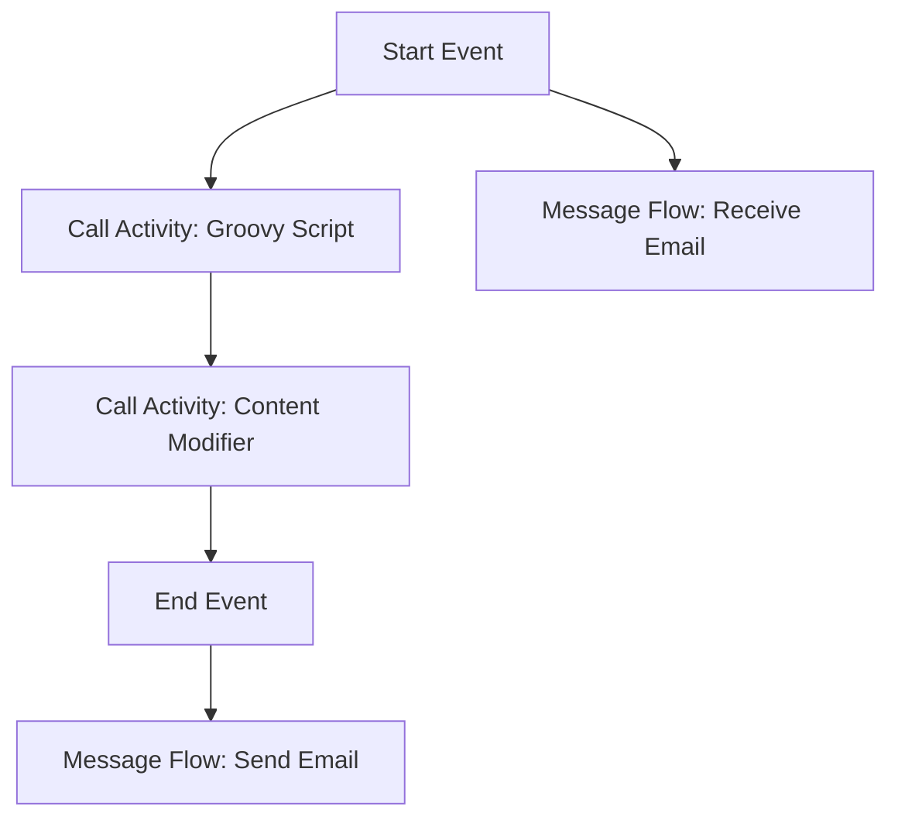

<h1 style='color: #1f4e79; font-size: 3em; margin: 80px 0 20px 0; border:none;'>Task1</h1><h2 style='border:none;'>Technical Specification Document</h2>
<table style='width: 400px; margin: 0 auto;'><tr><th>Author</th><td>Rohancherian783</td></tr><tr><th>Date</th><td>2025-12-23</td></tr><tr><th>Version</th><td>1.0.0</td></tr></table>

<h1 style="color: #1f4e79;">Table of Contents</h1>
1. Introduction  
&nbsp;&nbsp;&nbsp; 1.1 Purpose  
&nbsp;&nbsp;&nbsp; 1.2 Scope  
2. Integration Overview  
&nbsp;&nbsp;&nbsp; 2.1 Integration Architecture  
&nbsp;&nbsp;&nbsp; 2.2 Integration Components  
3. Integration Scenarios  
&nbsp;&nbsp;&nbsp; 3.1 Scenario Description  
&nbsp;&nbsp;&nbsp; 3.2 Data Flows  
&nbsp;&nbsp;&nbsp; 3.3 Security Requirements  
4. Error Handling and Logging  
5. Testing Validation  
6. Reference Documents  

<b style="color: #1f4e79;">1.1 Purpose</b>

The purpose of the iFlow artifact 'Task1' is to facilitate the integration of email communication within an SAP Cloud Platform Integration (CPI) environment. This integration flow is designed to automate the process of sending and receiving emails using SMTP and IMAP protocols. By leveraging these protocols, the iFlow enables seamless communication between different systems and stakeholders, ensuring that critical information is transmitted efficiently and reliably.

The iFlow is structured to handle various email-related tasks, including sending emails with dynamic content, processing incoming emails, and managing attachments. The integration flow is built to be robust and flexible, allowing for easy modifications and enhancements as business requirements evolve. This ensures that organizations can adapt to changing communication needs without significant rework or downtime.

<b style="color: #1f4e79;">1.2 Scope</b>

The scope of the 'Task1' iFlow encompasses the entire lifecycle of email communication within the integration landscape. This includes the following key functionalities:

1. **Email Sending**: The iFlow is capable of sending emails to specified recipients using SMTP. It supports dynamic content generation, allowing for personalized messages based on the context of the integration scenario. The email can include various elements such as subject lines, body content, and attachments.

2. **Email Receiving**: The iFlow is also designed to receive emails via IMAP. It can poll an email inbox at specified intervals, process unread messages, and perform actions based on the content of the emails received. This functionality is crucial for scenarios where automated responses or data extraction from incoming emails is required.

3. **Error Handling**: The iFlow includes mechanisms for error handling and logging, ensuring that any issues encountered during email processing are captured and can be addressed promptly. This is vital for maintaining the reliability and integrity of the integration process.

4. **Security Considerations**: The iFlow incorporates security measures such as authentication and encryption to protect sensitive information transmitted via email. This is particularly important in scenarios involving confidential data or compliance with regulatory requirements.

5. **Extensibility**: The design of the iFlow allows for easy integration with other systems and services, enabling organizations to extend its capabilities as needed. This includes the potential for integrating with third-party applications or additional SAP services.

Overall, the 'Task1' iFlow serves as a comprehensive solution for managing email communications within an SAP CPI environment, providing organizations with the tools they need to enhance their operational efficiency and responsiveness.

<b style="color: #1f4e79;">2. Integration Overview</b>

<b style="color: #1f4e79;">2.1 Integration Architecture</b>

<b style="color: #1f4e79;">2.2 Integration Components</b>

The integration components of the 'Task1' iFlow include:

- **Start Event**: Initiates the integration process, triggering the flow based on incoming email events.
- **Call Activities**: These are reusable components that encapsulate specific functionalities, such as executing Groovy scripts for data manipulation and modifying email content before sending.
- **End Event**: Marks the completion of the integration process, ensuring that all tasks have been executed successfully.
- **Message Flows**: Define the communication pathways for sending and receiving emails, utilizing SMTP for outgoing messages and IMAP for incoming messages.

<b style="color: #1f4e79;">3. Integration Scenarios</b>

<b style="color: #1f4e79;">3.1 Scenario Description</b>

The integration scenarios for 'Task1' involve automating email communications for various business processes, such as notifications, alerts, and data requests. Each scenario is designed to streamline communication and improve response times.

<b style="color: #1f4e79;">3.2 Data Flows</b>

Data flows within the iFlow are managed through message mappings and transformations, ensuring that the correct information is sent and received in the appropriate format.

<b style="color: #1f4e79;">3.3 Security Requirements</b>

Security requirements include authentication for email servers, encryption of sensitive data, and compliance with organizational policies regarding data protection.

<b style="color: #1f4e79;">4. Error Handling and Logging</b>

The iFlow incorporates error handling mechanisms to capture and log any issues encountered during processing. This includes retry logic and notifications for failed operations.

<b style="color: #1f4e79;">5. Testing Validation</b>

Testing validation involves verifying the functionality of the iFlow through unit tests and integration tests to ensure that all components work as expected.

<b style="color: #1f4e79;">6. Reference Documents</b>

Reference documents include SAP CPI documentation, email protocol specifications, and best practices for integration design.
