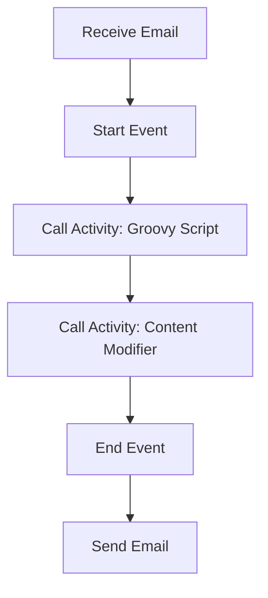

---
pdf_options:
  format: A4
  margin:
    top: 1.2in
    bottom: 0.8in
    left: 0.5in
    right: 0.5in
  displayHeaderFooter: true
  headerTemplate: |
    

      
      Task1 - Technical Specification
      
    

  footerTemplate: |
    

      2026-01-06
      Page  of 
    

---

<h1 style="color: #1f4e79; font-size: 3.5em; text-align: center !important;">Task1</h1>
<h2 style="font-size: 1.8em; font-weight: normal; text-align: center !important;">Technical Specification Document</h2>

<table style="width: 60%; margin: 0 auto; text-align: left;">
  <tr><th>Author</th><td>Rohancherian783</td></tr>
  <tr><th>Date</th><td>2026-01-06</td></tr>
  <tr><th>Version</th><td>1.0.0</td></tr>
</table>

<h1 style="color: #1f4e79; font-size: 2.5em; text-align: left;">Table of Contents</h1>
1. Introduction  
&nbsp;&nbsp;&nbsp; 1.1 Purpose  
&nbsp;&nbsp;&nbsp; 1.2 Scope  
2. Integration Overview  
&nbsp;&nbsp;&nbsp; 2.1 Integration Architecture  
&nbsp;&nbsp;&nbsp; 2.2 Integration Components  
3. Integration Scenarios  
&nbsp;&nbsp;&nbsp; 3.1 Scenario Description  
&nbsp;&nbsp;&nbsp; 3.2 Data Flows  
&nbsp;&nbsp;&nbsp; 3.3 Security Requirements  
4. Error Handling and Logging  
5. Testing Validation  
6. Reference Documents  

<h1 style="color: #1f4e79; text-align: left; clear: both;">1. Introduction</h1>
<b style="color: #1f4e79;">1.1 Purpose:</b>  
The purpose of the iFlow 'Task1' is to automate the process of receiving emails from a specified mailbox, processing the content of those emails, and subsequently sending a formatted email to a designated recipient. The iFlow is triggered by a scheduled event that polls the mailbox at regular intervals (every 10 seconds) to check for unread emails. Upon receiving an email, the iFlow extracts the subject and body of the email, modifies the content as necessary, and sends it to the specified recipient. The desired technical outcome is to ensure that relevant information from incoming emails is efficiently processed and communicated without manual intervention.

<b style="color: #1f4e79;">1.2 Scope:</b>  
The scope of this iFlow includes:
- **Endpoints:** 
  - Sender: IMAP server (imap.gmail.com:993) for receiving emails.
  - Receiver: SMTP server (smtp.gmail.com:587) for sending emails.
- **Data Transformation Logic:** 
  - The iFlow includes a Groovy script for processing the email content and a content modifier for setting the email subject.
- **Target Systems:** 
  - The iFlow interacts with Gmail as both the source and destination for email communication.
- **Constraints/Exclusions:** 
  - The iFlow does not handle attachments or perform any complex data transformations beyond basic content modification. It also does not include error handling for email delivery failures.

<h1 style="color: #1f4e79; text-align: left; clear: both;">2. Integration Overview</h1>
<b style="color: #1f4e79;">2.1 Integration Architecture:</b>  

<b style="color: #1f4e79;">2.2 Integration Components:</b>  
| Component                | Role                          | Details                                                                                       |
|--------------------------|-------------------------------|-----------------------------------------------------------------------------------------------|
| Sender (IMAP Adapter)    | Receive Emails                | Polls the Gmail inbox for unread emails every 10 seconds.                                    |
| Receiver (SMTP Adapter)  | Send Emails                   | Sends the processed email to the specified recipient using SMTP.                             |
| Groovy Script            | Process Email Content         | Contains logic to extract and modify the email body and subject.                             |
| Content Modifier         | Set Email Subject             | Modifies the email subject based on the incoming email's subject.                            |

<h1 style="color: #1f4e79; text-align: left; clear: both;">3. Integration Scenarios</h1>
<b style="color: #1f4e79;">3.1 Scenario Description:</b>  
1. **Start Event:** The iFlow is triggered by a scheduled event that initiates the polling of the mailbox.
2. **Receive Email:** The IMAP adapter connects to the Gmail server and retrieves unread emails from the inbox.
3. **Call Activity: Groovy Script:** The Groovy script processes the email content, extracting the subject and body.
4. **Call Activity: Content Modifier:** The content modifier sets the email subject for the outgoing email.
5. **Send Email:** The SMTP adapter sends the modified email to the designated recipient.
6. **End Event:** The iFlow concludes after sending the email.

<b style="color: #1f4e79;">3.2 Data Flows:</b>  
- **Incoming Data Flow:** 
  - Email is fetched from the Gmail inbox.
  - Subject and body are extracted.
- **Outgoing Data Flow:** 
  - Modified email is sent to the recipient.

<b style="color: #1f4e79;">3.3 Security Requirements:</b>  
- Basic authentication is used for both the IMAP and SMTP connections.
- SSL/TLS is enabled for secure communication with the email servers.

<h1 style="color: #1f4e79; text-align: left; clear: both;">4. Error Handling and Logging</h1>  
- The iFlow is configured to log all events for monitoring purposes.
- Error handling is minimal; if an email fails to send, it will not be retried, and the error will be logged.

<h1 style="color: #1f4e79; text-align: left; clear: both;">5. Testing Validation</h1>  
| Test Case ID | Scenario                       | Expected Outcome                                   |
|--------------|--------------------------------|---------------------------------------------------|
| TC01         | Receive Email                  | Email is successfully fetched from the inbox.     |
| TC02         | Process Email                  | Email content is correctly extracted and modified. |
| TC03         | Send Email                     | Email is successfully sent to the recipient.      |

<h1 style="color: #1f4e79; text-align: left; clear: both;">6. Reference Documents</h1>  
- SAP CPI Documentation  
- Email Adapter Configuration Guide  
- Groovy Scripting in SAP CPI Guide  
