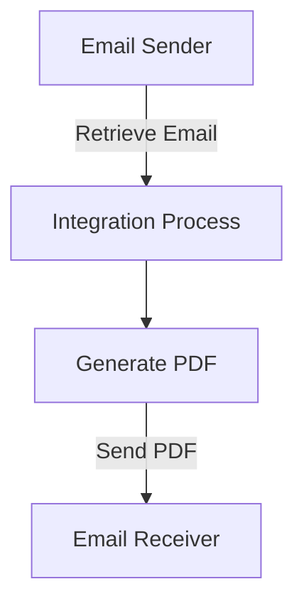

```html
<div style="width: 100%; overflow: hidden; margin-bottom: 20px;">
  <div style="float: left;">
    
  </div>
  <div style="float: right; border: 1px solid #924b95; padding: 5px;">
    
  </div>
</div>
<br><br><br>
<h1 align="center" style="color: #1f4e79; font-size: 3em; margin-top: 150px;">Task1 Integration Technical Specification</h1>
<br><br><br>
<div style="width: 400px; border: 1px solid black; padding: 0px; margin-left: 20px; margin-top: 100px;">
  <table style="width: 100%; border-collapse: collapse; margin: 0;">
    <tr><td style="font-weight: bold; padding: 5px; border-right: 1px solid #ddd; width: 30%;">Author</td><td style="padding: 5px;">[Lead Developer Name]</td></tr>
    <tr><td style="font-weight: bold; padding: 5px; border-top: 1px solid #ddd; border-right: 1px solid #ddd;">Date</td><td style="padding: 5px; border-top: 1px solid #ddd;">[Current Date, e.g., 2025-12-10]</td></tr>
    <tr><td style="font-weight: bold; padding: 5px; border-top: 1px solid #ddd; border-right: 1px solid #ddd;">Version</td><td style="padding: 5px; border-top: 1px solid #ddd;">1.0 (Draft)</td></tr>
  </table>
</div>
<br><br><br><br><br><br><br><br><br><br><br><br><br><br><br><br><br><br><br><br><br><br>
<h2 style="color: #1f4e79; font-size: 2.5em;">Table of Contents</h2>
1. Introduction
    1.1 Purpose
    1.2 Scope
2. Integration Overview
    2.1 Integration Architecture
    2.2 Integration Components
3. Integration Scenarios
    3.1 Scenario Description
    3.2 Data Flows
    3.3 Security Requirements
4. Error Handling and Logging
5. Testing Validation
6. Reference Documents


# 1. Introduction
## 1.1 Purpose
The purpose of the Task1 iFlow is to automate the process of converting email content into PDF documents and sending them as attachments. This integration ensures that important email communications are preserved in a standardized format for record-keeping and further processing.

## 1.2 Scope
This iFlow integrates with email systems to retrieve email content, processes it to generate PDF documents, and sends these documents as email attachments. The systems affected include the email server (Gmail) for both sending and receiving emails, and the SAP Cloud Platform Integration (CPI) environment where the iFlow is deployed.

# 2. Integration Overview
## 2.1 Integration Architecture
The integration architecture consists of a sender and receiver system, where the sender retrieves emails and the receiver sends the generated PDF attachments. The architecture is designed to handle email content extraction, PDF generation, and email sending.



## 2.2 Integration Components
- **Sender System:** Gmail (IMAP)
- **Receiver System:** Gmail (SMTP)
- **Adapter Types Used:** IMAP for receiving emails, SMTP for sending emails.

# 3. Integration Scenarios
## 3.1 Scenario Description
1. The iFlow triggers on a schedule to check for new emails.
2. It retrieves the email content from the inbox.
3. The content is processed to generate two PDF documents.
4. The PDFs are attached to a new email and sent to the specified recipient.

## 3.2 Data Flows
The data flow involves extracting the email body, generating PDFs using the iText library, and sending the PDFs as attachments. The mapping logic is handled within Groovy scripts that process the email content and create the PDFs.

## 3.3 Security Requirements
The integration uses basic authentication for accessing the email server. Credentials are securely stored and managed within the CPI environment.

# 4. Error Handling and Logging
Error handling is implemented to log any issues during the email retrieval or PDF generation processes. If an error occurs, a message is logged, and the integration can be configured to retry or alert the administrator.

# 5. Testing Validation
Key testing scenarios include:
- Validating email retrieval from the inbox.
- Ensuring PDFs are generated correctly from various email formats.
- Testing the sending of emails with attachments to verify successful delivery.

# 6. Reference Documents
- iFlow Content: Task1.iflw
- Groovy Scripts: script23.groovy, script17.groovy, script24.groovy, script11.groovy, script26.groovy, script25.groovy, script10.groovy, script29.groovy, script18.groovy, script30.groovy, script15.groovy, script19.groovy, script3.groovy, script5.groovy, script14.groovy, script12.groovy, script21.groovy, script9.groovy, script8.groovy, script16.groovy, script6.groovy, script27.groovy, script22.groovy, script4.groovy, script1.groovy, script13.groovy, script28.groovy, script7.groovy, script20.groovy, script2.groovy.
```
