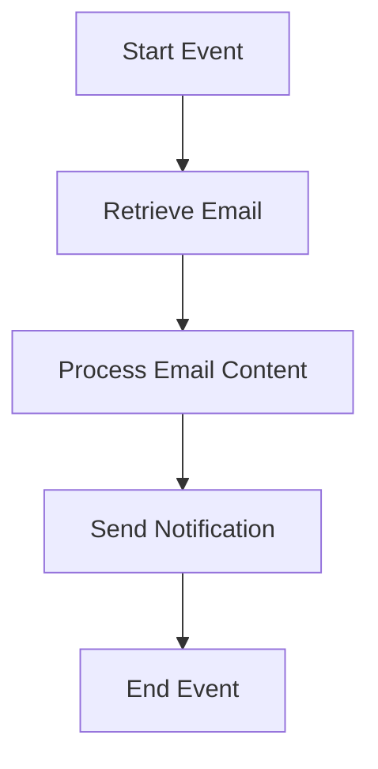

<h1 style="color: #1f4e79; text-align: center; font-size: 3.5em;">Task1</h1><h2 style="text-align: center; font-size: 2em;">Technical Specification Document</h2>

<table border="1" style="margin: 0 auto; border-collapse: collapse; min-width: 400px;"><tr><th style="padding: 12px; background-color: #f2f2f2; text-align: left;">Author</th><td style="padding: 12px;">Rohancherian783</td></tr><tr><th style="padding: 12px; background-color: #f2f2f2; text-align: left;">Date</th><td style="padding: 12px;">2026-01-02</td></tr><tr><th style="padding: 12px; background-color: #f2f2f2; text-align: left;">Version</th><td style="padding: 12px;">1.0.0</td></tr></table>

<h1 style="color: #1f4e79; font-size: 2.5em;">Table of Contents</h1>

1. Introduction  
&nbsp;&nbsp;&nbsp; 1.1 Purpose  
&nbsp;&nbsp;&nbsp; 1.2 Scope  

2. Integration Overview  
&nbsp;&nbsp;&nbsp; 2.1 Integration Architecture  
&nbsp;&nbsp;&nbsp; 2.2 Integration Components  

3. Integration Scenarios  
&nbsp;&nbsp;&nbsp; 3.1 Scenario Description  
&nbsp;&nbsp;&nbsp; 3.2 Data Flows  
&nbsp;&nbsp;&nbsp; 3.3 Security Requirements  

4. Error Handling and Logging  

5. Testing Validation  

6. Reference Documents  

<h1 style="color: #1f4e79;">1. Introduction</h1>

<b style="color: #1f4e79;">1.1 Purpose:</b>

The purpose of the iFlow 'Task1' is to facilitate the automated processing of email messages within an SAP Cloud Platform Integration (CPI) environment. This integration flow is designed to retrieve unread emails from a specified mailbox, process the content of these emails, and subsequently send notifications or alerts based on the email content. The iFlow leverages both IMAP and SMTP protocols to interact with email servers, ensuring that messages are fetched and sent securely and efficiently. The technical objective is to streamline communication processes, reduce manual intervention, and enhance operational efficiency by automating email handling tasks.

<b style="color: #1f4e79;">1.2 Scope:</b>

The scope of the 'Task1' iFlow encompasses the integration of email services within the SAP CPI framework. It includes the following key components:

- **Email Retrieval**: The iFlow is configured to connect to an IMAP server (in this case, Gmail) to fetch unread emails from the inbox. It is set to poll the mailbox at regular intervals, ensuring timely processing of incoming messages.

- **Email Processing**: Upon retrieval, the iFlow processes the email content using a Groovy script. This script can be customized to perform various operations, such as extracting specific data from the email body or headers, transforming the data, and preparing it for further actions.

- **Email Notification**: After processing, the iFlow sends out notifications via SMTP to designated recipients. The email notifications can include dynamic content based on the processed data, enhancing communication effectiveness.

- **Error Handling**: The iFlow incorporates error handling mechanisms to manage any issues that may arise during email retrieval or processing, ensuring that failures are logged and can be addressed promptly.

This iFlow is particularly beneficial for organizations that rely heavily on email communication for operational tasks, as it automates repetitive processes and minimizes the risk of human error.

<h1 style="color: #1f4e79;">2. Integration Overview</h1>

<b style="color: #1f4e79;">2.1 Integration Architecture:</b>

<b style="color: #1f4e79;">2.2 Integration Components:</b>

| Component Type       | Name/Details                          | Description                                                                 |
|----------------------|---------------------------------------|-----------------------------------------------------------------------------|
| Email Sender         | SMTP Configuration                    | Configured to send emails to specified recipients using SMTP protocol.      |
| Email Receiver       | IMAP Configuration                    | Configured to retrieve unread emails from the inbox using IMAP protocol.    |
| Groovy Script        | script30.groovy                      | Custom script for processing email content and extracting necessary data.   |
| Integration Process   | Integration Process                   | Main process that orchestrates the flow of email retrieval, processing, and sending. |

<h1 style="color: #1f4e79;">3. Integration Scenarios</h1>

<b style="color: #1f4e79;">3.1 Scenario Description:</b>

1. **Email Retrieval**: The iFlow connects to the IMAP server to fetch unread emails from the inbox.
2. **Content Processing**: The retrieved email content is processed using a Groovy script to extract relevant information.
3. **Notification Sending**: Based on the processed content, a notification email is sent to specified recipients.

<b style="color: #1f4e79;">3.2 Data Flows:</b>

- Incoming emails are fetched from the IMAP server.
- The email body and headers are processed to extract necessary information.
- Notifications are sent via SMTP to the designated recipients.

<b style="color: #1f4e79;">3.3 Security Requirements:</b>

| Security Aspect          | Requirement                          |
|--------------------------|--------------------------------------|
| Authentication           | Basic authentication for IMAP and SMTP connections. |
| Data Encryption          | Use of SSL/TLS for secure email transmission. |
| Access Control           | Ensure that only authorized users can access the email accounts. |

<h1 style="color: #1f4e79;">4. Error Handling and Logging</h1>

The iFlow includes comprehensive error handling mechanisms to capture and log any errors that occur during the email retrieval or processing stages. This ensures that issues can be diagnosed and resolved quickly, minimizing downtime and maintaining operational efficiency.

<h1 style="color: #1f4e79;">5. Testing Validation</h1>

Testing of the iFlow will involve validating the email retrieval process, ensuring that emails are correctly processed, and verifying that notifications are sent as expected. This will include unit testing of the Groovy script and integration testing of the entire flow.

<h1 style="color: #1f4e79;">6. Reference Documents</h1>

- SAP Cloud Platform Integration Documentation
- Email Protocol Specifications (IMAP, SMTP)
- Groovy Scripting Guide for SAP CPI
