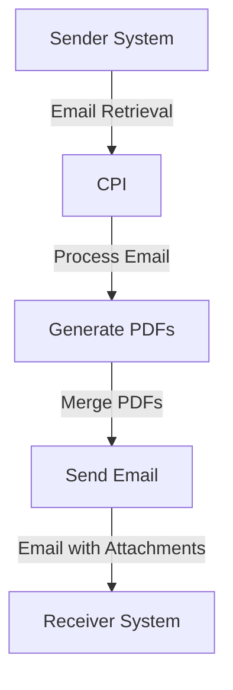

# Technical Documentation for iFlow 'Task1'

## 1. High-level architecture
The architecture of the iFlow 'Task1' involves a sender system that retrieves emails, processes their content, generates PDF reports, and sends these reports as email attachments to a receiver system. The integration is facilitated by SAP Cloud Platform Integration (CPI).

## 2. Purpose of this iFlow
The purpose of this iFlow is to automate the process of converting email content into PDF documents. It retrieves emails, extracts the body content, generates two PDF files from the content, merges them, and sends them as attachments in a new email.

## 3. Sender/Receiver systems
- **Sender System**: An email server (e.g., Gmail) that sends emails to the CPI.
- **Receiver System**: An email server (e.g., Gmail) that receives the generated PDF reports.

## 4. Adapter types used
- **Mail Adapter**: Used for both sending and receiving emails. The sender adapter retrieves emails using IMAP, while the receiver adapter sends emails using SMTP.

## 5. Step-by-step flow explanation
1. **Start Event**: The flow begins with a trigger from the sender system, which retrieves an email.
2. **Email Processing**: The email content is extracted using JavaMail API.
3. **PDF Generation**: Two PDFs are generated from the email content using iText library.
4. **Merging PDFs**: The two PDFs are merged into a single document.
5. **Sending Email**: The merged PDF is sent as an attachment to the receiver system.

## 6. Mapping logic summary
The mapping logic primarily involves the generation of PDFs from the email content. The following scripts are used for mapping:
- **script1.groovy**: Extracts the email body.
- **script3.groovy**: Parses the email content using JavaMail API.
- **script20.groovy**: Generates two PDFs from the email body and prepares them for sending as attachments.

## 7. Groovy script explanations
- **script1.groovy**: Extracts the email body from the incoming message and sets it as the new payload.
- **script3.groovy**: Uses JavaMail API to parse the email content and extract the body.
- **script20.groovy**: Generates two PDFs from the email body and constructs a multipart MIME message for sending.
- **script5.groovy**: Generates a PDF from the email body and sets it as the message body for sending.
- **script30.groovy**: Cleans the email body by removing disclaimers and unnecessary formatting before generating PDFs.

## 8. Error handling
Error handling is implemented in the Groovy scripts, particularly in `script5.groovy`, where exceptions during PDF generation are caught, and an error message is set in the message body. This ensures that any issues during processing are logged and communicated.

## 9. Security/authentication
The iFlow uses basic authentication for the email adapters. The sender and receiver email configurations include:
- **Sender Email**: Configured with the sender's email address and password.
- **Receiver Email**: Configured similarly to send emails securely.
- **SSL/TLS**: The email connections are secured using SSL/TLS protocols.

## 10. High-Level Process Flow Diagram

