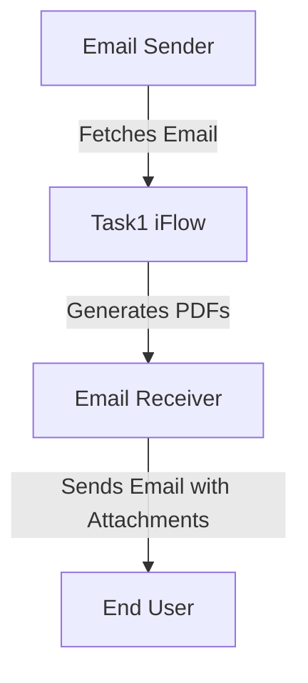

<h1 style="color: #1f4e79; font-size: 3em; text-align: center; margin-top: 5px; margin-bottom: 5px;">Task1</h1><h2 style="color: #1f4e79; font-size: 1.5em; text-align: center; margin-top: 5px; margin-bottom: 0px;">SAP CPI Technical Specification Document</h2>

<table border="1" style="width: 400px; border-collapse: collapse; border-color: black; margin: 0 auto; text-align: left;">
  <tr><td style="width: 30%; padding: 5px;">**Author:**</td><td style="padding: 5px;">Rohancherian783</td></tr>
  <tr><td style="padding: 5px;">**Date:**</td><td style="padding: 5px;">2025-12-22</td></tr>
  <tr><td style="padding: 5px;">**Version (Commit):**</td><td style="padding: 5px;">bf1a570</td></tr>
</table>

<h1 style="color: #1f4e79; font-size: 2.5em;">Table of Contents</h1>
1. Introduction 
1.1 Purpose 
1.2 Scope 
2. Integration Overview 
2.1 Integration Architecture 
2.2 Integration Components 
3. Integration Scenarios 
3.1 Scenario Description 
3.2 Data Flows 
3.3 Security Requirements 
4. Error Handling and Logging 
5. Testing Validation 
6. Reference Documents 

<h1 style="color: #1f4e79;">1. Introduction</h1>

<h2 style="color: #1f4e79;">1.1 Purpose</h2>
The purpose of this iFlow, named 'Task1', is to process incoming emails, extract their content, and generate PDF reports based on the email body. The generated PDFs are then attached to an outgoing email.

<h2 style="color: #1f4e79;">1.2 Scope</h2>
This iFlow interacts with email systems to receive and send emails. It processes email content, generates PDF documents, and handles attachments. The systems affected include the email server for both sending and receiving emails.

<h1 style="color: #1f4e79;">2. Integration Overview</h1>

<h2 style="color: #1f4e79;">2.1 Integration Architecture</h2>
The integration architecture consists of a sender system that retrieves emails and a receiver system that sends emails with the generated PDF attachments. The iFlow orchestrates the flow of data between these systems.

<h2 style="color: #1f4e79;">2.2 Integration Components</h2>
- **Sender System**: Email server (IMAP) that retrieves emails.
- **Receiver System**: Email server (SMTP) that sends emails.
- **Adapters Used**: IMAP adapter for receiving emails and SMTP adapter for sending emails.

<h1 style="color: #1f4e79;">3. Integration Scenarios</h1>

<h2 style="color: #1f4e79;">3.1 Scenario Description</h2>
The iFlow operates as follows:
1. An email is received via the IMAP adapter.
2. The email content is extracted and processed.
3. Two PDF documents are generated from the email content.
4. The PDFs are attached to a new email and sent via the SMTP adapter.

<h2 style="color: #1f4e79;">3.2 Data Flows</h2>
The mapping logic involves extracting the email body and generating PDFs using Groovy scripts. The scripts utilize the iText library to create PDF documents. The key scripts include:
- **script23.groovy**: Generates two PDFs from the email body and merges them.
- **script24.groovy**: Creates a MIME multipart message with the PDFs attached.

<h2 style="color: #1f4e79;">3.3 Security Requirements</h2>
The iFlow does not require basic authentication for the sender. However, it uses secure connections (SSL/TLS) for both IMAP and SMTP communications to ensure data integrity and confidentiality.

<h1 style="color: #1f4e79;">4. Error Handling and Logging</h1>
Error handling is implemented within the Groovy scripts to catch exceptions during PDF generation. Logs are maintained to track the processing of emails and any errors encountered.

<h1 style="color: #1f4e79;">5. Testing Validation</h1>
Key testing scenarios include:
- Validating the extraction of email content.
- Ensuring PDFs are generated correctly from the email body.
- Testing the sending of emails with attachments to verify successful delivery.

<h1 style="color: #1f4e79;">6. Reference Documents</h1>
- iFlow Content: `Task1.iflw`
- Groovy Scripts: `script23.groovy`, `script24.groovy`, `script17.groovy`, etc.
- XSLT Files: Not applicable for this iFlow.
