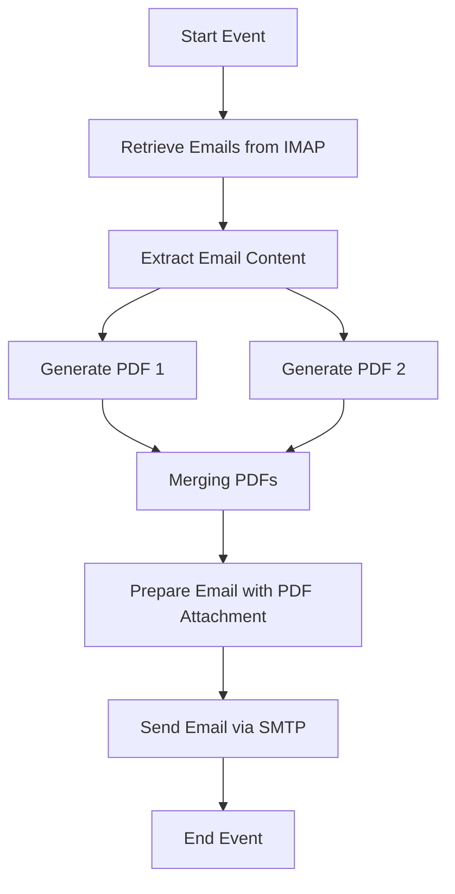

# Technical Documentation for iFlow 'Task1'

## 1. High-level architecture
The iFlow 'Task1' integrates email processing with PDF generation. It retrieves emails, extracts their content, generates PDF documents from the email body, and sends these PDFs as attachments in a new email.

## 2. Purpose of this iFlow
The primary purpose of this iFlow is to automate the conversion of email content into PDF format and send it as an attachment to a specified recipient. This is particularly useful for generating reports or documentation based on email communications.

## 3. Sender/Receiver systems
- **Sender System**: An email server (IMAP) that retrieves incoming emails.
- **Receiver System**: An email server (SMTP) that sends out emails with PDF attachments.

## 4. Adapter types used
- **IMAP Adapter**: Used to fetch emails from the sender system.
- **SMTP Adapter**: Used to send emails with the generated PDF attachments to the receiver system.

## 5. Step-by-step flow explanation
1. **Start Event**: The iFlow begins with a start event that triggers the process.
2. **Email Retrieval**: The iFlow retrieves emails from the sender system using the IMAP adapter.
3. **Content Extraction**: The email content is extracted using JavaMail API, which handles both plain text and HTML emails.
4. **PDF Generation**: The extracted email body is converted into two separate PDF documents.
5. **PDF Merging**: The two PDFs are merged into a single PDF document.
6. **Email Preparation**: The merged PDF is set as the body of a new email, and appropriate headers are added for attachment.
7. **Email Sending**: The iFlow sends the email with the PDF attachment to the specified recipient using the SMTP adapter.
8. **End Event**: The process concludes with an end event.

## 6. Mapping logic summary
- **PDF Generation**: Multiple Groovy scripts are used to generate PDFs from the email body. Each script creates a PDF document and sets it as an attachment.
- **Merging PDFs**: The merging of PDFs is handled in one of the Groovy scripts, which combines the two generated PDFs into a single document.

## 7. Groovy script explanations
- **script1.groovy**: Extracts email content using JavaMail API and sets it as the message body.
- **script3.groovy**: Parses the email body and sets it for further processing.
- **script5.groovy**: Generates a PDF from the email body and sets it as the message body.
- **script17.groovy**: Similar to script5, but focuses on attaching the PDF properly.
- **script21.groovy**: Generates two PDFs from the email body and attaches them to the message.
- **script30.groovy**: Cleans the email body, generates two PDFs, and sets them as attachments with dynamic filenames.
- **script24.groovy**: Creates two PDFs and prepares a MIME multipart message for sending.

## 8. Error handling
Error handling is implemented in several scripts, particularly in script5.groovy, where exceptions during PDF generation are caught, and an error message is set as the body of the message. This ensures that any issues during processing are logged and communicated.

## 9. Security/authentication
- **Email Authentication**: The iFlow uses basic authentication for the IMAP and SMTP adapters. Credentials are typically stored securely in the CPI environment.
- **Transport Security**: The email communication is secured using SSL/TLS protocols to ensure data integrity and confidentiality during transmission.

## 10. High-Level Process Flow Diagram

