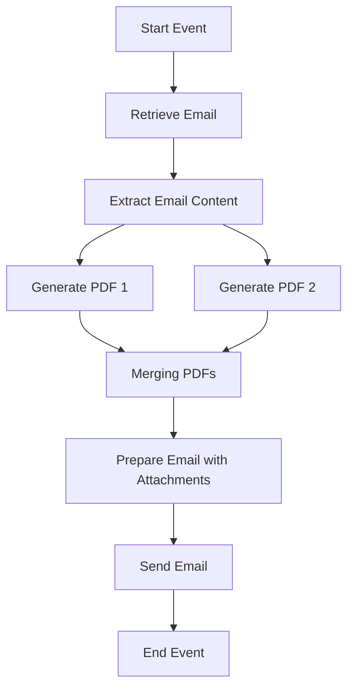

# Technical Documentation for iFlow 'Task1'

## 1. High-level architecture
The iFlow 'Task1' integrates email processing with PDF generation. It retrieves emails, extracts their content, generates PDF reports based on the email content, and sends these PDFs as attachments in a new email.

## 2. Purpose of this iFlow
The primary purpose of this iFlow is to automate the conversion of email content into PDF format and send these PDFs as attachments to specified recipients. This is particularly useful for generating reports or documentation from email communications.

## 3. Sender/Receiver systems
- **Sender System**: An email server (IMAP) that receives emails.
- **Receiver System**: An email server (SMTP) that sends emails with PDF attachments.

## 4. Adapter types used
- **IMAP Adapter**: Used to retrieve emails from the sender system.
- **SMTP Adapter**: Used to send emails with the generated PDF attachments to the receiver system.

## 5. Step-by-step flow explanation
1. **Start Event**: The iFlow is triggered by a scheduled event or an incoming email.
2. **Email Retrieval**: The iFlow retrieves unread emails from the sender's inbox using the IMAP adapter.
3. **Email Processing**: The email content is extracted using JavaMail API and stored in the message body.
4. **PDF Generation**: The content is processed to create two PDF documents using the iText library.
5. **PDF Merging**: The two PDFs are merged into a single document.
6. **Email Preparation**: The merged PDF is set as the body of the outgoing email, and appropriate headers are added.
7. **Email Sending**: The email is sent to the specified recipient using the SMTP adapter.
8. **End Event**: The iFlow completes its execution.

## 6. Mapping logic summary
The mapping logic primarily involves the generation of PDFs from the email content. The following scripts are used for this purpose:
- **script1.groovy**: Extracts email content and sets it as the message body.
- **script3.groovy**: Parses the email content using JavaMail API.
- **script20.groovy**: Generates two PDFs from the email body and prepares them for attachment in the outgoing email.

## 7. Groovy script explanations
- **script1.groovy**: Extracts the email body from the incoming message and sets it as the new payload.
- **script3.groovy**: Uses JavaMail API to parse the email content and retrieve the body.
- **script20.groovy**: Generates two PDFs from the email body and constructs a multipart MIME message for sending.
- **script26.groovy**: Merges two PDFs into one and sets it as the body of the outgoing message.
- **script30.groovy**: Cleans up the email body by removing disclaimers and unnecessary formatting before PDF generation.

## 8. Error handling
Error handling is implemented in several scripts, particularly in `script5.groovy`, where exceptions during PDF generation are caught, and an error message is set in the message body. This ensures that any issues during processing do not cause the iFlow to fail silently.

## 9. Security/authentication
- **Email Authentication**: The iFlow uses basic authentication for both the IMAP and SMTP adapters. Credentials are configured securely within the CPI environment.
- **Transport Security**: The email communication is secured using SSL/TLS protocols to ensure data integrity and confidentiality during transmission.

## 10. High-Level Process Flow Diagram

This documentation provides a comprehensive overview of the iFlow 'Task1', detailing its architecture, purpose, and operational flow, along with the associated scripts and error handling mechanisms.
