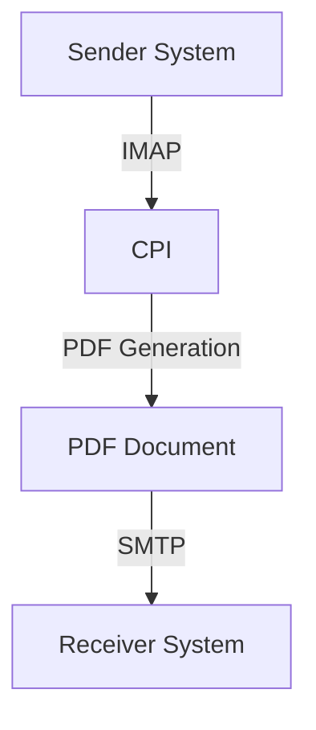

# Technical Documentation for iFlow 'Task1'

## 1. High-level architecture
The architecture of the iFlow 'Task1' involves the integration of email processing and PDF generation. The flow consists of a sender system that retrieves emails, processes their content, generates PDF reports, and sends them as attachments to a receiver system.

## 2. Purpose of this iFlow
The purpose of this iFlow is to automate the extraction of email content, convert it into PDF format, and send these PDFs as email attachments. This is particularly useful for generating reports from incoming emails.

## 3. Sender/Receiver systems
- **Sender System**: An email server (e.g., Gmail) that sends emails to the CPI.
- **Receiver System**: An email server (e.g., SMTP server) that receives the generated PDF reports.

## 4. Adapter types used
- **Mail Adapter**: Used for both sending and receiving emails.
  - **IMAP**: For retrieving emails from the sender system.
  - **SMTP**: For sending emails with the generated PDF attachments.

## 5. Step-by-step flow explanation
1. **Start Event**: The iFlow is triggered by a scheduled event or an incoming email.
2. **Email Retrieval**: The iFlow retrieves emails from the sender system using the IMAP adapter.
3. **Content Extraction**: The email content is extracted using Groovy scripts that handle both plain text and multipart emails.
4. **PDF Generation**: The extracted content is converted into one or more PDF documents using iText library in Groovy scripts.
5. **PDF Merging**: If multiple PDFs are generated, they are merged into a single PDF document.
6. **Email Preparation**: The merged PDF is set as an attachment, and the email body is prepared.
7. **Email Sending**: The final email with the PDF attachment is sent to the receiver system using the SMTP adapter.
8. **End Event**: The process concludes after the email is sent.

## 6. Mapping logic summary
The mapping logic primarily involves Groovy scripts that handle the conversion of email content to PDF format. Key scripts include:
- **script1.groovy**: Extracts email content and sets it as the message body.
- **script3.groovy**: Parses the email using JavaMail API to handle multipart content.
- **script17.groovy**: Generates a PDF from the email body.
- **script26.groovy**: Merges multiple PDFs into one and sets it as the email body.

## 7. Groovy script explanations
- **script1.groovy**: Extracts the email body from the incoming message and sets it as the new payload.
- **script3.groovy**: Uses JavaMail API to parse the email content and extract the body.
- **script17.groovy**: Generates a PDF from the extracted email body and prepares it for attachment.
- **script26.groovy**: Merges two generated PDFs into one and sets it as the message body.
- **script30.groovy**: Cleans the email body by removing disclaimers and unnecessary formatting before PDF generation.

## 8. Error handling
Error handling is implemented in several scripts, particularly in `script5.groovy`, which logs exceptions during PDF generation and sets a plain text error message as the body if an error occurs.

## 9. Security/authentication
- **Email Authentication**: Basic authentication is used for both the IMAP and SMTP connections. Credentials are typically stored securely in the CPI environment.
- **Transport Security**: SSL/TLS is used for secure communication between the sender and receiver systems.

## 10. High-Level Process Flow Diagram

This documentation provides a comprehensive overview of the iFlow 'Task1', detailing its architecture, purpose, systems involved, and the technical logic behind its implementation.
