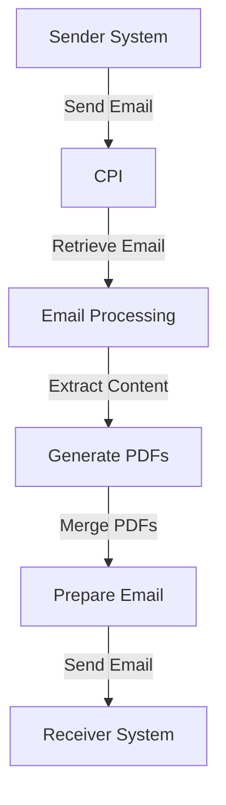

# Technical Documentation for iFlow: Task1

## 1. High-level architecture
The iFlow integrates email processing with PDF generation and attachment handling. It retrieves emails, extracts their content, generates PDFs from the content, and sends these PDFs as email attachments.

## 2. Purpose of this iFlow
The primary purpose of this iFlow is to automate the process of converting email content into PDF documents and sending them as attachments in a new email. This is particularly useful for generating reports or documentation based on incoming emails.

## 3. Sender/Receiver systems
- **Sender System**: An email server (e.g., Gmail) that sends emails to the CPI.
- **Receiver System**: An email server (e.g., Gmail) that receives the processed emails with PDF attachments.

## 4. Adapter types used
- **Mail Adapter**: Used for both sending and receiving emails.
  - **IMAP**: For receiving emails.
  - **SMTP**: For sending emails.

## 5. Step-by-step flow explanation
1. **Start Event**: The iFlow is triggered by an incoming email.
2. **Email Retrieval**: The email content is retrieved using the IMAP adapter.
3. **Content Extraction**: The email body is extracted, handling both plain text and multipart formats.
4. **PDF Generation**: Two PDFs are generated from the extracted email content.
5. **PDF Merging**: The two PDFs are merged into a single document.
6. **Email Preparation**: The merged PDF is set as an attachment in a new email.
7. **Email Sending**: The new email with the PDF attachment is sent using the SMTP adapter.
8. **End Event**: The process concludes after the email is sent.

## 6. Mapping logic summary
The iFlow does not utilize XSLT for mapping. Instead, it employs Groovy scripts for processing and generating PDFs. The scripts handle the extraction of email content, PDF creation, and attachment management.

## 7. Groovy script explanations
- **script1.groovy**: Extracts email content from the incoming message using JavaMail API.
- **script3.groovy**: Parses the email content and sets it as the new payload.
- **script17.groovy**: Generates a PDF from the extracted email body and attaches it to the message.
- **script21.groovy**: Creates two PDFs from the email body and attaches them to the message.
- **script30.groovy**: Cleans the email body, generates PDFs, and sets dynamic filenames for the attachments.
- **script26.groovy**: Merges two PDFs into one and sets it as the message body.
- **script24.groovy**: Creates two separate PDFs and prepares them for attachment.
- **script5.groovy**: Handles PDF generation and sets the content type for the message.
- **script12.groovy**: Similar to script17, generates a PDF and sets it as an attachment.
- **script14.groovy**: Generates a PDF and attaches it, ensuring the content type is set correctly.
- **script18.groovy**: Extracts email content and generates a PDF attachment.
- **script19.groovy**: Generates a PDF from the email body and sets it as the message body.
- **script20.groovy**: Generates two PDFs and creates a multipart MIME message for sending.
- **script22.groovy**: Generates a PDF and sets it as an attachment with proper headers.
- **script27.groovy**: Generates two PDFs and attaches them to the message.
- **script28.groovy**: Logs the attachments for debugging purposes.

## 8. Error handling
Error handling is implemented in several scripts, particularly in `script5.groovy`, where exceptions during PDF generation are caught, and an error message is set in the message body. This ensures that any issues during processing are logged and communicated.

## 9. Security/authentication
- **Email Authentication**: The iFlow uses basic authentication for both the IMAP and SMTP adapters. Credentials are typically stored securely in the CPI environment.
- **Transport Security**: The email communication is secured using SSL/TLS protocols to ensure data integrity and confidentiality during transmission.

## 10. High-Level Process Flow Diagram

