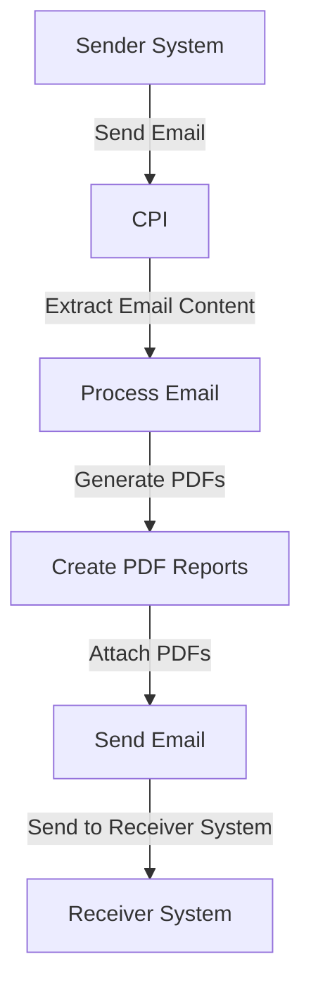

# Technical Documentation for iFlow 'Task1'

## 1. High-level architecture
The architecture of the iFlow 'Task1' involves a sender system that retrieves emails, processes their content, generates PDF reports, and sends them as attachments to a receiver system. The integration is facilitated through SAP Cloud Platform Integration (CPI), which orchestrates the flow of data between the sender and receiver.

## 2. Purpose of this iFlow
The purpose of this iFlow is to automate the process of converting email content into PDF documents. It retrieves emails, extracts their body content, generates two PDF reports from the content, and sends these PDFs as attachments in a new email to a specified recipient.

## 3. Sender/Receiver systems
- **Sender System**: An email server (e.g., Gmail) that sends emails to the CPI.
- **Receiver System**: An email server (e.g., Gmail) that receives the processed email with PDF attachments.

## 4. Adapter types used
- **Mail Adapter**: Used for both sending and receiving emails. The sender adapter retrieves emails from the inbox, while the receiver adapter sends emails with the generated PDF attachments.

## 5. Step-by-step flow explanation
1. **Start Event**: The iFlow is triggered by a scheduled event or an incoming email.
2. **Email Retrieval**: The Mail adapter retrieves the email content from the sender system.
3. **Content Processing**: The email body is extracted and processed to remove unnecessary content and format it for PDF generation.
4. **PDF Generation**: Two PDF documents are created from the email content.
5. **Email Sending**: The generated PDFs are attached to a new email and sent to the specified recipient.

## 6. Mapping logic summary
The iFlow does not utilize XSLT for mapping. Instead, it employs Groovy scripts to handle the transformation and generation of PDF documents. The scripts extract email content, create PDFs, and prepare the email for sending.

## 7. Groovy script explanations
The iFlow utilizes multiple Groovy scripts for various tasks:
- **Email Body Extraction**: Scripts like `script1.groovy` and `script3.groovy` extract the email body from the incoming message, handling both plain text and multipart emails.
- **PDF Generation**: Scripts such as `script17.groovy`, `script21.groovy`, and `script30.groovy` generate PDF documents from the extracted email content. They create two PDFs and prepare them for attachment.
- **Attachment Handling**: Scripts like `script11.groovy` and `script12.groovy` set the appropriate headers for the email attachments, ensuring they are sent correctly.
- **Error Handling**: Some scripts include error handling to manage exceptions during PDF generation.

## 8. Error handling
Error handling is implemented in several Groovy scripts. For instance, in `script5.groovy`, exceptions during PDF generation are caught, and an error message is set in the message body. This ensures that any issues are logged and communicated back to the sender.

## 9. Security/authentication
The iFlow uses basic authentication for the Mail adapter. The sender and receiver email accounts are configured with their respective credentials. The configuration ensures secure access to the email servers, preventing unauthorized access.

## 10. High-Level Process Flow Diagram

