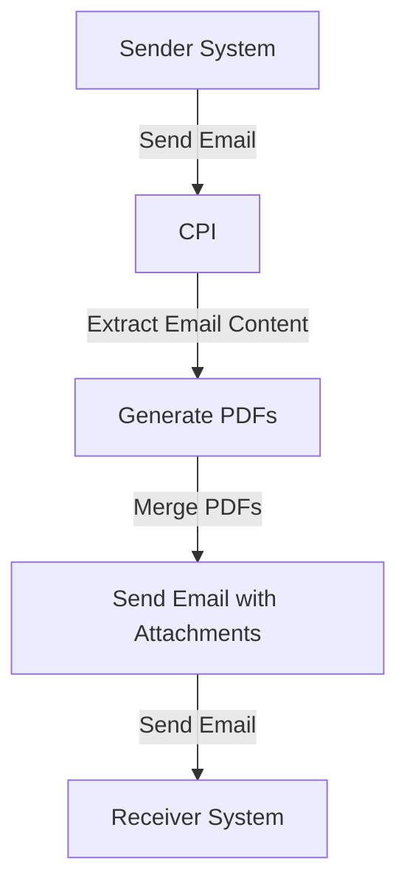

# Technical Documentation for iFlow 'Task1'

## 1. High-level architecture
The architecture of the iFlow 'Task1' integrates email processing with PDF generation. It involves receiving emails, extracting their content, generating PDFs from the content, and sending these PDFs as email attachments.

## 2. Purpose of this iFlow
The purpose of this iFlow is to automate the process of converting email content into PDF documents and sending them as attachments in a new email. This is particularly useful for generating reports or documentation based on incoming emails.

## 3. Sender/Receiver systems
- **Sender System**: An email server (e.g., Gmail) that sends emails to the CPI.
- **Receiver System**: An email server (e.g., Gmail) that receives the generated PDF reports.

## 4. Adapter types used
- **Mail Adapter**: Used for both sending and receiving emails.
  - **IMAP**: For receiving emails.
  - **SMTP**: For sending emails.

## 5. Step-by-step flow explanation
1. **Start Event**: The iFlow is triggered by an incoming email.
2. **Email Processing**: The email content is extracted using JavaMail API.
3. **PDF Generation**: The extracted content is converted into two separate PDF documents.
4. **Merging PDFs**: The two PDFs are merged into a single document.
5. **Sending Email**: The merged PDF is sent as an attachment in a new email to the specified recipient.

## 6. Mapping logic summary
The mapping logic primarily involves the generation of PDFs from the email content. The following Groovy scripts are used for this purpose:
- **script1.groovy**: Extracts email content.
- **script3.groovy**: Processes the email content and prepares it for PDF generation.
- **script20.groovy**: Generates two PDFs from the email content and prepares them for sending as attachments.

## 7. Groovy script explanations
- **script1.groovy**: Extracts the email body from the incoming message using JavaMail API.
- **script3.groovy**: Converts the email body into a string and sets it as the new payload for further processing.
- **script20.groovy**: Generates two PDFs from the email content, creates a multipart MIME message, and sets the PDFs as attachments.
- **script26.groovy**: Merges two PDFs into one and sets it as the body of the outgoing message.
- **script11.groovy** and **script10.groovy**: Set the content disposition for the attachments.

## 8. Error handling
Error handling is implemented in several scripts, particularly in `script5.groovy`, where exceptions during PDF generation are caught, and an error message is set in the message body. This ensures that any issues during processing are logged and communicated.

## 9. Security/authentication
- **Authentication**: Basic authentication is used for the email adapters. Credentials are configured in the CPI environment to securely access the email servers.
- **Transport Security**: The email communication is secured using SSL/TLS protocols to protect the data in transit.

## 10. High-Level Process Flow Diagram

