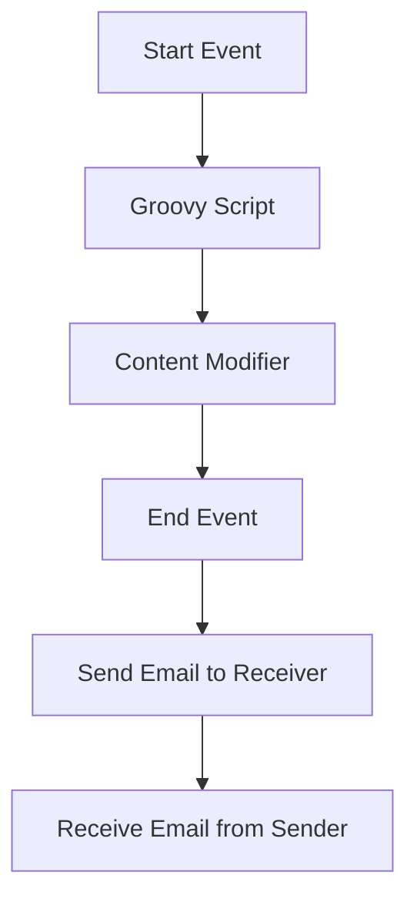

# Technical Documentation Report for iFlow: scenarioflows

## 1. High-level architecture
The iFlow 'scenarioflows' is designed to facilitate email communication between a sender and a receiver using SAP Cloud Platform Integration (CPI). The architecture consists of a sender that retrieves emails from an IMAP server and a receiver that sends emails via an SMTP server. The integration process is orchestrated through a BPMN workflow that includes various activities such as content modification and Groovy script execution.

## 2. Purpose of this iFlow
The primary purpose of this iFlow is to automate the process of reading emails from a specified inbox and sending them to a designated recipient. This integration ensures that important communications are processed and forwarded without manual intervention, thereby enhancing operational efficiency.

## 3. Sender/Receiver systems
- **Sender System**: The sender system is an email server configured to use IMAP (Internet Message Access Protocol) for retrieving emails. The configuration specifies the server as `imap.gmail.com:993` and connects to the inbox to read unread messages.
- **Receiver System**: The receiver system is configured to send emails using SMTP (Simple Mail Transfer Protocol) through the server `smtp.gmail.com:587`. The sender's email address is `cherianrohan37@gmail.com`, and the recipient's email address is `rohan.cherian@motiveminds.com`.

## 4. Adapter types used
- **IMAP Adapter**: Used for retrieving emails from the sender's inbox.
- **SMTP Adapter**: Used for sending emails to the receiver.

## 5. Step-by-step flow explanation
1. **Start Event**: The process begins with a start event that triggers the iFlow.
2. **Call Activity - Groovy Script**: The first activity is a Groovy script that processes the incoming email data.
3. **Call Activity - Content Modifier**: This activity modifies the email content, specifically setting the subject header based on the incoming message properties.
4. **End Event**: The process concludes with an end event, indicating the completion of the integration process.
5. **Message Flow to Receiver**: After processing, the email is sent to the receiver using the SMTP adapter.

## 6. Mapping logic summary
The iFlow utilizes a content modifier to set the email subject dynamically. The subject is derived from the property `${property.Subject}` which is set during the email retrieval process. There are no XSLT mappings defined in this iFlow.

## 7. Groovy script explanations
The iFlow includes a Groovy script (script30.groovy) that is executed to handle specific logic related to the email processing. The script's purpose is to manipulate the incoming email data, potentially extracting necessary information or transforming it before it is sent to the receiver.

## 8. Error handling
Error handling is configured to not return exceptions to the sender, as indicated by the property `returnExceptionToSender` set to `false`. This means that any errors encountered during the processing will not be communicated back to the sender system.

## 9. Security/authentication
The iFlow does not utilize basic authentication for the sender endpoint, as indicated by the property `enableBasicAuthentication` set to `false`. The email server configurations do not specify any additional security mechanisms, such as OAuth tokens or API keys, which may be necessary for secure communication. The SMTP server uses `starttls_optional` for encryption, and the IMAP server uses `imaps` for secure email retrieval.

## 10. High-Level Process Flow Diagram

This documentation provides a comprehensive overview of the iFlow 'scenarioflows', detailing its architecture, purpose, systems involved, and the flow of data through the integration process.
