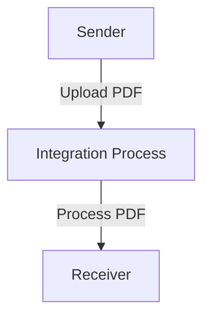

\pagebreak

<h1 style="color: #1f4e79; font-size: 3em; text-align: center; margin-top: 5px; margin-bottom: 5px;">Odata Mass PDF upload</h1><h2 style="color: #1f4e79; font-size: 1.5em; text-align: center; margin-top: 5px; margin-bottom: 0px;">SAP CPI Technical Specification Document</h2>

<table border="1" style="width: 400px; border-collapse: collapse; border-color: black; margin: 0 auto; text-align: left;"><tr><td style="width: 30%; padding: 5px;">**Author:**</td><td style="padding: 5px;">Rohancherian783</td></tr><tr><td style="padding: 5px;">**Date:**</td><td style="padding: 5px;">2025-12-11</td></tr><tr><td style="padding: 5px;">**Version (Commit):**</td><td style="padding: 5px;">84e6c58</td></tr></table>

<h1 style="color: #1f4e79; font-size: 2.5em;">Table of Contents</h1>

1. Introduction  
    1.1 Purpose  
    1.2 Scope  
2. Integration Overview  
    2.1 Integration Architecture  
    2.2 Integration Components  
3. Integration Scenarios  
    3.1 Scenario Description  
    3.2 Data Flows  
    3.3 Security Requirements  
4. Error Handling and Logging  
5. Testing Validation  
6. Reference Documents  

<h1 style="color: #1f4e79;">1. Introduction</h1>

<h2 style="color: #1f4e79;">1.1 Purpose</h2>  
The purpose of the iFlow 'Odata_Mass_PDF_upload' is to facilitate the mass upload of PDF documents through an OData service. This integration flow is designed to streamline the process of handling multiple PDF files, ensuring they are correctly processed and stored in the target system.

<h2 style="color: #1f4e79;">1.2 Scope</h2>  
This iFlow operates within the SAP Cloud Platform Integration (CPI) environment and interacts with various systems that support OData services. The primary systems affected include the sender system that initiates the upload and the receiver system that processes the uploaded PDFs. The flow is designed to handle the transfer of data securely and efficiently, ensuring that all necessary validations and error handling mechanisms are in place.

<h1 style="color: #1f4e79;">2. Integration Overview</h1>

<h2 style="color: #1f4e79;">2.1 Integration Architecture</h2>  
The integration architecture for the 'Odata_Mass_PDF_upload' iFlow consists of a sender and a receiver, with a defined process that manages the flow of PDF documents. The architecture ensures that the documents are uploaded, processed, and stored correctly.

<h2 style="color: #1f4e79;">2.2 Integration Components</h2>  
The integration components include:
- **Sender System**: This is the system that initiates the upload of PDF documents.
- **Receiver System**: This is the target system that processes the uploaded PDFs.
- **Adapters Used**: The iFlow utilizes HTTP adapters for communication between the sender and receiver systems.

<h1 style="color: #1f4e79;">3. Integration Scenarios</h1>

<h2 style="color: #1f4e79;">3.1 Scenario Description</h2>  
The integration scenario begins with the sender system triggering the upload of multiple PDF documents. The iFlow captures these documents and processes them through the defined integration process. The flow includes validation steps to ensure that the documents meet the required criteria before they are sent to the receiver system for storage.

<h2 style="color: #1f4e79;">3.2 Data Flows</h2>  
The data flow within the iFlow involves the following steps:
- **Input Handling**: The iFlow receives the PDF documents from the sender.
- **Processing Logic**: The integration process validates the documents and prepares them for transmission.
- **Output Handling**: The processed PDFs are sent to the receiver system for storage.

Currently, there are no XSLT mappings or Groovy scripts defined in the provided artifacts, indicating that the flow relies on standard processing without custom transformations.

<h2 style="color: #1f4e79;">3.3 Security Requirements</h2>  
The iFlow is configured with the following security measures:
- **Basic Authentication**: The sender does not enable basic authentication, indicating that other security measures may be in place.
- **CORS and Credentials**: Cross-Origin Resource Sharing (CORS) is disabled, and credentials are not allowed, ensuring that the flow adheres to strict security protocols.

<h1 style="color: #1f4e79;">4. Error Handling and Logging</h1>  
Error handling within the iFlow is managed through the configuration settings. The flow is set to not return exceptions to the sender, which implies that errors are logged internally for further analysis. The transaction timeout is set to 30 seconds, ensuring that processes do not hang indefinitely.

<h1 style="color: #1f4e79;">5. Testing Validation</h1>  
Key testing scenarios for the iFlow include:
- **Upload Validation**: Testing the upload functionality with various PDF documents to ensure they are processed correctly.
- **Error Handling**: Simulating errors to verify that the flow handles exceptions as expected without returning them to the sender.

<h1 style="color: #1f4e79;">6. Reference Documents</h1>  
The following artifacts were analyzed for the creation of this report:
- iFlow Content: `Odata_Mass_PDF_upload.iflw`  
- Configuration settings and properties defined within the iFlow.

