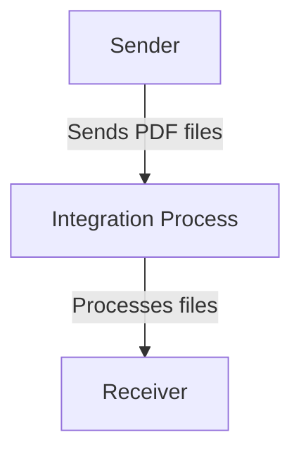

<h1 style="color: #1f4e79; font-size: 3em; text-align: center; margin-top: 5px; margin-bottom: 5px;">Odata Mass PDF upload</h1><h2 style="color: #1f4e79; font-size: 1.5em; text-align: center; margin-top: 5px; margin-bottom: 0px;">SAP CPI Technical Specification Document</h2>

<table border="1" style="width: 400px; border-collapse: collapse; border-color: black; margin: 0 auto; text-align: left;"><tr><td style="width: 30%; padding: 5px;">**Author:**</td><td style="padding: 5px;">Rohancherian783</td></tr><tr><td style="padding: 5px;">**Date:**</td><td style="padding: 5px;">2025-12-11</td></tr><tr><td style="padding: 5px;">**Version (Commit):**</td><td style="padding: 5px;">c952345</td></tr></table>

<h1 style="color: #1f4e79; font-size: 2.5em;">Table of Contents</h1>

1. Introduction  
   1.1 Purpose  
   1.2 Scope  
2. Integration Overview  
   2.1 Integration Architecture  
   2.2 Integration Components  
3. Integration Scenarios  
   3.1 Scenario Description  
   3.2 Data Flows  
   3.3 Security Requirements  
4. Error Handling and Logging  
5. Testing Validation  
6. Reference Documents  

<h1 style="color: #1f4e79;">1. Introduction</h1>

<h2 style="color: #1f4e79;">1.1 Purpose</h2>  
The purpose of the iFlow 'Odata_Mass_PDF_upload' is to facilitate the bulk upload of PDF documents via an OData service. This integration flow is designed to streamline the process of handling multiple PDF files, ensuring they are correctly processed and uploaded to the designated system.

<h2 style="color: #1f4e79;">1.2 Scope</h2>  
This iFlow operates within the SAP Cloud Platform Integration (CPI) environment and interacts with external systems that provide OData services for document management. The primary systems affected include the sender system that initiates the PDF upload and the receiver system that processes the uploaded documents.

<h1 style="color: #1f4e79;">2. Integration Overview</h1>

<h2 style="color: #1f4e79;">2.1 Integration Architecture</h2>  
The integration architecture for the 'Odata_Mass_PDF_upload' iFlow consists of a sender and a receiver, with a defined process flow that manages the upload of PDF documents. The architecture is designed to ensure seamless communication between the systems involved.

<h2 style="color: #1f4e79;">2.2 Integration Components</h2>  
The integration components include:
- **Sender**: An endpoint that initiates the PDF upload process.
- **Receiver**: An endpoint that receives and processes the uploaded PDF documents.
- **Adapters**: The iFlow utilizes HTTP adapters for communication between the sender and receiver systems.

<h1 style="color: #1f4e79;">3. Integration Scenarios</h1>

<h2 style="color: #1f4e79;">3.1 Scenario Description</h2>  
The integration scenario begins with the sender system triggering the upload of multiple PDF files. The iFlow captures these files and processes them through the integration process, ultimately sending them to the receiver system for storage or further processing.

<h2 style="color: #1f4e79;">3.2 Data Flows</h2>  
The data flow involves the following steps:
1. The sender system sends a request to the iFlow with the PDF files.
2. The integration process handles the incoming files, ensuring they are formatted correctly for the receiver.
3. The processed files are then sent to the receiver system.

Currently, there are no specific XSLT mappings or Groovy scripts mentioned in the provided artifacts, indicating that the iFlow may rely on standard processing without custom transformations.

<h2 style="color: #1f4e79;">3.3 Security Requirements</h2>  
The iFlow configuration indicates that basic authentication is not enabled for the sender endpoint. Security measures should be considered to ensure that the data being transmitted is secure, including the potential implementation of HTTPS and other authentication mechanisms as needed.

<h1 style="color: #1f4e79;">4. Error Handling and Logging</h1>  
Error handling within the iFlow is managed through the configuration settings, including properties such as `returnExceptionToSender` set to false, which indicates that exceptions will not be returned to the sender. Proper logging mechanisms should be implemented to capture any errors that occur during the processing of PDF uploads.

<h1 style="color: #1f4e79;">5. Testing Validation</h1>  
Key testing scenarios for the iFlow include:
- Validating the successful upload of PDF files from the sender to the receiver.
- Testing the handling of invalid file formats or sizes.
- Ensuring that error handling works as expected when issues arise during the upload process.

<h1 style="color: #1f4e79;">6. Reference Documents</h1>  
The following artifacts were analyzed for this report:
- iFlow Content: `Odata_Mass_PDF_upload.iflw`  
- Configuration settings and properties related to the integration flow.

