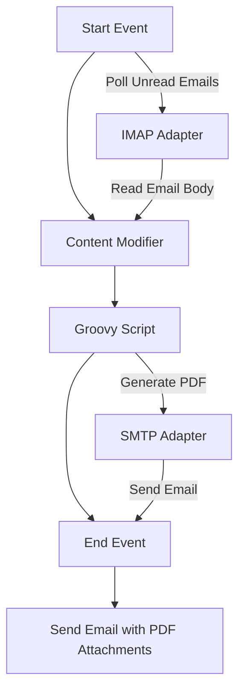

# Documentation Report for Email_Contents_to_PDF iFlow

## 1. High-level architecture
The Email_Contents_to_PDF iFlow is designed to read emails from a Gmail account, convert the email body content into PDF format, and send the generated PDFs as attachments to another email address. The architecture consists of a sender (IMAP adapter for reading emails) and a receiver (SMTP adapter for sending emails).

## 2. Purpose of this iFlow
The primary purpose of this iFlow is to automate the process of converting email content into PDF format and sending it as an attachment. This is useful for archiving or sharing email content in a standardized format.

## 3. Sender/Receiver systems
- **Sender System**: Gmail (using IMAP protocol)
- **Receiver System**: Gmail (using SMTP protocol)

## 4. Adapter types used
- **IMAP Adapter**: Used for receiving emails from the sender's Gmail account.
- **SMTP Adapter**: Used for sending emails with the generated PDF attachments to the receiver's Gmail account.

## 5. Step-by-step flow explanation
1. **Start Event**: The iFlow is triggered by a scheduled event that polls the sender's Gmail inbox for unread emails.
2. **Content Modifier**: The email body is extracted and prepared for processing.
3. **Groovy Script**: The email body is passed to a Groovy script that converts the content into PDF format.
4. **End Event**: The process concludes after the email with the PDF attachments is sent to the receiver.

## 6. Mapping logic summary
The mapping logic is handled within the Groovy script, which takes the email body as input and generates a PDF. The script creates two PDF attachments with the same content and modifies the email body to indicate that the original content is attached.

## 7. Groovy script explanations
The Groovy script (`script1.groovy`) performs the following tasks:
- Reads the email body from the incoming message.
- Defines a function `createPdf` that converts the text content into a PDF byte array.
- Generates the PDF content using the email body.
- Creates two PDF attachments with the same content and sets them in the message.
- Updates the message body to inform the recipient about the attachments.

```groovy
import com.sap.gateway.ip.core.customdev.util.Message
import java.util.HashMap
import java.io.ByteArrayOutputStream
import javax.activation.DataHandler
import javax.mail.util.ByteArrayDataSource
import com.itextpdf.text.Document
import com.itextpdf.text.Paragraph
import com.itextpdf.text.pdf.PdfWriter

def Message processData(Message message) {
    def bodyText = message.getBody(String)
    def createPdf = { String content ->
        ByteArrayOutputStream output = new ByteArrayOutputStream()
        Document document = new Document()
        PdfWriter.getInstance(document, output)
        document.open()
        document.add(new Paragraph(content))
        document.close()
        return output.toByteArray()
    }
    byte[] pdfBytes = createPdf(bodyText)
    def attachments = new HashMap<String, DataHandler>()
    def dataSource = new ByteArrayDataSource(pdfBytes, "application/pdf")
    def dataHandler = new DataHandler(dataSource)
    attachments.put("Message_A.pdf", dataHandler)
    attachments.put("Message_B.pdf", dataHandler)
    message.setAttachments(attachments)
    message.setBody("Attached is the original email content in PDF format (two copies).")
    return message
}
```

## 8. Error handling
Error handling is not explicitly defined in the provided iFlow configuration. However, it is recommended to implement error handling mechanisms such as logging errors and sending notifications in case of failures during email processing or PDF generation.

## 9. Security/authentication
The iFlow uses basic authentication for accessing the Gmail account. The sender's email credentials are required to read emails and send attachments. It is important to ensure that sensitive information is securely managed and not hard-coded in the iFlow.

## 10. High-Level Process Flow Diagram (Mermaid 'graph TD')


This documentation provides a comprehensive overview of the Email_Contents_to_PDF iFlow, detailing its architecture, purpose, flow, and logic.
