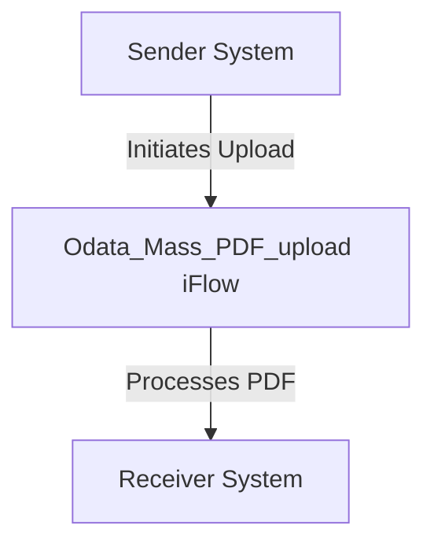

<h1 style="color: #1f4e79; font-size: 3em; text-align: center; margin-top: 5px; margin-bottom: 5px;">Odata Mass PDF upload</h1><h2 style="color: #1f4e79; font-size: 1.5em; text-align: center; margin-top: 5px; margin-bottom: 0px;">SAP CPI Technical Specification Document</h2>

<table border="1" style="width: 400px; border-collapse: collapse; border-color: black; margin: 0 auto; text-align: left;">
  <tr><td style="width: 30%; padding: 5px;">**Author:**</td><td style="padding: 5px;">Rohancherian783</td></tr>
  <tr><td style="padding: 5px;">**Date:**</td><td style="padding: 5px;">2025-12-12</td></tr>
  <tr><td style="padding: 5px;">**Version (Commit):**</td><td style="padding: 5px;">d696f4f</td></tr>
</table>

<h1 style="color: #1f4e79; font-size: 2.5em;">Table of Contents</h1>
1. Introduction 
1.1 Purpose 
1.2 Scope 
2. Integration Overview 
2.1 Integration Architecture 
2.2 Integration Components 
3. Integration Scenarios 
3.1 Scenario Description 
3.2 Data Flows 
3.3 Security Requirements 
4. Error Handling and Logging 
5. Testing Validation 
6. Reference Documents 

          

<h1 style="color: #1f4e79;">1. Introduction</h1>

<h2 style="color: #1f4e79;">1.1 Purpose</h2>
The purpose of the iFlow 'Odata_Mass_PDF_upload' is to facilitate the mass upload of PDF documents through an OData service. This integration flow is designed to streamline the process of handling PDF files, ensuring that they are correctly processed and uploaded to the designated system.

<h2 style="color: #1f4e79;">1.2 Scope</h2>
This iFlow operates within the boundaries of the SAP Cloud Platform Integration (CPI) environment. It interacts with external systems that provide OData services for document management. The primary systems affected by this iFlow include the sender system that initiates the upload and the receiver system that processes the uploaded PDFs.

<h1 style="color: #1f4e79;">2. Integration Overview</h1>

<h2 style="color: #1f4e79;">2.1 Integration Architecture</h2>
The integration architecture for the 'Odata_Mass_PDF_upload' iFlow consists of a sender and a receiver, where the sender initiates the upload of PDF documents, and the receiver processes these documents. The architecture is designed to ensure seamless communication between the systems involved.

<h2 style="color: #1f4e79;">2.2 Integration Components</h2>
The integration components include:
- **Sender System**: The system that sends the PDF documents to the iFlow.
- **Receiver System**: The system that receives and processes the uploaded PDFs.
- **Adapters**: The iFlow utilizes HTTP adapters for communication between the sender and receiver systems.

<h1 style="color: #1f4e79;">3. Integration Scenarios</h1>

<h2 style="color: #1f4e79;">3.1 Scenario Description</h2>
The integration scenario begins with the sender system triggering the upload of PDF documents. The iFlow processes the incoming request, handling the PDF files as specified, and subsequently forwards the processed documents to the receiver system.

<h2 style="color: #1f4e79;">3.2 Data Flows</h2>
The data flow involves the following steps:
1. The sender system sends a request to the iFlow containing the PDF documents.
2. The iFlow processes the incoming data, ensuring that the PDF files are correctly formatted and ready for upload.
3. The processed PDFs are then sent to the receiver system for further handling.

The iFlow may include mapping logic to transform the incoming data format into the required format for the receiver system.

<h2 style="color: #1f4e79;">3.3 Security Requirements</h2>
Security measures for this iFlow include:
- **Authentication**: The iFlow can be configured to use basic authentication, although it is currently set to false.
- **CORS Configuration**: Cross-Origin Resource Sharing (CORS) is disabled, ensuring that only authorized systems can interact with the iFlow.
- **Error Handling**: The iFlow is configured to not return exceptions to the sender, which can be adjusted based on requirements.

<h1 style="color: #1f4e79;">4. Error Handling and Logging</h1>
Error handling within the iFlow is managed through predefined strategies. The iFlow is set to not return exceptions to the sender, which means that any errors encountered during processing will be logged internally for review. This approach allows for better control over error management and ensures that the sender does not receive unnecessary error messages.

<h1 style="color: #1f4e79;">5. Testing Validation</h1>
Key testing scenarios for the 'Odata_Mass_PDF_upload' iFlow include:
- Validating the successful upload of PDF documents from the sender system.
- Ensuring that the receiver system correctly processes the uploaded PDFs.
- Testing the error handling mechanisms to confirm that errors are logged appropriately without returning exceptions to the sender.

<h1 style="color: #1f4e79;">6. Reference Documents</h1>
The following input artifacts were analyzed for the creation of this report:
- iFlowContent.xml
- Groovy scripts (if applicable)
- XSLT files (if applicable)
- Integration flow definition (Odata_Mass_PDF_upload.iflw)
