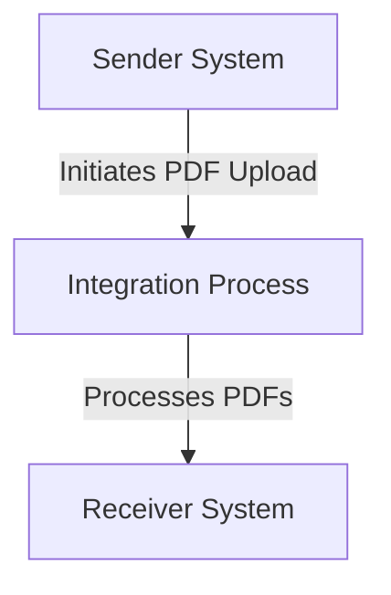

SAP / motiveminds
\n\n\n\n\n\n<h1 style="color: #1f4e79; font-size: 3em; text-align: left; margin-top: 100px;">AI Tech Specification Project - Odata Mass PDF upload - Odata Mass PDF upload</h1>\n\n\n\n\n\n\n\n\n\n\n\nKey | Value \n:--- | :--- \nAuthor | Nidhi Srivastava \nDate | 2025-12-01 \nVersion | Draft \n\n\n\n\n\n\n\n\n\n\n\n\n\n\n\n\n\n\n\n\n\n\n\n<h1 style="color: #1f4e79; font-size: 2.5em;">Table of Contents</h1>

1. Introduction  
    1.1 Purpose  
    1.2 Scope  
2. Integration Overview  
    2.1 Integration Architecture  
    2.2 Integration Components  
3. Integration Scenarios  
    3.1 Scenario Description  
    3.2 Data Flows  
    3.3 Security Requirements  
4. Error Handling and Logging  
5. Testing Validation  
6. Reference Documents  

          

# 1. Introduction

## 1.1 Purpose
The purpose of the iFlow 'Odata_Mass_PDF_upload' is to facilitate the mass upload of PDF documents via an OData service. This integration flow is designed to streamline the process of handling multiple PDF files, ensuring they are correctly processed and stored in the target system.

## 1.2 Scope
This iFlow operates within the SAP Cloud Platform Integration (CPI) environment and interacts with various systems, including the sender system that initiates the upload and the receiver system that processes the uploaded PDFs. The boundaries of this iFlow are limited to the integration of PDF files and do not extend to other document types or data formats.

# 2. Integration Overview

## 2.1 Integration Architecture
The integration architecture for the 'Odata_Mass_PDF_upload' iFlow consists of a sender and a receiver, with an integration process in between. The sender initiates the upload of PDF files, which are then processed by the integration flow before being sent to the receiver system.

## 2.2 Integration Components
- **Sender System**: This is the system that sends the PDF files to the iFlow for processing.
- **Receiver System**: This is the target system where the processed PDF files are stored.
- **Adapters Used**: The iFlow utilizes HTTP adapters for communication between the sender and receiver systems.

# 3. Integration Scenarios

## 3.1 Scenario Description
The integration scenario begins when the sender system triggers the iFlow by sending a request to upload multiple PDF files. The integration process handles the incoming request, processes the PDF files, and forwards them to the receiver system for storage.

## 3.2 Data Flows
The data flow involves the following steps:
1. The sender system sends a request containing the PDF files.
2. The integration process receives the request and extracts the PDF data.
3. The PDF files are processed as per the business logic defined in the iFlow.
4. The processed PDFs are sent to the receiver system for storage.

### Groovy Script Explanations
Currently, there are no Groovy scripts provided in the artifacts for this iFlow. If any Groovy scripts were included, they would typically be used for data transformation or additional processing logic.

## 3.3 Security Requirements
The iFlow does not enable basic authentication, as indicated by the configuration settings. Security measures should be implemented at the sender and receiver systems to ensure secure data transmission. The iFlow configuration does not specify any additional security mechanisms.

# 4. Error Handling and Logging
Error handling is managed through the iFlow configuration, which includes properties such as `returnExceptionToSender` set to false. This means that exceptions are not returned to the sender, and appropriate logging should be implemented to capture any errors that occur during the processing of PDF uploads.

# 5. Testing Validation
Key testing scenarios for the iFlow include:
- Validating the successful upload of multiple PDF files.
- Ensuring that the integration process correctly handles and processes the PDF data.
- Testing the interaction between the sender and receiver systems to confirm that the PDFs are stored correctly.

# 6. Reference Documents
- iFlow Content: `Odata_Mass_PDF_upload.iflw`
- Additional configuration files and scripts (if any) were not provided in the artifacts.
