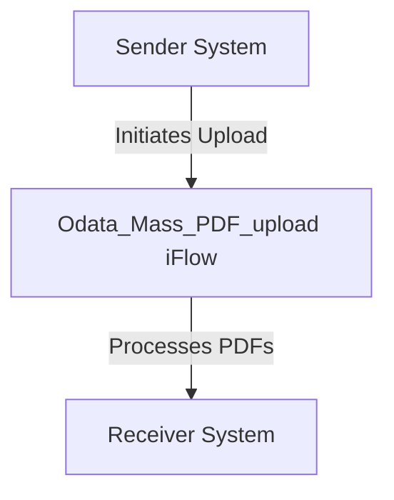

<h1 style="color: #1f4e79; font-size: 3em; text-align: left; margin-top: 100px;">AI Tech Specification Project - Odata Mass PDF upload - Odata Mass PDF upload</h1>

 <table border="1" style="width: 400px; border-collapse: collapse; border-color: black;">
  <tr><td style="width: 30%; padding: 5px;">**Author:**</td><td style="padding: 5px;">Rohancherian783</td></tr>
  <tr><td style="padding: 5px;">**Date:**</td><td style="padding: 5px;">2025-12-11</td></tr>
  <tr><td style="padding: 5px;">**Version (Commit):**</td><td style="padding: 5px;">7a95bd8</td></tr>
</table>

<h1 style="color: #1f4e79; font-size: 2.5em;">Table of Contents</h1>

1. Introduction  
    1.1 Purpose  
    1.2 Scope  
2. Integration Overview  
    2.1 Integration Architecture  
    2.2 Integration Components  
3. Integration Scenarios  
    3.1 Scenario Description  
    3.2 Data Flows  
    3.3 Security Requirements  
4. Error Handling and Logging  
5. Testing Validation  
6. Reference Documents  

# 1. Introduction

## 1.1 Purpose
The purpose of the iFlow 'Odata_Mass_PDF_upload' is to facilitate the mass upload of PDF documents through an OData service. This integration flow is designed to streamline the process of handling multiple PDF files, ensuring they are correctly processed and uploaded to the target system.

## 1.2 Scope
This iFlow is intended for use within the SAP Cloud Platform Integration (CPI) environment. It interacts with various systems that support OData services, specifically targeting scenarios where bulk PDF uploads are required. The primary systems affected include the sender system that initiates the upload and the receiver system that processes the uploaded PDFs.

# 2. Integration Overview

## 2.1 Integration Architecture
The integration architecture for the 'Odata_Mass_PDF_upload' iFlow consists of a sender and a receiver, with an integration process that manages the flow of data between them. The architecture is designed to handle the initiation of the upload process, the transfer of PDF files, and the completion of the upload.

## 2.2 Integration Components
- **Sender System**: This is the system that initiates the PDF upload process. It sends the PDF files to the iFlow.
- **Receiver System**: This is the target system that receives and processes the uploaded PDF files.
- **Adapters Used**: The iFlow utilizes HTTP adapters for both sending and receiving data, enabling communication between the sender and receiver systems.

# 3. Integration Scenarios

## 3.1 Scenario Description
The integration scenario begins with the sender system triggering the iFlow to upload multiple PDF files. The iFlow processes the incoming request, handles the PDF files, and forwards them to the receiver system for further processing. The flow is designed to ensure that all files are uploaded successfully and any errors are managed appropriately.

## 3.2 Data Flows
The data flow within the iFlow involves the following steps:
1. The sender system sends a request to the iFlow containing the PDF files.
2. The iFlow processes the incoming request, extracting the PDF files for upload.
3. The iFlow then forwards the PDF files to the receiver system.

Currently, there are no specific XSLT mappings or Groovy scripts mentioned in the provided artifacts. However, if any Groovy scripts were to be included, they would typically be used for data transformation or validation purposes during the upload process.

## 3.3 Security Requirements
The iFlow is configured with specific security settings:
- **Basic Authentication**: The sender system does not require basic authentication for this integration flow, as indicated by the configuration.
- **CORS and Session Handling**: Cross-Origin Resource Sharing (CORS) is disabled, and HTTP session handling is set to 'None', indicating that the flow does not maintain session state.

# 4. Error Handling and Logging
Error handling within the iFlow is managed through the configuration settings. The property `returnExceptionToSender` is set to false, which means that exceptions will not be returned to the sender system directly. Instead, the iFlow is expected to handle errors internally, potentially logging them for further analysis.

# 5. Testing Validation
Key testing scenarios for the 'Odata_Mass_PDF_upload' iFlow include:
- Validating the successful upload of multiple PDF files from the sender system to the receiver system.
- Testing the error handling mechanism by simulating failures during the upload process.
- Ensuring that the iFlow correctly processes and forwards the PDF files without data loss or corruption.

# 6. Reference Documents
The following artifacts were analyzed for the creation of this documentation:
- iFlow Content: `Odata_Mass_PDF_upload.iflw`
