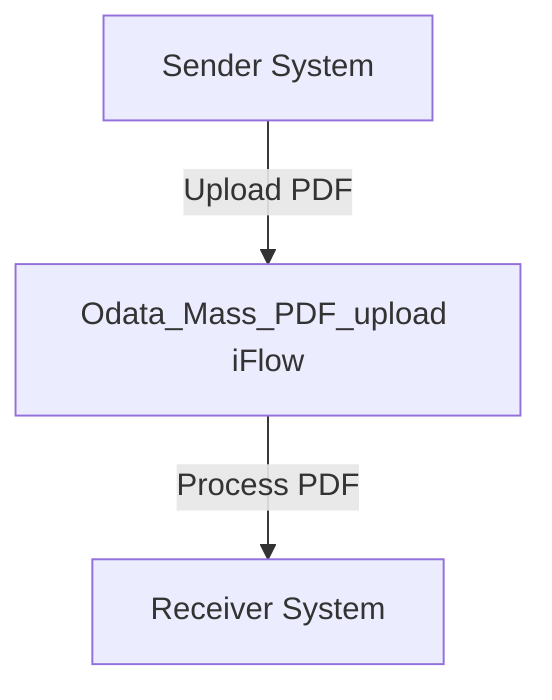

&nbsp;&nbsp;
\n\n\n\n\n\n\n\n\n\n\n<h1 style="color: #1f4e79; font-size: 3em; text-align: left; margin-top: 100px;">AI Tech Specification Project - Odata Mass PDF upload - Odata Mass PDF upload</h1>\n\n\n\n\n\n\n\n\n\n\n\n\n| Key | Value |\n| :--- | :--- |\n| Author | Nidhi Srivastava |\n| Date | 2025-12-01 |\n| Version | Draft |\n\n\n\n\n\n\n\n\n\n\n\n\n\n\n\n\n\n\n\n\n\n\n\n<h1 style="color: #1f4e79; font-size: 2.5em;">Table of Contents</h1>

1. Introduction  
    1.1 Purpose  
    1.2 Scope  

2. Integration Overview  
    2.1 Integration Architecture  
    2.2 Integration Components  

3. Integration Scenarios  
    3.1 Scenario Description  
    3.2 Data Flows  
    3.3 Security Requirements  

4. Error Handling and Logging  

5. Testing Validation  

6. Reference Documents  

  

# 1. Introduction

## 1.1 Purpose
The purpose of the iFlow 'Odata_Mass_PDF_upload' is to facilitate the mass upload of PDF documents into an OData service. This integration flow is designed to streamline the process of transferring large volumes of PDF files from a sender system to a receiver system, ensuring that the documents are processed efficiently and accurately.

## 1.2 Scope
This iFlow operates within the SAP Cloud Platform Integration (CPI) environment and interacts with both sender and receiver systems. The sender system is responsible for initiating the upload of PDF files, while the receiver system is tasked with processing and storing these files. The iFlow is limited to handling PDF documents and does not encompass other file types or formats.

# 2. Integration Overview

## 2.1 Integration Architecture
The integration architecture for the 'Odata_Mass_PDF_upload' iFlow consists of a sender and a receiver, with an integration process that manages the flow of data between them. The architecture is designed to ensure seamless communication and data transfer.

## 2.2 Integration Components
The integration components include:
- **Sender System**: The system that initiates the PDF upload.
- **Receiver System**: The system that receives and processes the uploaded PDFs.
- **Adapters**: The iFlow utilizes HTTP adapters for communication between the sender and receiver systems.

# 3. Integration Scenarios

## 3.1 Scenario Description
The integration scenario begins with the sender system triggering the upload of PDF documents. The iFlow receives the documents, processes them, and forwards them to the receiver system for storage and further processing. The flow is initiated by a start event and concludes with an end event, encapsulating the entire process.

## 3.2 Data Flows
The data flow within the iFlow involves the following steps:
1. The sender system sends a request to the iFlow with the PDF documents.
2. The iFlow processes the incoming request and prepares the data for the receiver system.
3. The processed data is sent to the receiver system for final handling.

The iFlow does not include any specific XSLT or mapping logic as it primarily focuses on the transfer of PDF files without transformation.

## 3.3 Security Requirements
The iFlow is configured with the following security measures:
- **Basic Authentication**: The sender system does not require basic authentication, as indicated by the configuration settings.
- **CORS**: Cross-Origin Resource Sharing (CORS) is disabled, ensuring that only requests from allowed origins are processed.
- **Session Handling**: The iFlow does not manage HTTP sessions, which simplifies the security model.

# 4. Error Handling and Logging
Error handling within the iFlow is managed through the configuration settings. The iFlow is set to not return exceptions to the sender, which means that errors will be logged internally rather than communicated back to the sender system. This approach allows for centralized error management and logging.

# 5. Testing Validation
Key testing scenarios for the iFlow include:
- Validating the successful upload of PDF documents from the sender system.
- Ensuring that the receiver system correctly processes and stores the uploaded PDFs.
- Testing the error handling mechanisms to confirm that errors are logged appropriately.

# 6. Reference Documents
The following artifacts were analyzed for the creation of this documentation:
- iFlow Content: `Odata_Mass_PDF_upload.iflw`
