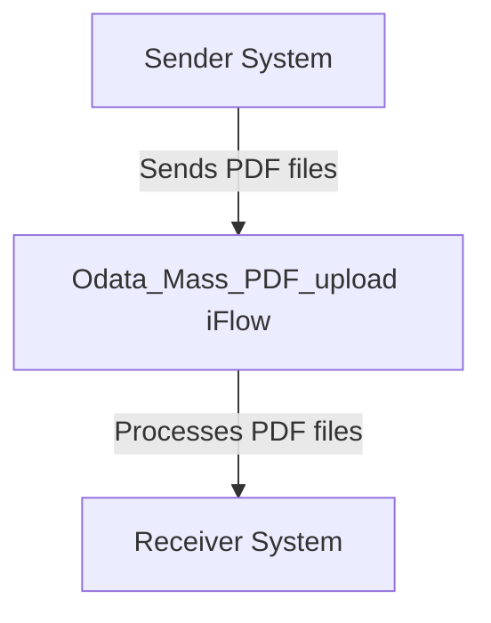

<h1 style="color: #1f4e79; font-size: 3em; text-align: left; margin-top: 100px;">AI Tech Specification Project - Odata Mass PDF upload - Odata Mass PDF upload</h1>

<table border="1" style="width: 400px; border-collapse: collapse; border-color: black;">
  <tr><td style="width: 30%; padding: 5px;">**Author:**</td><td style="padding: 5px;">Rohancherian783</td></tr>
  <tr><td style="padding: 5px;">**Date:**</td><td style="padding: 5px;">2025-12-11</td></tr>
  <tr><td style="padding: 5px;">**Version (Commit):**</td><td style="padding: 5px;">23d9e87</td></tr>
</table>

<h1 style="color: #1f4e79; font-size: 2.5em;">Table of Contents</h1>

1. Introduction  
    1.1 Purpose  
    1.2 Scope  
2. Integration Overview  
    2.1 Integration Architecture  
    2.2 Integration Components  
3. Integration Scenarios  
    3.1 Scenario Description  
    3.2 Data Flows  
    3.3 Security Requirements  
4. Error Handling and Logging  
5. Testing Validation  
6. Reference Documents  

          

# 1. Introduction

## 1.1 Purpose
The purpose of the iFlow 'Odata_Mass_PDF_upload' is to facilitate the mass upload of PDF documents via OData services. This integration flow is designed to streamline the process of handling multiple PDF files, ensuring they are correctly processed and stored in the target system.

## 1.2 Scope
This iFlow operates within the SAP Cloud Platform Integration (CPI) environment and interacts with both sender and receiver systems. The sender system is responsible for initiating the upload of PDF documents, while the receiver system is tasked with processing and storing these documents. The iFlow is limited to handling PDF files and does not encompass other file formats or data types.

# 2. Integration Overview

## 2.1 Integration Architecture
The integration architecture for the 'Odata_Mass_PDF_upload' iFlow consists of a sender and a receiver, with an integration process that manages the flow of data between them. The architecture is designed to ensure efficient communication and data handling.

## 2.2 Integration Components
- **Sender System**: This is the system that initiates the upload of PDF documents. It communicates with the iFlow to send the files.
- **Receiver System**: This system receives the processed PDF documents from the iFlow and is responsible for their storage and further processing.
- **Adapters Used**: The iFlow utilizes HTTP adapters for communication between the sender and receiver systems.

# 3. Integration Scenarios

## 3.1 Scenario Description
The integration scenario begins with the sender system triggering the iFlow to upload multiple PDF documents. The iFlow processes these documents sequentially, ensuring that each file is validated and correctly formatted before being sent to the receiver system for storage.

## 3.2 Data Flows
The data flow within the iFlow involves the following steps:
1. The sender system sends a request to the iFlow containing the PDF files.
2. The iFlow validates the incoming files to ensure they meet the required specifications.
3. Upon successful validation, the iFlow forwards the PDF files to the receiver system for storage.

### Groovy Script Explanations
Currently, there are no Groovy scripts included in the provided artifacts for this iFlow. If Groovy scripts were present, they would typically be used for data transformation or validation purposes.

## 3.3 Security Requirements
The iFlow does not enable basic authentication, as indicated by the configuration settings. Security measures should be implemented at the sender and receiver systems to ensure secure data transmission. The iFlow configuration allows for the management of headers and CORS settings, although these are currently set to default values.

# 4. Error Handling and Logging
Error handling within the iFlow is managed through the configuration settings. The property `returnExceptionToSender` is set to false, indicating that exceptions will not be returned to the sender system. Instead, errors will be logged for monitoring and troubleshooting purposes.

# 5. Testing Validation
Key testing scenarios for the iFlow include:
- Validating the successful upload of multiple PDF files.
- Ensuring that the iFlow correctly handles invalid file formats or corrupted files.
- Testing the integration with the receiver system to confirm that files are stored correctly.

# 6. Reference Documents
- iFlow Content: `Odata_Mass_PDF_upload.iflw`
- Integration architecture and process flow diagrams
- Configuration settings and properties used in the iFlow
