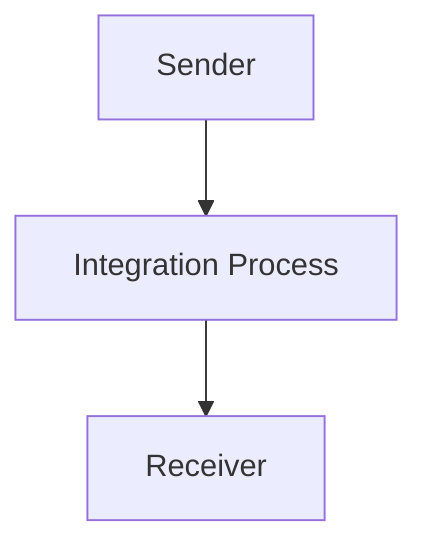

<h1 style="color: #1f4e79; font-size: 3em; text-align: center; margin-top: 5px; margin-bottom: 5px;">Odata Mass PDF upload</h1><h2 style="color: #1f4e79; font-size: 1.5em; text-align: center; margin-top: 5px; margin-bottom: 0px;">SAP CPI Technical Specification Document</h2>

<table border="1" style="width: 400px; border-collapse: collapse; border-color: black; margin: 0 auto; text-align: left;"><tr><td style="width: 30%; padding: 5px;">**Author:**</td><td style="padding: 5px;">Rohancherian783</td></tr><tr><td style="padding: 5px;">**Date:**</td><td style="padding: 5px;">2025-12-11</td></tr><tr><td style="padding: 5px;">**Version (Commit):**</td><td style="padding: 5px;">c952345</td></tr></table>

<h1 style="color: #1f4e79; font-size: 2.5em;">Table of Contents</h1>

1. Introduction  
   1.1 Purpose  
   1.2 Scope  
2. Integration Overview  
   2.1 Integration Architecture  
   2.2 Integration Components  
3. Integration Scenarios  
   3.1 Scenario Description  
   3.2 Data Flows  
   3.3 Security Requirements  
4. Error Handling and Logging  
5. Testing Validation  
6. Reference Documents  

<h1 style="color: #1f4e79;">1. Introduction</h1>

<h2 style="color: #1f4e79;">1.1 Purpose</h2>  
The purpose of the iFlow 'Odata_Mass_PDF_upload' is to facilitate the mass upload of PDF documents through an OData service. This integration flow is designed to streamline the process of handling PDF files, ensuring that they are correctly processed and stored in the target system.

<h2 style="color: #1f4e79;">1.2 Scope</h2>  
This iFlow operates within the SAP Cloud Platform Integration (CPI) environment and interacts with both sender and receiver systems. The sender system is responsible for initiating the upload process, while the receiver system handles the storage and management of the uploaded PDF files. The integration flow is limited to processing PDF documents and does not encompass other file types or formats.

<h1 style="color: #1f4e79;">2. Integration Overview</h1>

<h2 style="color: #1f4e79;">2.1 Integration Architecture</h2>  
The integration architecture for the 'Odata_Mass_PDF_upload' iFlow consists of a sender and a receiver, with a defined integration process that manages the flow of data. The architecture ensures that PDF files are uploaded efficiently and securely.

<h2 style="color: #1f4e79;">2.2 Integration Components</h2>  
The integration components include:
- **Sender System**: Initiates the upload of PDF files.
- **Receiver System**: Receives and processes the uploaded PDF files.
- **Adapters Used**: The iFlow utilizes HTTP adapters for communication between the sender and receiver systems.

<h1 style="color: #1f4e79;">3. Integration Scenarios</h1>

<h2 style="color: #1f4e79;">3.1 Scenario Description</h2>  
The integration scenario begins with the sender system triggering the upload of PDF files. The integration process captures the incoming request, processes the data, and forwards it to the receiver system for storage. The flow is straightforward, with a start event leading directly to an end event, indicating successful completion of the upload.

<h2 style="color: #1f4e79;">3.2 Data Flows</h2>  
The data flow involves the following steps:
1. The sender system sends a request to upload a PDF file.
2. The integration process receives the request and processes the PDF data.
3. The processed data is sent to the receiver system for storage.

Currently, there are no specific XSLT mappings or Groovy scripts defined in the provided artifacts for this iFlow.

<h2 style="color: #1f4e79;">3.3 Security Requirements</h2>  
The iFlow does not enable basic authentication, as indicated in the configuration. Security measures should be implemented at the sender and receiver systems to ensure secure data transmission. The iFlow configuration allows for CORS settings, but they are currently disabled.

<h1 style="color: #1f4e79;">4. Error Handling and Logging</h1>  
Error handling is configured to not return exceptions to the sender, which means that any errors encountered during processing will not be communicated back. It is essential to implement logging mechanisms within the integration process to capture any errors for troubleshooting purposes.

<h1 style="color: #1f4e79;">5. Testing Validation</h1>  
Key testing scenarios for the iFlow include:
- Validating the successful upload of PDF files from the sender system to the receiver system.
- Testing the handling of invalid PDF formats or corrupted files.
- Ensuring that the integration process logs errors appropriately.

<h1 style="color: #1f4e79;">6. Reference Documents</h1>  
The following artifacts were analyzed for the creation of this report:
- iFlow Content: `Odata_Mass_PDF_upload.iflw`

