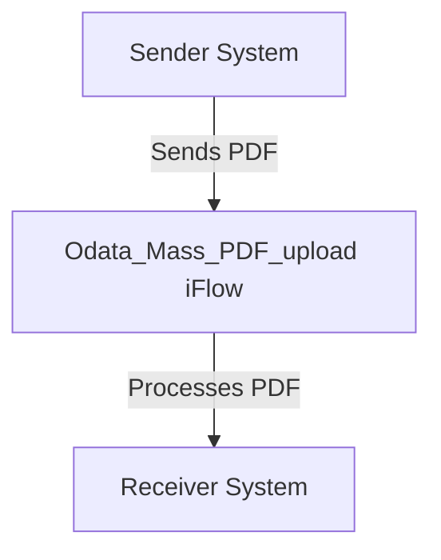

<h1 style="color: #1f4e79; font-size: 3em; text-align: center; margin-top: 5px; margin-bottom: 5px;">Odata Mass PDF upload</h1><h2 style="color: #1f4e79; font-size: 1.5em; text-align: center; margin-top: 5px; margin-bottom: 0px;">SAP CPI Technical Specification Document</h2>

<table border="1" style="width: 400px; border-collapse: collapse; border-color: black; margin: 0 auto; text-align: left;">
  <tr><td style="width: 30%; padding: 5px;">**Author:**</td><td style="padding: 5px;">Rohancherian783</td></tr>
  <tr><td style="padding: 5px;">**Date:**</td><td style="padding: 5px;">2025-12-11</td></tr>
  <tr><td style="padding: 5px;">**Version (Commit):**</td><td style="padding: 5px;">fbc8fb9</td></tr>
</table>

<h1 style="color: #1f4e79; font-size: 2.5em;">Table of Contents</h1>

1. Introduction  
   1.1 Purpose  
   1.2 Scope  
2. Integration Overview  
   2.1 Integration Architecture  
   2.2 Integration Components  
3. Integration Scenarios  
   3.1 Scenario Description  
   3.2 Data Flows  
   3.3 Security Requirements  
4. Error Handling and Logging  
5. Testing Validation  
6. Reference Documents  

<h1 style="color: #1f4e79;">1. Introduction</h1>

<h2 style="color: #1f4e79;">1.1 Purpose</h2>  
The purpose of the iFlow 'Odata_Mass_PDF_upload' is to facilitate the mass upload of PDF documents via OData services. This integration flow is designed to streamline the process of handling PDF files, ensuring that they are correctly processed and stored in the target system.

<h2 style="color: #1f4e79;">1.2 Scope</h2>  
This iFlow operates within the SAP Cloud Platform Integration (CPI) environment and interacts with various systems that support OData services. The primary systems affected include the sender system that initiates the PDF upload and the receiver system that processes and stores the uploaded documents. The iFlow is limited to handling PDF files and does not encompass other file types or formats.

<h1 style="color: #1f4e79;">2. Integration Overview</h1>

<h2 style="color: #1f4e79;">2.1 Integration Architecture</h2>  
The integration architecture for the 'Odata_Mass_PDF_upload' iFlow consists of a sender and a receiver, with an integration process that manages the flow of data between them. The architecture is designed to ensure efficient communication and data handling.

<h2 style="color: #1f4e79;">2.2 Integration Components</h2>  
The integration components include:
- **Sender System**: The system that initiates the PDF upload.
- **Receiver System**: The system that receives and processes the uploaded PDF files.
- **Adapters Used**: The iFlow utilizes OData adapters for communication between the sender and receiver systems.

<h1 style="color: #1f4e79;">3. Integration Scenarios</h1>

<h2 style="color: #1f4e79;">3.1 Scenario Description</h2>  
The integration scenario begins with the sender system triggering the upload of PDF documents. The iFlow processes the incoming request, validates the data, and forwards the PDF files to the designated receiver system for storage and further processing.

<h2 style="color: #1f4e79;">3.2 Data Flows</h2>  
The data flow involves the following steps:
1. The sender system sends a request to the iFlow containing the PDF document.
2. The iFlow processes the request, ensuring that the PDF is in the correct format.
3. The processed PDF is then sent to the receiver system for storage.

Currently, there are no specific XSLT mappings or Groovy scripts mentioned in the provided artifacts for this iFlow.

<h2 style="color: #1f4e79;">3.3 Security Requirements</h2>  
The iFlow does not enable basic authentication, as indicated in the configuration. Security measures should be implemented at the sender and receiver systems to ensure that only authorized users can initiate PDF uploads and access the stored documents.

<h1 style="color: #1f4e79;">4. Error Handling and Logging</h1>  
Error handling within the iFlow is configured to not return exceptions to the sender. This means that any errors encountered during processing will not be communicated back to the initiating system. It is essential to implement logging mechanisms to capture errors for troubleshooting and monitoring purposes.

<h1 style="color: #1f4e79;">5. Testing Validation</h1>  
Key testing scenarios for the iFlow include:
- Validating the successful upload of PDF documents.
- Testing the error handling mechanism by simulating invalid PDF formats.
- Ensuring that the receiver system correctly processes and stores the uploaded PDFs.

<h1 style="color: #1f4e79;">6. Reference Documents</h1>  
The following artifacts were analyzed for this report:
- iFlow Content: `Odata_Mass_PDF_upload.iflw`  
- Additional configuration files and documentation related to the integration flow.
