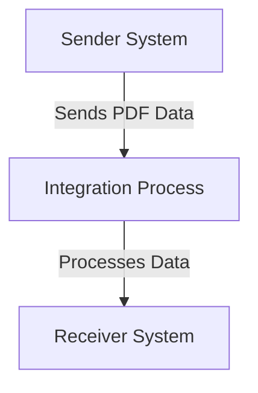

<h1 style="color: #1f4e79; font-size: 3em; text-align: center; margin-top: 5px; margin-bottom: 5px;">Odata Mass PDF upload</h1><h2 style="color: #1f4e79; font-size: 1.5em; text-align: center; margin-top: 5px; margin-bottom: 0px;">SAP CPI Technical Specification Document</h2>

<table border="1" style="width: 400px; border-collapse: collapse; border-color: black; margin: 0 auto; text-align: left;">
  <tr><td style="width: 30%; padding: 5px;">**Author:**</td><td style="padding: 5px;">Rohancherian783</td></tr>
  <tr><td style="padding: 5px;">**Date:**</td><td style="padding: 5px;">2025-12-11</td></tr>
  <tr><td style="padding: 5px;">**Version (Commit):**</td><td style="padding: 5px;">d790e9a</td></tr>
</table>

<h1 style="color: #1f4e79; font-size: 2.5em;">Table of Contents</h1>

1. Introduction  
   1.1 Purpose  
   1.2 Scope  
2. Integration Overview  
   2.1 Integration Architecture  
   2.2 Integration Components  
3. Integration Scenarios  
   3.1 Scenario Description  
   3.2 Data Flows  
   3.3 Security Requirements  
4. Error Handling and Logging  
5. Testing Validation  
6. Reference Documents  

<h1 style="color: #1f4e79;">1. Introduction</h1>

<h2 style="color: #1f4e79;">1.1 Purpose</h2>  
The purpose of the iFlow 'Odata_Mass_PDF_upload' is to facilitate the mass upload of PDF documents via OData services. This integration flow is designed to streamline the process of handling PDF files, ensuring that they are correctly processed and stored in the target system.

<h2 style="color: #1f4e79;">1.2 Scope</h2>  
This iFlow operates within the context of an enterprise integration scenario, connecting a sender system that generates PDF documents with a receiver system that stores these documents. The primary systems affected by this iFlow include the OData service provider and the document management system where the PDFs are uploaded.

<h1 style="color: #1f4e79;">2. Integration Overview</h1>

<h2 style="color: #1f4e79;">2.1 Integration Architecture</h2>  
The integration architecture for the 'Odata_Mass_PDF_upload' iFlow consists of a sender and a receiver, with an integration process that manages the flow of data between them. The architecture is designed to ensure efficient handling of PDF uploads through OData.

<h2 style="color: #1f4e79;">2.2 Integration Components</h2>  
The integration components include:
- **Sender System**: The source of the PDF documents, which sends data to the iFlow.
- **Receiver System**: The target system that receives and stores the PDF documents.
- **Adapters Used**: The iFlow utilizes OData adapters for communication between the sender and receiver systems.

<h1 style="color: #1f4e79;">3. Integration Scenarios</h1>

<h2 style="color: #1f4e79;">3.1 Scenario Description</h2>  
The integration scenario begins with the sender system generating PDF documents. These documents are then sent to the iFlow, where they are processed and forwarded to the receiver system for storage. The flow is initiated by a start event and concludes with an end event, ensuring that all documents are handled appropriately.

<h2 style="color: #1f4e79;">3.2 Data Flows</h2>  
The data flow involves the following steps:
1. The sender system triggers the iFlow by sending a request containing the PDF data.
2. The integration process receives the data and processes it as per the defined logic.
3. The processed data is then sent to the receiver system for storage.

The iFlow does not include specific XSLT mappings or Groovy scripts as per the provided artifact, indicating a straightforward data transfer without complex transformations.

<h2 style="color: #1f4e79;">3.3 Security Requirements</h2>  
The iFlow is configured with the following security settings:
- **Basic Authentication**: Disabled for the sender endpoint.
- **CORS**: Not enabled, ensuring that cross-origin requests are not allowed.
- **Session Handling**: Set to 'None', indicating that no session management is required for this flow.

<h1 style="color: #1f4e79;">4. Error Handling and Logging</h1>  
Error handling in the iFlow is managed through the configuration settings, which include properties such as `returnExceptionToSender` set to false. This indicates that exceptions are not returned to the sender, and appropriate logging mechanisms should be in place to capture any errors that occur during the processing of PDF uploads.

<h1 style="color: #1f4e79;">5. Testing Validation</h1>  
Key testing scenarios for the iFlow include:
- Validating the successful upload of PDF documents from the sender system to the receiver system.
- Testing the handling of invalid PDF formats to ensure that errors are logged appropriately.
- Ensuring that the integration process completes without exceptions and that all documents are stored correctly in the receiver system.

<h1 style="color: #1f4e79;">6. Reference Documents</h1>  
The following artifacts were analyzed for the creation of this report:
- iFlow Content: `Odata_Mass_PDF_upload.iflw`  
- Integration architecture and configuration details.
