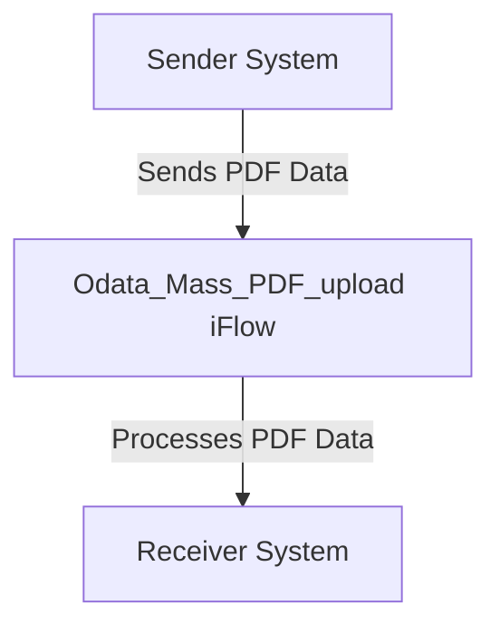

<h1 style="color: #1f4e79; font-size: 3em; text-align: center; margin-top: 5px; margin-bottom: 5px;">Odata Mass PDF upload</h1><h2 style="color: #1f4e79; font-size: 1.5em; text-align: center; margin-top: 5px; margin-bottom: 0px;">SAP CPI Technical Specification Document</h2>

<table border="1" style="width: 400px; border-collapse: collapse; border-color: black; margin: 0 auto; text-align: left;">
  <tr><td style="width: 30%; padding: 5px;">**Author:**</td><td style="padding: 5px;">Rohancherian783</td></tr>
  <tr><td style="padding: 5px;">**Date:**</td><td style="padding: 5px;">2025-12-11</td></tr>
  <tr><td style="padding: 5px;">**Version (Commit):**</td><td style="padding: 5px;">1259773</td></tr>
</table>

<h1 style="color: #1f4e79; font-size: 2.5em;">Table of Contents</h1>

1. Introduction  
    1.1 Purpose  
    1.2 Scope  
2. Integration Overview  
    2.1 Integration Architecture  
    2.2 Integration Components  
3. Integration Scenarios  
    3.1 Scenario Description  
    3.2 Data Flows  
    3.3 Security Requirements  
4. Error Handling and Logging  
5. Testing Validation  
6. Reference Documents  

# 1. Introduction

## 1.1 Purpose
The purpose of the iFlow 'Odata_Mass_PDF_upload' is to facilitate the mass upload of PDF documents through an OData service. This integration flow is designed to streamline the process of handling PDF files, ensuring that they are correctly processed and uploaded to the target system.

## 1.2 Scope
This iFlow is intended for use within the SAP Cloud Platform Integration (CPI) environment. It interacts with various systems that support OData protocols, specifically targeting scenarios where bulk PDF uploads are required. The systems affected include the sender system that initiates the upload and the receiver system that processes the uploaded PDFs.

# 2. Integration Overview

## 2.1 Integration Architecture
The integration architecture for the 'Odata_Mass_PDF_upload' iFlow consists of a sender and a receiver, with an integration process that manages the flow of data between them. The architecture is designed to ensure efficient handling of PDF uploads while maintaining data integrity and security.

## 2.2 Integration Components
The integration components involved in this iFlow include:

- **Sender System**: The system that initiates the PDF upload.
- **Receiver System**: The target system that receives and processes the uploaded PDFs.
- **Adapters**: The iFlow utilizes OData adapters to facilitate communication between the sender and receiver systems.

# 3. Integration Scenarios

## 3.1 Scenario Description
The integration scenario begins with the sender system triggering the iFlow to upload multiple PDF documents. The iFlow processes the incoming data, ensuring that each PDF is correctly formatted and adheres to the required specifications before forwarding it to the receiver system.

## 3.2 Data Flows
The data flow within the iFlow involves the following steps:

1. **Data Reception**: The iFlow receives PDF data from the sender system.
2. **Processing**: The iFlow processes the received data, which may include validation and transformation as necessary.
3. **Data Transmission**: The processed PDF data is sent to the receiver system for further handling.

The mapping logic and any transformation rules (if applicable) are defined within the iFlow configuration. Currently, there are no specific XSLT or Groovy scripts mentioned in the provided artifacts.

## 3.3 Security Requirements
The iFlow implements security measures to ensure that the data being transmitted is protected. Key security configurations include:

- **Basic Authentication**: Although the sender has the option to enable basic authentication, it is currently set to false.
- **CORS and Session Handling**: Cross-Origin Resource Sharing (CORS) is disabled, and HTTP session handling is set to none, indicating that the flow does not maintain session state.

# 4. Error Handling and Logging
Error handling within the iFlow is managed through the configuration settings. The property `returnExceptionToSender` is set to false, indicating that exceptions will not be returned to the sender. This requires additional logging mechanisms to capture errors for troubleshooting purposes.

# 5. Testing Validation
Key testing scenarios for the iFlow include:

- **Successful PDF Upload**: Validate that the iFlow correctly processes and uploads PDF documents without errors.
- **Error Handling**: Test the iFlow's response to invalid PDF formats or other errors during processing to ensure proper logging and handling.

# 6. Reference Documents
The following artifacts were analyzed for the creation of this report:

- iFlow Content: `Odata_Mass_PDF_upload.iflw`
