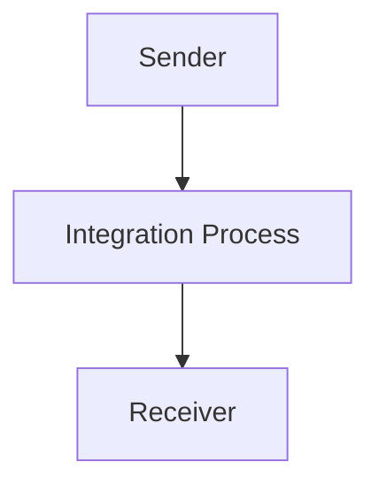

<h1 style="color: #1f4e79; font-size: 3em; text-align: center; margin-top: 5px; margin-bottom: 5px;">Odata Mass PDF upload</h1><h2 style="color: #1f4e79; font-size: 1.5em; text-align: center; margin-top: 5px; margin-bottom: 0px;">SAP CPI Technical Specification Document</h2>

<table border="1" style="width: 400px; border-collapse: collapse; border-color: black; margin: 0 auto; text-align: left;">
  <tr><td style="width: 30%; padding: 5px;">**Author:**</td><td style="padding: 5px;">Rohancherian783</td></tr>
  <tr><td style="padding: 5px;">**Date:**</td><td style="padding: 5px;">2025-12-11</td></tr>
  <tr><td style="padding: 5px;">**Version (Commit):**</td><td style="padding: 5px;">4731d86</td></tr>
</table>

<h1 style="color: #1f4e79; font-size: 2.5em;">Table of Contents</h1>

1. Introduction  
   1.1 Purpose  
   1.2 Scope  

2. Integration Overview  
   2.1 Integration Architecture  
   2.2 Integration Components  

3. Integration Scenarios  
   3.1 Scenario Description  
   3.2 Data Flows  
   3.3 Security Requirements  

4. Error Handling and Logging  

5. Testing Validation  

6. Reference Documents  

<h1 style="color: #1f4e79;">1. Introduction</h1>

<h2 style="color: #1f4e79;">1.1 Purpose</h2>  
The purpose of the iFlow 'Odata_Mass_PDF_upload' is to facilitate the mass upload of PDF documents via OData services. This integration flow is designed to streamline the process of handling multiple PDF files, ensuring they are correctly processed and uploaded to the target system.

<h2 style="color: #1f4e79;">1.2 Scope</h2>  
This iFlow operates within the SAP Cloud Platform Integration (CPI) environment and interacts with both sender and receiver systems. The primary systems affected include the OData service provider and the storage system for the uploaded PDFs. The flow is limited to handling PDF files and does not encompass other file types or formats.

<h1 style="color: #1f4e79;">2. Integration Overview</h1>

<h2 style="color: #1f4e79;">2.1 Integration Architecture</h2>  
The integration architecture for the 'Odata_Mass_PDF_upload' iFlow consists of a sender and a receiver, with an integration process that manages the flow of data between them. The architecture is designed to ensure efficient data transfer and processing.

<h2 style="color: #1f4e79;">2.2 Integration Components</h2>  
The integration components include:
- **Sender**: An OData service that initiates the upload of PDF files.
- **Receiver**: The target system where the PDF files are stored.
- **Adapters**: The iFlow utilizes HTTP adapters for both sending and receiving data.

<h1 style="color: #1f4e79;">3. Integration Scenarios</h1>

<h2 style="color: #1f4e79;">3.1 Scenario Description</h2>  
The integration scenario begins with the sender triggering the iFlow by sending a request to upload PDF files. The integration process then handles the incoming data, processes it, and forwards it to the receiver for storage.

<h2 style="color: #1f4e79;">3.2 Data Flows</h2>  
The data flow involves the following steps:
1. The sender sends a request containing the PDF files to the iFlow.
2. The integration process receives the request and processes the PDF files.
3. The processed files are then sent to the receiver for storage.

Currently, there are no specific XSLT mappings or Groovy scripts utilized in this iFlow, as the process is straightforward and does not require complex transformations.

<h2 style="color: #1f4e79;">3.3 Security Requirements</h2>  
The iFlow does not enable basic authentication, which means that security measures must be implemented at the sender and receiver levels. The configuration does not specify any credentials, indicating that the flow may rely on other security mechanisms such as network security or application-level security.

<h1 style="color: #1f4e79;">4. Error Handling and Logging</h1>  
Error handling in this iFlow is managed through the configuration settings. The property `returnExceptionToSender` is set to false, indicating that exceptions will not be returned to the sender. Instead, errors should be logged for further analysis.

<h1 style="color: #1f4e79;">5. Testing Validation</h1>  
Key testing scenarios for the iFlow include:
- Validating the successful upload of PDF files.
- Testing the response from the receiver to ensure files are stored correctly.
- Handling error scenarios, such as invalid file formats or network issues.

<h1 style="color: #1f4e79;">6. Reference Documents</h1>  
The following artifacts were analyzed for this report:
- iFlow Content: `Odata_Mass_PDF_upload.iflw`  
- Configuration settings and properties related to the integration flow.
