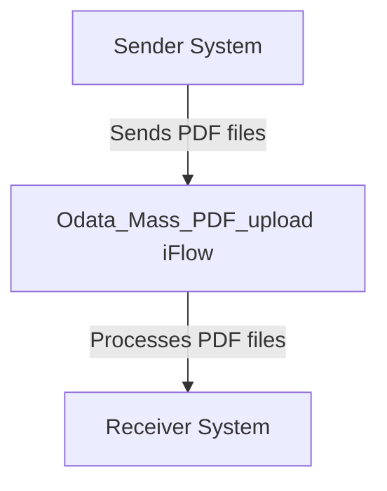

<h1 style="color: #1f4e79; font-size: 3em; text-align: left; margin-top: 100px;">AI Tech Specification Project - Odata Mass PDF upload - Odata Mass PDF upload</h1>

 <table border="1" style="width: 400px; border-collapse: collapse; border-color: black;">
  <tr><td style="width: 30%; padding: 5px;">**Author:**</td><td style="padding: 5px;">Rohancherian783</td></tr>
  <tr><td style="padding: 5px;">**Date:**</td><td style="padding: 5px;">2025-12-11</td></tr>
  <tr><td style="padding: 5px;">**Version (Commit):**</td><td style="padding: 5px;">852916d</td></tr>
</table>

<h1 style="color: #1f4e79; font-size: 2.5em;">Table of Contents</h1>

1. Introduction  
   1.1 Purpose  
   1.2 Scope  
2. Integration Overview  
   2.1 Integration Architecture  
   2.2 Integration Components  
3. Integration Scenarios  
   3.1 Scenario Description  
   3.2 Data Flows  
   3.3 Security Requirements  
4. Error Handling and Logging  
5. Testing Validation  
6. Reference Documents  

  

# 1. Introduction

## 1.1 Purpose
The purpose of the iFlow 'Odata_Mass_PDF_upload' is to facilitate the mass upload of PDF documents through an OData service. This integration flow is designed to streamline the process of sending multiple PDF files from a sender system to a receiver system, ensuring that the documents are processed efficiently and accurately.

## 1.2 Scope
This iFlow operates within the SAP Cloud Platform Integration (CPI) environment and interacts with both sender and receiver systems. The sender system is responsible for initiating the upload of PDF documents, while the receiver system processes these documents. The iFlow is limited to handling PDF files and does not encompass other file types or formats.

# 2. Integration Overview

## 2.1 Integration Architecture
The integration architecture for the 'Odata_Mass_PDF_upload' iFlow consists of a sender and receiver endpoint, with an integration process that manages the flow of data between them. The architecture is designed to ensure seamless communication and data transfer.

## 2.2 Integration Components
- **Sender System**: The system that initiates the upload of PDF documents.
- **Receiver System**: The system that receives and processes the uploaded PDF documents.
- **Adapters Used**: The integration flow utilizes HTTP adapters for communication between the sender and receiver systems.

# 3. Integration Scenarios

## 3.1 Scenario Description
The integration scenario begins with the sender system triggering the iFlow to upload multiple PDF documents. The iFlow processes each document and forwards it to the receiver system. The flow is initiated by a start event and concludes with an end event, ensuring that all documents are handled in a single transaction.

## 3.2 Data Flows
The data flow within the iFlow involves the following steps:
1. The sender system sends a request to the iFlow containing the PDF documents.
2. The iFlow processes the incoming request and extracts the PDF files.
3. The iFlow forwards the extracted PDF files to the receiver system for processing.

### Mapping Logic Summary
Currently, there are no specific XSLT mappings or transformations defined in the provided artifacts. The iFlow primarily focuses on the transfer of PDF files without additional data transformation.

### Groovy Script Explanations
No Groovy scripts are included in the provided artifacts for this iFlow. The integration logic is handled directly within the iFlow configuration.

## 3.3 Security Requirements
The iFlow does not enable basic authentication, as indicated by the configuration settings. Security measures should be implemented at the sender and receiver systems to ensure secure data transfer. The iFlow configuration allows for the specification of various security properties, but they are not actively utilized in this instance.

# 4. Error Handling and Logging
The iFlow is configured to not return exceptions to the sender, which means that error handling must be managed within the integration process. Proper logging mechanisms should be established to capture any errors that occur during the processing of PDF uploads.

# 5. Testing Validation
Key testing scenarios for the 'Odata_Mass_PDF_upload' iFlow include:
- Validating the successful upload of multiple PDF documents.
- Ensuring that the receiver system processes the uploaded documents correctly.
- Testing the error handling capabilities when invalid PDF files are sent.

# 6. Reference Documents
- iFlow Content: `Odata_Mass_PDF_upload.iflw`
