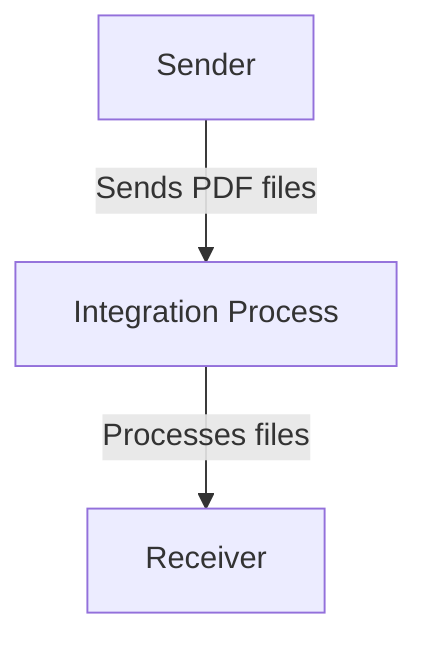

<h1 style="color: #1f4e79; font-size: 3em; text-align: center; margin-top: 5px; margin-bottom: 5px;">Odata Mass PDF upload</h1><h2 style="color: #1f4e79; font-size: 1.5em; text-align: center; margin-top: 5px; margin-bottom: 0px;">SAP CPI Technical Specification Document</h2>

<table border="1" style="width: 400px; border-collapse: collapse; border-color: black; margin: 0 auto; text-align: left;">
  <tr><td style="width: 30%; padding: 5px;">**Author:**</td><td style="padding: 5px;">Rohancherian783</td></tr>
  <tr><td style="padding: 5px;">**Date:**</td><td style="padding: 5px;">2025-12-11</td></tr>
  <tr><td style="padding: 5px;">**Version (Commit):**</td><td style="padding: 5px;">3e46591</td></tr>
</table>

<h1 style="color: #1f4e79; font-size: 2.5em;">Table of Contents</h1>

1. Introduction  
    1.1 Purpose  
    1.2 Scope  
2. Integration Overview  
    2.1 Integration Architecture  
    2.2 Integration Components  
3. Integration Scenarios  
    3.1 Scenario Description  
    3.2 Data Flows  
    3.3 Security Requirements  
4. Error Handling and Logging  
5. Testing Validation  
6. Reference Documents  

# 1. Introduction

## 1.1 Purpose
The purpose of the iFlow 'Odata_Mass_PDF_upload' is to facilitate the mass upload of PDF documents via OData services. This integration flow is designed to streamline the process of handling multiple PDF files, ensuring that they are correctly processed and stored in the target system.

## 1.2 Scope
This iFlow operates within the SAP Cloud Platform Integration (CPI) environment and interacts with various systems that support OData protocols. The primary systems affected include the sender system that initiates the PDF upload and the receiver system that processes and stores the uploaded documents. The flow is designed to handle PDF files in bulk, ensuring efficient data transfer and processing.

# 2. Integration Overview

## 2.1 Integration Architecture
The integration architecture for the 'Odata_Mass_PDF_upload' iFlow consists of a sender and a receiver, with an integration process that manages the flow of data between them. The architecture is designed to ensure seamless communication and data handling.

## 2.2 Integration Components
The integration components of this iFlow include:

- **Sender System**: The system that initiates the PDF upload process.
- **Receiver System**: The target system that receives and processes the uploaded PDF files.
- **Adapters**: The iFlow utilizes OData adapters for communication between the sender and receiver systems.

# 3. Integration Scenarios

## 3.1 Scenario Description
The integration scenario begins when the sender system triggers the iFlow to upload multiple PDF documents. The integration process handles the incoming data, processes it, and forwards it to the receiver system for storage. The flow is designed to ensure that all documents are uploaded successfully and any errors are managed appropriately.

## 3.2 Data Flows
The data flow within the iFlow involves the following steps:

1. **Data Reception**: The sender system sends a batch of PDF files to the integration process.
2. **Processing Logic**: The integration process validates and processes the incoming PDF files.
3. **Data Transmission**: The processed files are sent to the receiver system for storage.

The mapping logic for this iFlow is primarily handled through the integration process, which ensures that the data is correctly formatted and transmitted.

## 3.3 Security Requirements
The security requirements for this iFlow include:

- **Authentication**: The iFlow does not enable basic authentication, which means that security measures must be implemented at the sender and receiver systems.
- **Data Protection**: All data transmitted between the sender and receiver must be encrypted to ensure confidentiality and integrity.

# 4. Error Handling and Logging
Error handling within the iFlow is managed through the integration process. If any errors occur during the upload or processing of PDF files, the iFlow is designed to log these errors and provide feedback to the sender system. This ensures that any issues can be addressed promptly and that the integrity of the data flow is maintained.

# 5. Testing Validation
Key testing requirements for the 'Odata_Mass_PDF_upload' iFlow include:

- **Functional Testing**: Verify that the iFlow correctly uploads and processes multiple PDF files.
- **Error Handling Testing**: Ensure that the iFlow can handle errors gracefully and logs them appropriately.
- **Performance Testing**: Assess the performance of the iFlow under various load conditions to ensure it can handle bulk uploads efficiently.

# 6. Reference Documents
The following input artifacts were analyzed for the creation of this documentation:

- `Odata_Mass_PDF_upload.iflw` (iFlow configuration file)
