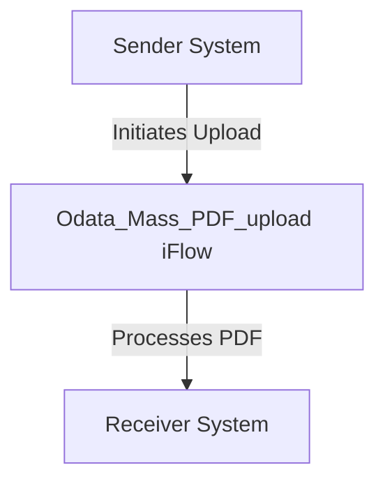

<h2 style="color: #1f4e79; font-size: 1.5em; text-align: left; margin-top: 50px; margin-bottom: 5px;">SAP CPI Technical Specification Document</h2><h1 style="color: #1f4e79; font-size: 3em; text-align: left; margin-top: 5px; margin-bottom: 0px;">Odata Mass PDF upload</h1>

 <table border="1" style="width: 400px; border-collapse: collapse; border-color: black;">
  <tr><td style="width: 30%; padding: 5px;">**Author:**</td><td style="padding: 5px;">Rohancherian783</td></tr>
  <tr><td style="padding: 5px;">**Date:**</td><td style="padding: 5px;">2025-12-11</td></tr>
  <tr><td style="padding: 5px;">**Version (Commit):**</td><td style="padding: 5px;">8d830e0</td></tr>
</table>

<h1 style="color: #1f4e79; font-size: 2.5em;">Table of Contents</h1>

1. Introduction  
    1.1 Purpose  
    1.2 Scope  
2. Integration Overview  
    2.1 Integration Architecture  
    2.2 Integration Components  
3. Integration Scenarios  
    3.1 Scenario Description  
    3.2 Data Flows  
    3.3 Security Requirements  
4. Error Handling and Logging  
5. Testing Validation  
6. Reference Documents  

# 1. Introduction

## 1.1 Purpose
The purpose of the iFlow 'Odata_Mass_PDF_upload' is to facilitate the mass upload of PDF documents via an OData service. This integration flow is designed to streamline the process of handling multiple PDF files, ensuring they are correctly processed and stored in the target system.

## 1.2 Scope
This iFlow is intended to integrate with systems that support OData services, specifically for the upload of PDF documents. The primary systems affected include the sender system that initiates the upload and the receiver system that processes and stores the uploaded documents. The iFlow does not cover any downstream processing of the PDFs once they are uploaded.

# 2. Integration Overview

## 2.1 Integration Architecture
The integration architecture for the 'Odata_Mass_PDF_upload' iFlow consists of a sender and a receiver, where the sender initiates the upload of PDF documents through an OData service, and the receiver processes these documents.

## 2.2 Integration Components
- **Sender System**: This is the system that sends the PDF documents to the iFlow for processing.
- **Receiver System**: This is the target system that receives and stores the uploaded PDF documents.
- **Adapters Used**: The iFlow utilizes OData adapters for communication between the sender and the receiver.

# 3. Integration Scenarios

## 3.1 Scenario Description
The iFlow operates by receiving a request from the sender system to upload multiple PDF documents. Upon receiving the request, the iFlow processes each document and forwards it to the designated receiver system for storage.

## 3.2 Data Flows
The data flow involves the following steps:
1. The sender system sends a request to the iFlow containing the PDF documents.
2. The iFlow processes the incoming request, extracting the PDF files.
3. Each PDF file is then sent to the receiver system for storage.

### Mapping Logic Summary
The iFlow may include XSLT or other mapping logic to transform the incoming data format into the required format for the receiver system. However, specific mapping details are not provided in the current artifact.

### Groovy Script Explanations
No Groovy scripts are explicitly mentioned in the provided artifact. If present in other parts of the iFlow, they would typically be used for additional processing or transformation of the data before sending it to the receiver.

## 3.3 Security Requirements
The iFlow configuration indicates that basic authentication is not enabled for the sender. Security measures should be considered to ensure that only authorized systems can initiate uploads. This may involve implementing OAuth or other authentication mechanisms in a production environment.

# 4. Error Handling and Logging
The iFlow is configured with properties that suggest error handling strategies, such as `returnExceptionToSender` set to false, indicating that exceptions may not be sent back to the sender. Proper logging mechanisms should be in place to capture errors during the upload process for troubleshooting.

# 5. Testing Validation
Key testing scenarios for the iFlow include:
- Validating successful uploads of single and multiple PDF documents.
- Testing the response from the receiver system to ensure documents are stored correctly.
- Error handling tests to ensure that appropriate messages are logged and handled when uploads fail.

# 6. Reference Documents
- iFlow Content: `Odata_Mass_PDF_upload.iflw`
- Additional artifacts such as Groovy scripts and XSLT files were not provided in the current context but may exist in the broader integration project.
