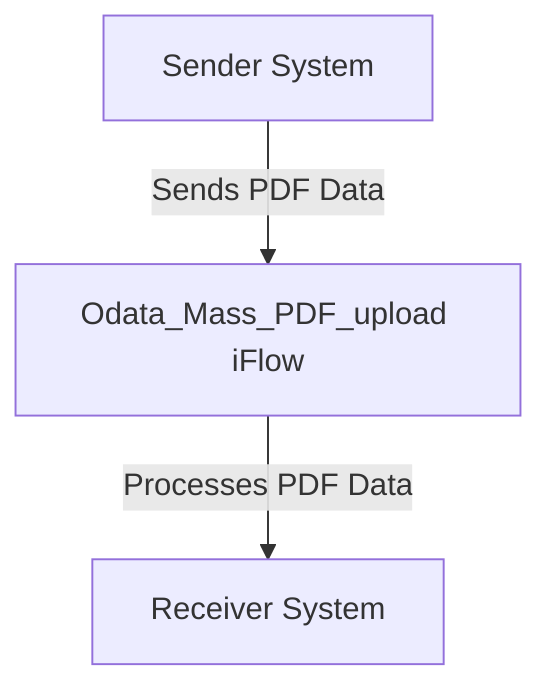

SAP | motiveminds
\n\n\n\n\n\n\n<h1 style="color: #1f4e79; font-size: 3em; text-align: left; margin-top: 100px;">AI Tech Specification Project - Odata Mass PDF upload - Odata Mass PDF upload</h1>\n\n\n\n\n\n\n\n\n\n\n\n\n| Key | Value |\n| :--- | :--- |\n| Author | Nidhi Srivastava |\n| Date | 2025-12-01 |\n| Version | Draft |\n\n\n\n\n\n\n\n\n\n\n\n\n\n\n\n\n\n\n\n\n\n\n\n<h1 style="color: #1f4e79; font-size: 2.5em;">Table of Contents</h1>

1. Introduction  
    1.1 Purpose  
    1.2 Scope  
2. Integration Overview  
    2.1 Integration Architecture  
    2.2 Integration Components  
3. Integration Scenarios  
    3.1 Scenario Description  
    3.2 Data Flows  
    3.3 Security Requirements  
4. Error Handling and Logging  
5. Testing Validation  
6. Reference Documents  

          

# 1. Introduction

## 1.1 Purpose
The purpose of the iFlow 'Odata_Mass_PDF_upload' is to facilitate the mass upload of PDF documents through an OData service. This integration flow is designed to streamline the process of handling PDF files, ensuring that they are correctly processed and stored in the target system.

## 1.2 Scope
This iFlow operates within the SAP Cloud Platform Integration (CPI) environment and interacts with various systems, including the sender and receiver endpoints. The primary systems affected by this iFlow include the source system that generates the PDF documents and the target system where these documents are stored. The iFlow is responsible for managing the data transfer, ensuring data integrity, and handling any errors that may arise during the process.

# 2. Integration Overview

## 2.1 Integration Architecture
The integration architecture for the 'Odata_Mass_PDF_upload' iFlow consists of a sender and a receiver, with an integration process that manages the flow of data between them. The architecture is designed to ensure efficient communication and data handling.

## 2.2 Integration Components
The integration components of the iFlow include:

- **Sender System**: The source system that initiates the PDF upload.
- **Receiver System**: The target system where the PDF documents are stored.
- **Adapters Used**: The iFlow utilizes HTTP adapters for communication between the sender and receiver systems.

# 3. Integration Scenarios

## 3.1 Scenario Description
The integration scenario begins with the sender system generating PDF documents. These documents are sent to the 'Odata_Mass_PDF_upload' iFlow, which processes the incoming data. The iFlow then forwards the processed data to the receiver system for storage. The flow is initiated by a start event and concludes with an end event, ensuring that the entire process is tracked and managed effectively.

## 3.2 Data Flows
The data flow within the iFlow involves the following steps:

1. **Data Reception**: The iFlow receives PDF data from the sender system.
2. **Processing Logic**: The iFlow processes the incoming data, which may include validation and transformation.
3. **Data Transmission**: The processed data is sent to the receiver system for storage.

The iFlow does not include specific XSLT mappings or Groovy scripts in the provided artifact, indicating that the processing logic may be handled directly within the iFlow configuration.

## 3.3 Security Requirements
The security configuration for the iFlow includes:

- **Basic Authentication**: The sender does not enable basic authentication, indicating that the integration may rely on other security mechanisms.
- **CORS and Session Handling**: Cross-Origin Resource Sharing (CORS) is disabled, and HTTP session handling is set to 'None', which may affect how the iFlow interacts with web clients.

# 4. Error Handling and Logging
The iFlow is configured to not return exceptions to the sender, which implies that error handling may be managed internally. The error strategy is not explicitly defined in the provided artifact, suggesting that default error handling mechanisms may be in place.

# 5. Testing Validation
Key testing scenarios for the iFlow include:

- **Successful PDF Upload**: Validate that the iFlow correctly processes and uploads PDF documents to the receiver system.
- **Error Handling**: Test the iFlow's response to invalid PDF data or connection issues with the receiver system.

# 6. Reference Documents
The following artifacts were analyzed for the creation of this documentation:

- iFlow Content: `Odata_Mass_PDF_upload.iflw`
