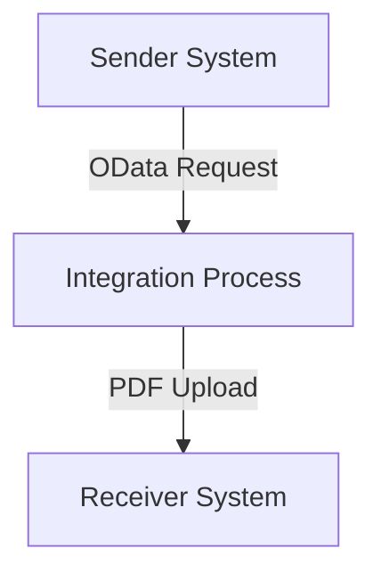

SAP / motiveminds
\n\n\n\n\n\n<h1 style="color: #1f4e79; font-size: 3em; text-align: left; margin-top: 100px;">AI Tech Specification Project - Odata Mass PDF upload</h1>\n\n\n\n\n\n| Key | Value |\n| :--- | :--- |\n| Author | Nidhi Srivastava |\n| Date | 2025-12-01 |\n| Version | Draft |\n\n\n\n\n\n\n\n\n\n\n\n\n\n\n\n\n\n\n\n\n\n\n\n<h1 style="color: #1f4e79; font-size: 2.5em;">Table of Contents</h1>

1. Introduction  
    1.1 Purpose  
    1.2 Scope  
2. Integration Overview  
    2.1 Integration Architecture  
    2.2 Integration Components  
3. Integration Scenarios  
    3.1 Scenario Description  
    3.2 Data Flows  
    3.3 Security Requirements  
4. Error Handling and Logging  
5. Testing Validation  
6. Reference Documents  

          

# 1. Introduction

## 1.1 Purpose
The purpose of the iFlow 'Odata_Mass_PDF_upload' is to facilitate the mass upload of PDF documents via OData services. This integration flow is designed to streamline the process of handling multiple PDF files, ensuring they are correctly processed and stored in the target system.

## 1.2 Scope
This iFlow operates within the SAP Cloud Platform Integration (CPI) environment and interacts with both sender and receiver systems. The primary systems affected include the source OData service that provides the PDF files and the target system where these files are uploaded. The iFlow is responsible for managing the data transformation and ensuring secure transmission of files.

# 2. Integration Overview

## 2.1 Integration Architecture
The integration architecture for the 'Odata_Mass_PDF_upload' iFlow consists of a sender and a receiver, with an integration process that manages the flow of data between them. The architecture is designed to handle the mass upload of PDF files efficiently.

## 2.2 Integration Components
The integration components include:
- **Sender System**: This is the OData service that initiates the request for uploading PDF files.
- **Receiver System**: This is the target system where the PDF files are uploaded.
- **Adapters Used**: The iFlow utilizes OData adapters for the sender and receiver endpoints to facilitate communication.

# 3. Integration Scenarios

## 3.1 Scenario Description
The integration scenario begins with the sender system sending a request to the iFlow to upload multiple PDF files. The iFlow processes this request, transforming the data as necessary, and then forwards the PDF files to the receiver system for storage.

## 3.2 Data Flows
The data flow involves the following steps:
1. The sender system sends an OData request containing the PDF files.
2. The iFlow processes the incoming data, applying any necessary transformations.
3. The transformed data is sent to the receiver system for upload.

### Mapping Logic Summary
The iFlow may include XSLT or other mapping logic to ensure that the data format aligns with the requirements of the receiver system. Specific mapping details would be defined in the configuration files.

### Groovy Script Explanations
If Groovy scripts are utilized within the iFlow, they would serve to handle complex transformations or validations that cannot be easily achieved through standard mapping techniques. The purpose of these scripts would be to enhance the flexibility and capability of the integration process.

## 3.3 Security Requirements
The iFlow implements security measures to ensure the safe transmission of data:
- **Authentication**: Basic authentication is disabled for the sender, indicating that other security measures may be in place.
- **Transport Security**: The integration flow should utilize HTTPS to secure data in transit.
- **Credentials Management**: Any credentials required for accessing the sender or receiver systems must be securely managed within the CPI environment.

# 4. Error Handling and Logging
Error handling within the iFlow is crucial for maintaining data integrity and ensuring successful uploads. The iFlow should include mechanisms to capture errors during the upload process, log them appropriately, and provide feedback to the sender system if necessary. This may involve using built-in error handling features of CPI, such as retries or notifications.

# 5. Testing Validation
Key testing scenarios for the iFlow include:
- Validating successful uploads of single and multiple PDF files.
- Testing the handling of invalid file formats or sizes.
- Ensuring that error handling mechanisms work as expected.
- Verifying that security measures are effective and that data is transmitted securely.

# 6. Reference Documents
The following artifacts were analyzed to create this documentation:
- iFlow Content: `Odata_Mass_PDF_upload.iflw`
- Any associated Groovy scripts or XSLT files (not provided in the current artifact).
